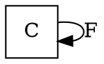
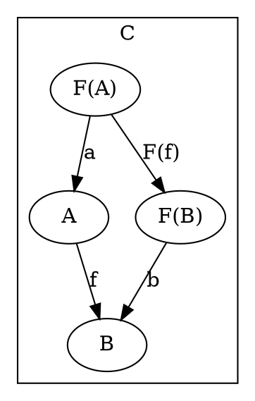
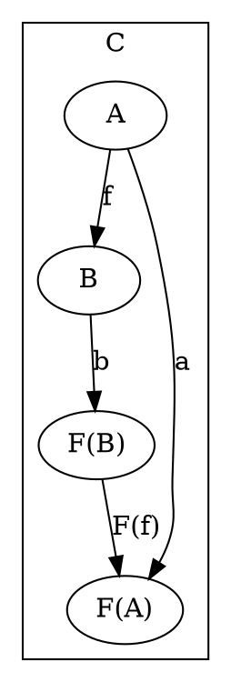

# [Definition](https://en.wikipedia.org/wiki/F-algebra)

## F-algebra

```graphviz
digraph G {
  "C" [shape="square"]
  "C" -> "C" [label="F"]
}
```

```graphviz
digraph G {
  subgraph clusterC {
    label="C"
    "A"
    "B"    

    "F(A)"
    "F(B)"

    "A" -> "B" [label="f"]

    "F(A)" -> "A" [label="a"]
    "F(B)" -> "B" [label="b"]

    "F(A)" -> "F(B)" [label="F(f)"]
  }
}
```

F-algebra is (A, a)

## F-coalgebra

```graphviz
digraph G {
  subgraph clusterC {
    label="C"
    "A"
    "B"    

    "F(A)"
    "F(B)"

    "A" -> "B" [label="f"]

    "A" -> "F(A)" [label="a"]
    "B" -> "F(B)" [label="b"]

    "F(B)" -> "F(A)" [label="F(f)"]
  }
}
```

F-coalgebra is (A, a)