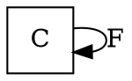
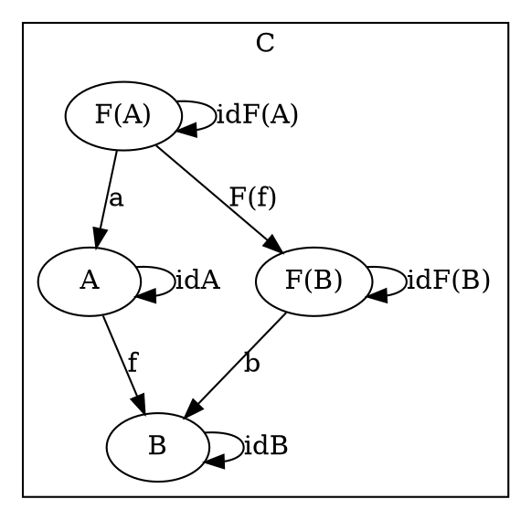
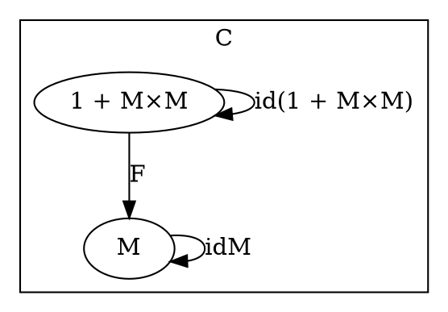
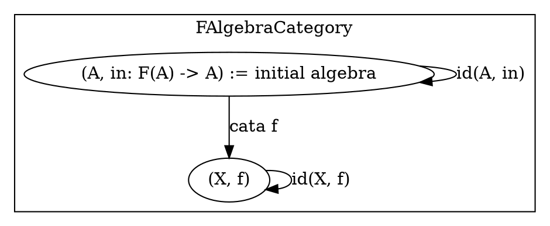
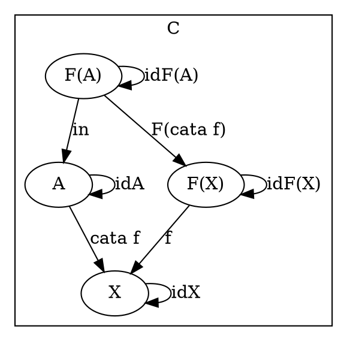
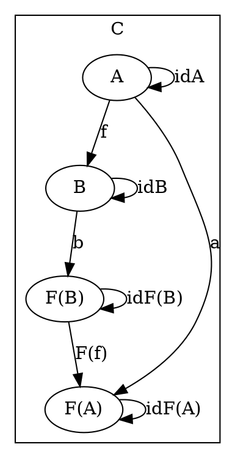
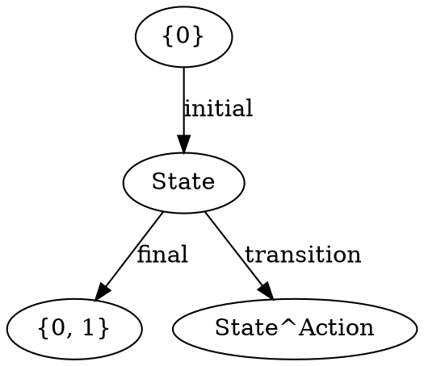
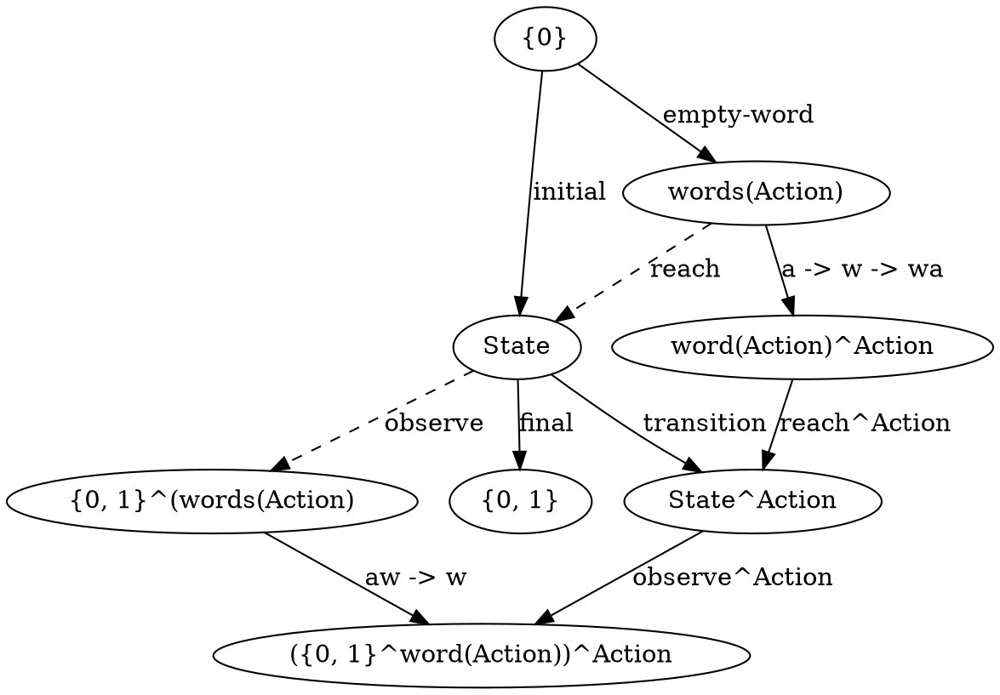

# [Definition](https://en.wikipedia.org/wiki/F-algebra)

## F-algebra

### Category level


### Object level



F-algebra is (A, a)

<!-- TODO add https://en.wikipedia.org/wiki/F-algebra#Algebraic_structures -->

### Object level



<!-- F(M) = 1 + M×M -->

### [Initial Algebra](https://en.wikipedia.org/wiki/Initial_algebra) & [Catamorphism](https://en.wikipedia.org/wiki/Catamorphism)

#### FAlgebraCategory Object level



#### C Object level



### Code

Strong type systems enable us to abstractly specify the initial algebra of a functor f as its fixed point a = f a

```haskell
type Algebra f a = f a -> a -- the generic f-algebras

newtype Fix f = Iso { invIso :: f (Fix f) } -- gives us the initial algebra for the functor f

cata :: Functor f => Algebra f a -> (Fix f -> a) -- catamorphism from Fix f to a
cata alg = alg . fmap (cata alg) . invIso -- note that invIso and alg map in opposite directions
```

```haskell
type Nat = Fix Maybe
zero :: Nat
zero = Iso Nothing -- every 'Maybe a' has a term Nothing, and Iso maps it into a
successor :: Nat -> Nat
successor = Iso . Just -- Just maps a to 'Maybe a' and Iso maps back to a new term
```

## F-coalgebra



F-coalgebra is (A, a)

<!-- TODO add coalgebra examples (transition systems, lambda calculus?) -->

finite state machine



embedded in a F-algebra, F-coalgebra
https://www.cs.mcgill.ca/~prakash/Pubs/BrzMin.pdf



<!-- TODO add terminal coalgebra -->

<!-- TODO add https://en.wikipedia.org/wiki/Anamorphism -->