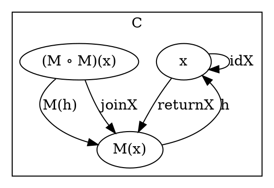

# [Definition](https://en.wikipedia.org/wiki/Monad_(category_theory)#Algebras_for_a_monad)

## Object level

```graphviz
digraph G {
  subgraph clusterC {
    label="C"

    "x"
    "M(x)"
    "(M ∘ M)(x)"
  }

  "x" -> "x" [label="idX"]

  "M(x)" -> "x" [label="h"]

  "(M ∘ M)(x)" -> "M(x)" [label="M(h)"]
  "(M ∘ M)(x)" -> "M(x)" [label="joinX"]

  "x" -> "M(x)" [label="returnX"]
}
```