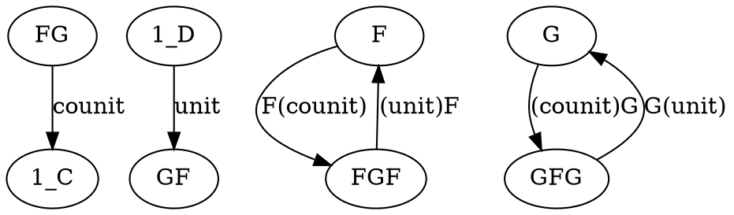
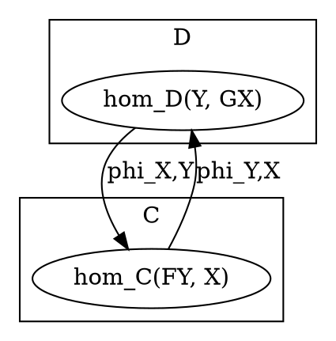

# Definitions

From highest level to lowest level of abstraction


## [Definition via counit–unit adjunction](https://en.wikipedia.org/wiki/Adjoint_functors#Definition_via_counit%E2%80%93unit_adjunction)




## [Definition via Hom-set adjunction](https://en.wikipedia.org/wiki/Adjoint_functors#Definition_via_Hom-set_adjunction)



## [Definition via universal morphisms](https://en.wikipedia.org/wiki/Adjoint_functors#Definition_via_universal_morphisms)

### [Left adjoint](https://en.wikipedia.org/wiki/Adjoint_functors#Definition_via_universal_morphisms)

```
for each object X in C
 there exists a universal morphism from F to X
```
In more details:
```
for each object X in C
  there exists an object G(X) in D
    and a morphism counitX: F(G(X)) -> X
      such that
        for every object Y in D
          and every morphism f: F(Y) -> X
            there exists a unique morphism g: Y -> G(X)
              with counitX ∘ F(g) = f
```
`F` is called a left adjoint to `G`


### [Right adjoint](https://en.wikipedia.org/wiki/Adjoint_functors#Definition_via_universal_morphisms)

```
for each object Y in D,
 there exists a universal morphism from Y to G
```
In more details:
```
for each object Y in D,
  there exists an object F(Y) in C
    and a morphism unitY: Y -> G(F(Y))
      such that
        for each object X in C,
          and every morphism g: Y -> G(X)
            there exists a unique morphism f: F(Y) -> X
              with G(f) ∘ unitY = g
```

`G` is called a right adjoint to `F`


# Code

## [Haskell](https://hackage.haskell.org/package/adjunction-0.0.0.0/docs/src/Data.Functor.Adjoint.html#Adjoint)

```haskell
class
  (Functor f, Functor g) =>
    Adjoint f g | f -> g, g -> f
      where
        -- defining unit and counit is sufficient
        unit ::
          a -> g (f a)
        counit ::
          f (g a) -> a
        -- but we can also define Adjoint using leftAdjunct and rightAdjunct instead
        leftAdjunct ::
          (f a -> b) -> a -> g b
        rightAdjunct ::
          (a -> g b) -> f a -> b
```