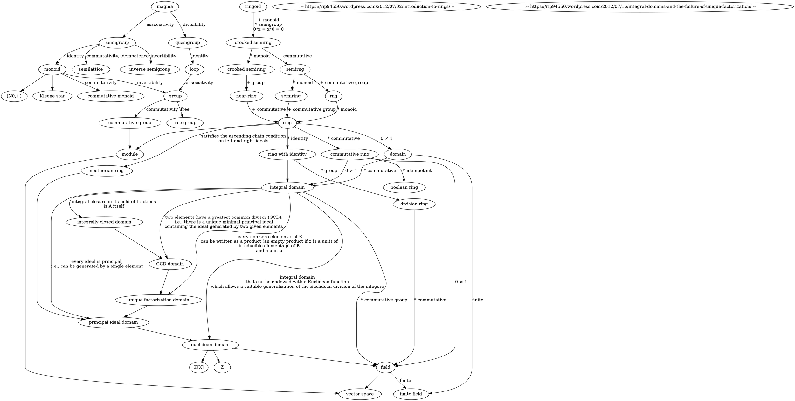

https://en.wikipedia.org/wiki/Magma_(algebra)

```graphviz
digraph G {
  "magma" -> "semigroup" [label="associativity"]
  "magma" -> "quasigroup" [label="divisibility"]
  "quasigroup" -> "loop" [label="identity"]
  "semigroup" -> "monoid" [label="identity"]
  "semigroup" -> "semilattice" [label="commutativity, idempotence"]
  "semigroup" -> "inverse semigroup" [label="invertibility"]
  "loop" -> "group" [label="associativity"]
  "monoid" -> "group" [label="invertibility"]
  "monoid" -> "(N0,+)" [href="https://en.wikipedia.org/wiki/Free_monoid#Examples"]
  "monoid" -> "Kleene star" [href="https://en.wikipedia.org/wiki/Free_monoid#Examples"]
  "monoid" -> "commutative monoid" [label="commutativity"]

  "group" -> "commutative group" [label="commutativity"]
  "group" -> "free group" [label="free"]

  "ringoid" [href="https://mathworld.wolfram.com/Ringoid.html"]
  "ringoid" -> "crooked semirng" [label="+ monoid\n* semigroup\n0*x = x*0 = 0", href="https://math.stackexchange.com/questions/2361889/graphically-organizing-the-interrelationships-of-basic-algebraic-structures"]
  "crooked semirng" -> "crooked semiring" [label="* monoid", href="https://math.stackexchange.com/questions/2361889/graphically-organizing-the-interrelationships-of-basic-algebraic-structures"]
  "crooked semiring" -> "near-ring" [label="+ group", href="https://math.stackexchange.com/questions/2361889/graphically-organizing-the-interrelationships-of-basic-algebraic-structures"]
  "near-ring" -> "ring" [label="+ commutative", href="https://math.stackexchange.com/questions/2361889/graphically-organizing-the-interrelationships-of-basic-algebraic-structures"]

  "rng" -> "ring" [label="* monoid", href="https://math.stackexchange.com/questions/2361889/graphically-organizing-the-interrelationships-of-basic-algebraic-structures"]
  "crooked semirng" -> "semirng" [label="+ commutative", href="https://math.stackexchange.com/questions/2361889/graphically-organizing-the-interrelationships-of-basic-algebraic-structures"]

  "semirng" -> "rng" [label="+ commutative group", href="https://math.stackexchange.com/questions/2361889/graphically-organizing-the-interrelationships-of-basic-algebraic-structures"]
  "semirng" -> "semiring" [label="* monoid", href="https://math.stackexchange.com/questions/2361889/graphically-organizing-the-interrelationships-of-basic-algebraic-structures"]
  "semiring" -> "ring" [label="+ commutative group", href="https://math.stackexchange.com/questions/2361889/graphically-organizing-the-interrelationships-of-basic-algebraic-structures"]

  "commutative group" -> "module" [label=""]
  "module" -> "vector space" [label=""]

  "ring" -> "module"
  "field" -> "vector space"

  <!-- https://rip94550.wordpress.com/2012/07/02/introduction-to-rings/ -->
  "ring" -> "ring with identity" [label="* identity"]

  "ring with identity" -> "division ring" [label="* group", href="http://abstract.ups.edu/aata/section-rings-definitions.html"]

  "division ring" -> "field" [label="* commutative", href="http://abstract.ups.edu/aata/section-rings-definitions.html"]
  "ring" -> "commutative ring" [label="* commutative"]

  "ring" -> "domain" [label="0 ≠ 1", href="https://math.stackexchange.com/questions/2361889/graphically-organizing-the-interrelationships-of-basic-algebraic-structures"]
  "domain" -> "integral domain" [label="* commutative", href="https://math.stackexchange.com/questions/2361889/graphically-organizing-the-interrelationships-of-basic-algebraic-structures"]
  "ring with identity" -> "integral domain"
  "commutative ring" -> "integral domain" [label="0 ≠ 1", href="https://math.stackexchange.com/questions/2361889/graphically-organizing-the-interrelationships-of-basic-algebraic-structures"]
  "commutative ring" -> "boolean ring" [label="* idempotent"]
  "commutative ring" -> "field" [label="0 ≠ 1", href="https://math.stackexchange.com/questions/2361889/graphically-organizing-the-interrelationships-of-basic-algebraic-structures"]

  <!-- https://rip94550.wordpress.com/2012/07/16/integral-domains-and-the-failure-of-unique-factorization/ -->
  "integral domain" -> "unique factorization domain" [label="every non-zero element x of R\ncan be written as a product (an empty product if x is a unit) of\nirreducible elements pi of R\nand a unit u", href="https://en.wikipedia.org/wiki/Unique_factorization_domain#Definition"]

  "integral domain" -> "principal ideal domain" [label="every ideal is principal,\ni.e., can be generated by a single element", href="https://en.wikipedia.org/wiki/Principal_ideal_domain"]
  "integral domain" -> "integrally closed domain" [label="integral closure in its field of fractions\nis A itself", href="https://en.wikipedia.org/wiki/Integrally_closed_domain"]

  "integral domain" -> "GCD domain" [label="two elements have a greatest common divisor (GCD);\ni.e., there is a unique minimal principal ideal\ncontaining the ideal generated by two given elements", href="https://en.wikipedia.org/wiki/GCD_domain"]
  "integrally closed domain" -> "GCD domain" [href="https://en.wikipedia.org/wiki/Unique_factorization_domain"]
  "GCD domain" -> "unique factorization domain" [href="https://en.wikipedia.org/wiki/Unique_factorization_domain"]

  "unique factorization domain" -> "principal ideal domain"
  "ring" -> "noetherian ring" [label="satisfies the ascending chain condition\non left and right ideals", href="https://en.wikipedia.org/wiki/Noetherian_ring"]
  "noetherian ring" -> "principal ideal domain"

  "integral domain" -> "euclidean domain" [label="integral domain\nthat can be endowed with a Euclidean function\nwhich allows a suitable generalization of the Euclidean division of the integers", href="https://en.wikipedia.org/wiki/Euclidean_domain"]
  "principal ideal domain" -> "euclidean domain"
  "euclidean domain" -> "field"
  "euclidean domain" -> "Z" [href="https://en.wikipedia.org/wiki/Polynomial_ring#Properties_of_K[X]"]
  "euclidean domain" -> "K[X]" [href="https://en.wikipedia.org/wiki/Polynomial_ring#Properties_of_K[X]"]

  "integral domain" -> "field" [label="* commutative group", href="https://math.stackexchange.com/questions/2361889/graphically-organizing-the-interrelationships-of-basic-algebraic-structures"]
  "domain" -> "finite field" [label="finite"]
  "field" -> "finite field" [label="finite", href="https://math.stackexchange.com/questions/2361889/graphically-organizing-the-interrelationships-of-basic-algebraic-structures"]
}
```

https://math.stackexchange.com/questions/2361889/graphically-organizing-the-interrelationships-of-basic-algebraic-structures