# [Definitions](https://en.m.wikipedia.org/wiki/Category_(mathematics))

```graphviz
digraph G {
  subgraph clusterC {
    "A" -> "A" [label="1A"]
    "B" -> "B" [label="1B"]
    "C" -> "C" [label="1C"]
    
    "A" -> "B" [label="f"]
    "B" -> "C" [label="g"]
    "A" -> "C" [label="g ∘ f"]
  }
}
```




# Code

## [Haskell](http://hackage.haskell.org/package/base-4.12.0.0/docs/src/Control.Category.html#Category)

```haskell
class Category cat where
    -- | the identity morphism
    id :: cat a a

    -- | morphism composition
    (.) :: cat b c -> cat a b -> cat a c

{-# RULES
"identity/left" forall p .
                id . p = p
"identity/right"        forall p .
                p . id = p
"association"   forall p q r .
                (p . q) . r = p . (q . r)
 #-}
```