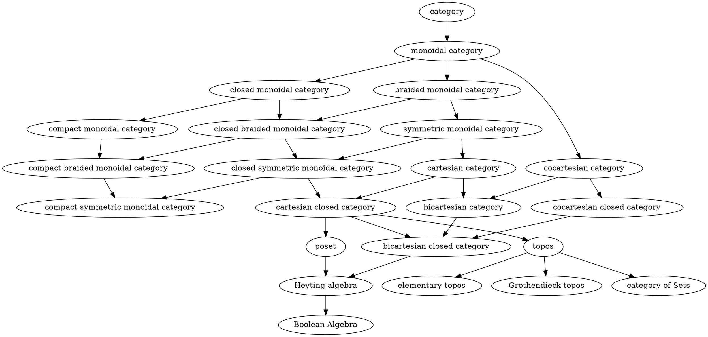

# [Definitions](https://en.m.wikipedia.org/wiki/Category_(mathematics))

```graphviz
digraph G {
  subgraph clusterC {
    "A" -> "A" [label="1A"]
    "B" -> "B" [label="1B"]
    "C" -> "C" [label="1C"]
    
    "A" -> "B" [label="f"]
    "B" -> "C" [label="g"]
    "A" -> "C" [label="g ∘ f"]
  }
}
```


## Object level



## Element level

https://en.wikipedia.org/wiki/Category_of_sets

In the mathematical field of category theory, the category of sets, denoted as Set, is the category whose objects are sets. The arrows or morphisms between sets A and B are the total functions from A to B, and the composition of morphisms is the composition of functions.


# Code

## [Haskell](http://hackage.haskell.org/package/base-4.12.0.0/docs/src/Control.Category.html#Category)

```haskell
class Category cat where
    -- | the identity morphism
    id :: cat a a

    -- | morphism composition
    (.) :: cat b c -> cat a b -> cat a c

{-# RULES
"identity/left" forall p .
                id . p = p
"identity/right"        forall p .
                p . id = p
"association"   forall p q r .
                (p . q) . r = p . (q . r)
 #-}
```

https://docs.google.com/spreadsheets/d/1bc5qauMqHykdv5Vl0F7ZNTETrZ0GZIL-CuXbQYkYtSY/edit#gid=1457368323

# Instances



<!-- TODO https://en.wikipedia.org/wiki/Cartesian_closed_category -->
   <!-- These categories are particularly important in mathematical logic and the theory of programming, in that their internal language is the simply typed lambda calculus -->