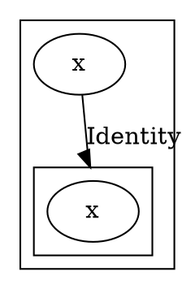
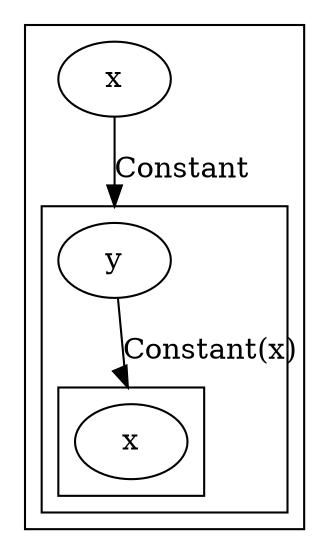
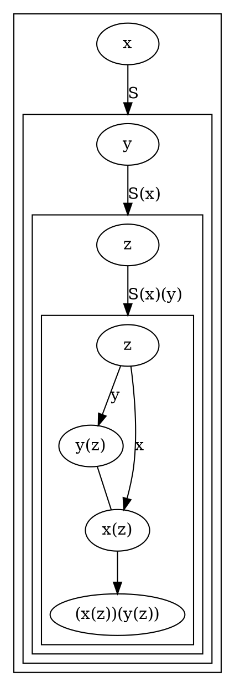

## Identity

https://en.wikipedia.org/wiki/Combinatory_logic#Examples_of_combinators
```
(I x) = x
```

https://gist.github.com/Avaq/1f0636ec5c8d6aed2e45
```js
const I = x => x;
```



## Constant

https://en.wikipedia.org/wiki/Combinatory_logic#Examples_of_combinators
```
(K x y) = x
```

https://gist.github.com/Avaq/1f0636ec5c8d6aed2e45
```js
const K = x => y => x;
```



## Substitution

https://en.wikipedia.org/wiki/Combinatory_logic#Examples_of_combinators
```
(S x y z) = (x z (y z))
```

https://gist.github.com/Avaq/1f0636ec5c8d6aed2e45
```js
const S = f => g => x => f(x)(g(x));
```



Given S and K, I itself is unnecessary, since it can be built from the other two
```
((S K K) x)
= (S K K x)
= (K x (K x))
= x
```

