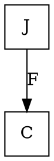
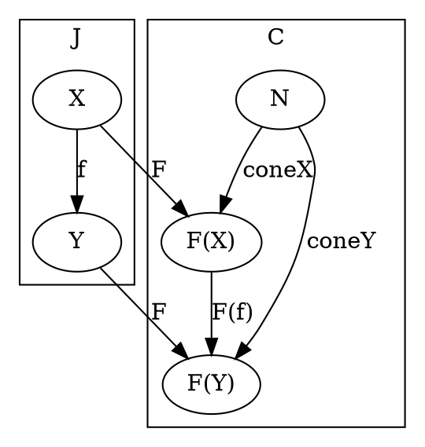
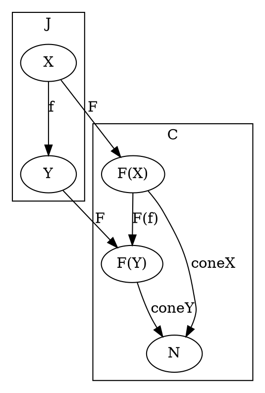

# [Definition](https://en.wikipedia.org/wiki/Cone_(category_theory)#Definition)

```
Let F : J → C be a diagram in C.
  Formally,
    a diagram is nothing more than a functor from J to C
```

### Category level



### Object level



# [Definition](https://en.wikipedia.org/wiki/Limit_(category_theory)#Colimits)


### Category level


### Object level



