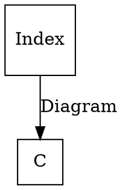

# [Definition](https://en.wikipedia.org/wiki/Diagram_(category_theory)#Definition)

```
Formally,
  a diagram of type J in a category C
    is a (covariant) functor
      D : J → C.
```

```
The category J
  is called the index category
  or the scheme of the diagram D;
the functor
  is sometimes called a J-shaped diagram
```

### Category level

