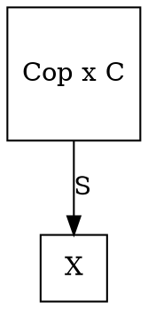
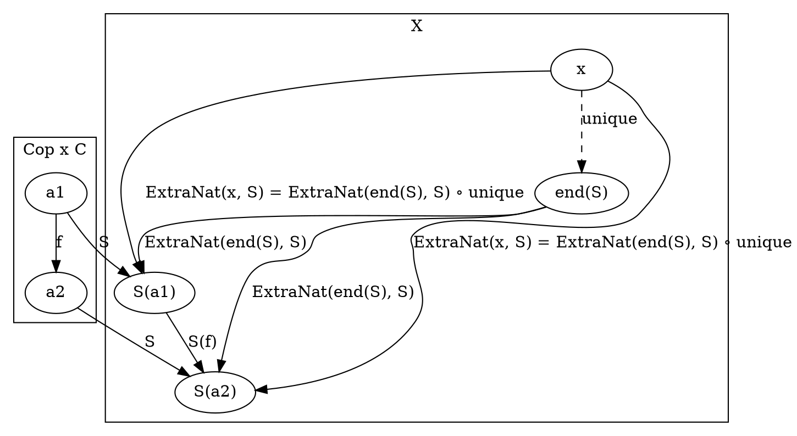

# [Definitions](https://en.wikipedia.org/wiki/End_(category_theory))

```
an end of a functor S: Cop x C -> X
  is a universal extranatural transformation from an object e of X to S
```

Category level



Object level



# [Properties](https://en.wikipedia.org/wiki/End_(category_theory))

Characterization as limit: If X is complete and C is small, the end can be described as the equalizer in the diagram