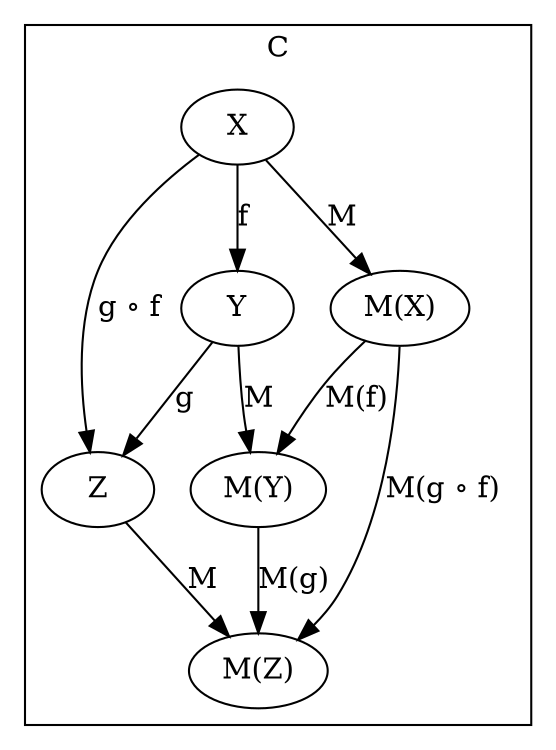

object level

```graphviz
digraph G {
  subgraph clusterC {
    label="C"
    "X"
    "Y"
    "Z"    

    "X" -> "Y" [label="f"]
    "Y" -> "Z" [label="g"]
    "X" -> "Z" [label="g ∘ f"]

    "M(X)"
    "M(Y)"
    "M(Z)"

    "M(X)" -> "M(Y)" [label="M(f)"]
    "M(Y)" -> "M(Z)" [label="M(g)"]
    "M(X)" -> "M(Z)" [label="M(g ∘ f)"]
  }

  subgraph clusterD {

  }

  "X" -> "M(X)" [label="M"]
  "Y" -> "M(Y)" [label="M"]
  "Z" -> "M(Z)" [label="M"]
}
```