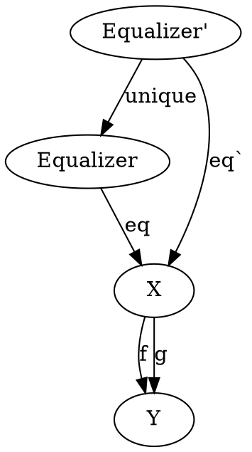
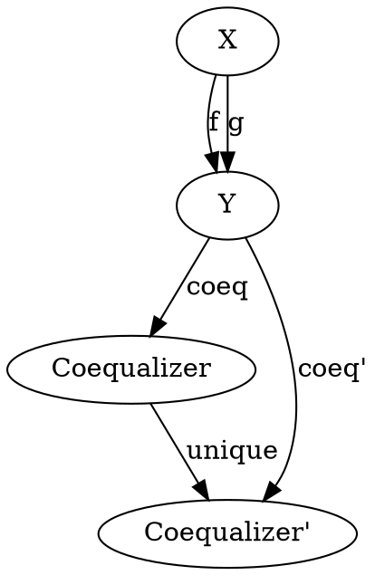

https://en.wikipedia.org/wiki/Equaliser_(mathematics)

```graphviz
digraph G {
  "Equalizer" -> "X" [label="eq"]

  "Equalizer'" -> "X" [label="eq`"]
  "Equalizer'" -> "Equalizer" [label="unique"]

  "X" -> "Y" [label="f"]
  "X" -> "Y" [label="g"]
}
```

https://en.wikipedia.org/wiki/Coequalizer

```graphviz
digraph G {
  "X" -> "Y" [label="f"]
  "X" -> "Y" [label="g"]

  "Y" -> "Coequalizer" [label="coeq"]
  "Y" -> "Coequalizer'" [label="coeq'"]

  "Coequalizer" -> "Coequalizer'" [label="unique"]
}
```