```graphviz
digraph G {
  label="dependency graph"
  "FLT-Wiles" -> "Selmer Group"
  "FLT-Wiles" -> "Galois representation"
  "FLT-Wiles" -> "modular form"
  "FLT-Wiles" -> "frey curve"
  "frey curve" -> "elliptic curve"

  "Galois representation" -> "Galois group"
  "Galois representation" -> "general linear group"

  "FLT-Wiles" -> "Hasse-Weil zeta function" -> "analytic continuation"
  "FLT-Wiles" -> "Shimura-Taniyama"
  "FLT-Wiles" -> "ε-conjecture"
  "FLT-Wiles" -> "modular curve"
  "FLT-Wiles" -> "Hecke rings" -> "Gorenstein"
  "FLT-Wiles" -> "Iwasawa theory"

  "FLT-Wiles" -> "Theorem 0.1. For each prime p ∈ Z and each prime λ|p of Of there\nis a continuous representation ρf,λ : Gal(Q¯ /Q) −→ GL2(Of,λ)\nwhich is unramified outside the primes dividing N p\nand such that for all primes q  N p, trace ρf,λ(Frob q) = c(q, f), det ρf,λ(Frob q) = χ(q)qk−1."
  "FLT-Wiles" -> "Theorem 0.2. Suppose that ρ0 is irreducible and satisfies either (I) or (II) above.\nSuppose also that ρ0 is modular and that\n(i) ρ0 is absolutely irreducible when restricted to Q(−1) p−1 2 p.\n(ii) If q ≡ −1 mod p is ramified in ρ0 then either ρ0|Dq is reducible over\nthe algebraic closure where Dq is a decomposition group at q or ρ0|Iq is\nabsolutely irreducible where Iq is an inertia group at q.\nThen any representation ρ as in the conjecture does indeed come from a modular form."
  "FLT-Wiles" -> "Theorem 0.3. Suppose that E is an elliptic curve defined over Q and\nthat ρ0 is the Galois action on the 3-division points. Suppose that E has the following properties:\n(i) E has good or multiplicative reduction at 3.\n(ii) ρ0 is absolutely irreducible when restricted to Q√−3 .\n(iii) For any q ≡ −1 mod 3 either ρ0|Dq is reducible over the algebraic closure or ρ0|Iq is absolutely irreducible.\nThen E should be modular."
  "FLT-Wiles" -> "Theorem 0.4. Suppose that E is a semistable elliptic curve defined over Q.\nThen E is modular."
  "FLT-Wiles" -> "Theorem 0.5. Suppose that up +vp +wp = 0 with u, v, w ∈ Q and p ≥ 3,\nthen uvw = 0. (Equivalently - there are no nonzero integers a, b , c, n with n > 2\nsuch that an + bn = cn.)"
  "FLT-Wiles" -> "Theorem 0.6. Suppose that ρ0 is irreducible and satisfies the hypothesis of the conjecture, including (I) above.\nSuppose further that\n(i) ρ0 = IndQ L κ0 for a character κ0 of an imaginary quadratic extension L of Q which is unramified at p.\n(ii) det ρ0|Ip = ω.\nThen a representation ρ as in the conjecture does indeed come from a modular form."
  "FLT-Wiles" -> "Proposition 1.1 (Diamond). Suppose that π : Dp → GL2(A) is a continuous representation where A is an Artinian local ring with residue field k,\na finite field of characteristic p.\nSuppose π ≈ ( χ1ε0∗χ2 ) with χ1 and χ2 unramified and χ1 = χ2.\nThen the residual representation π¯ is associated to a finite flat group scheme over Zp."
  "FLT-Wiles" -> "Proposition 1.2. Suppose that ρf,λ is a deformation of ρ0 of type D = (·, Σ, O,M) with O an unramified extension of Of,λ.\nThen as O-modules HomO(pD/p2 D, K/O) H1 D(QΣ/Q, V )."
  "FLT-Wiles" -> "Proposition 1.3. (i) If ρ0 is flat but ordinary and ρf,λ is associated to a p-divisible group then for all n H1 f (Qp, Vλn ) = H1 F (Qp, Vλn ).\n(ii) If ρf,λ is ordinary, det ρf,λ Ip = ε and ρf,λ is associated to a p-divisible group,\nthen for all n, H1 F (Qp, Vλn ) ⊆ H1 Se(Qp, Vλn )."
  "FLT-Wiles" -> "Proposition 1.4. If ρf,λ is associated to a p-divisible group (the ordinary case is allowed) then\n(i) prn H1 F (Qp, T) = H1 F (Qp, T /λn) and similarly for T ∗, T ∗/λn.\n(ii) H1 F (Qp, Vλn ) is the orthogonal complement of H1 F (Qp, V ∗ λn )\nunder Tate local duality between H1(Qp, Vλn ) and H1(Qp, V ∗ λn ) and similarly for Wλn and W∗ λn replacing Vλn and V ∗ λn .\nMore generally these results hold for any crystalline representation V in place of V and λ a uniformizer in K\nwhere K is any finite extension of Qp with K ⊂ EndGal(Qp/Qp)V."
  "FLT-Wiles" -> "Proposition 1.5. H1 Se∗ (Qp, W∗ λn ) = ϕ−1 w (Xn,i), H1 Se∗ (Qp, V ∗ λn ) = ϕ−1 v (Yn,i)."
  "FLT-Wiles" -> "Proposition 1.6. #H1 L(QΣ/Q, X)/#H1 L∗ (QΣ/Q, X∗) = h∞ q∈Σ hq\nwhere hq = #H0(Qq, X∗)/[H1(Qq, X) : Lq] h∞ = #H0(R, X∗)#H0(Q, X)/#H0(Q, X∗)."
  "FLT-Wiles" -> "Proposition 1.7. If q ∈ Σ, and X is an arbitrary finite Gal(QΣ/Q)-module of p-power order,\n#H1 L (QΣ∪q/Q, X)/#H1 L(QΣ/Q, X) ≤ #H0(Qq, X∗)\nwhere L! = L! for # ∈ Σ and L q = H (Qq, X)."
  "FLT-Wiles" -> "Proposition 1.8. If q ∈ M (q = p) and X = Vλn then hq = 1."
  "FLT-Wiles" -> "Proposition 1.9. (i) If X = Vλn then hph∞ = #(O/λ) 3n#H0(Qp, V ∗ λn )/#H0(Q, V ∗ λn ) in the unrestricted case.\n(ii) If X = Vλn then hph∞ ≤ #(O/λ) n#H0(Qp,(V ord λn ) ∗)/#H0(Q, W∗ λn ) in the ordinary case.\n(iii) If X = Vλn or Wλn then hph∞ ≤ #H0(Qp,(W0 λn )∗)/#H0(Q, W∗ λn ) in the Selmer case.\n(iv) If X = Vλn or Wλn then hph∞ = 1 in the strict case.\n(v) If X = Vλn then hph∞ = 1 in the flat case.\n(vi) If X = Vλn or Wλn\nthen hph∞ = 1/#H0(Q, V ∗ λn ) if Ln,p = H1 F (Qp, X) and ρf,λ arises from an ordinary p-divisible group"
  "FLT-Wiles" -> "Lemma 1.10. If im ρ0 has order divisible by p then:\n(i) It contains an element γ0 of order m ≥ 3 with (m, p)=1 and γ0 trivial on any abelian quotient of im ρ0.\n(ii) It contains an element ρ0(σ) with any prescribed image in the Sylow 2-subgroup of (im ρ0)/(im ρ0) and with the ratio of the eigenvalues not equal to ω(σ). (Here (im ρ0) denotes the derived subgroup of (im ρ0).)\nThe same results hold if the image of the projective representation ρ˜0 associated to ρ0 is isomorphic to A4, S4 or A5."
  "FLT-Wiles" -> "Proposition 1.11. Suppose that ρ0 is absolutely irreducible.\nThen H1(K1(ζp)/Q, W∗ λ )=0."
  "FLT-Wiles" -> "Lemma 1.12. Suppose that ρ0 is absolutely irreducible and that
(a) ˜ρ0 is dihedral (the case where the image is Z/2 × Z/2 is allowed),\n(b) ρ0|L is absolutely irreducible where L = Q(−1)(p−1)/2p.\nThen for any positive integer n and any irreducible Galois stable subspace X of Wλ ⊗ ¯k there exists an element σ ∈ Gal(Q¯ /Q) such that\n(i) ˜ρ0(σ) = 1,\n(ii) σ fixes Q(ζpn ),\n(iii) σ has an eigenvalue 1 on X."
  "FLT-Wiles" -> "Theorem 2.1. (i) If p  N and ρm is irreducible then JH(N)(Q)[m] (T/m) 2.\n(ii) If p  N and ρm is irreducible and m is Dp-distinguished then JH(N p)(Q)[m] (T/m) 2.\n(In case (ii) m is a maximal ideal of T = TH(N p).)"
  "Theorem 2.1. (i) If p  N and ρm is irreducible then JH(N)(Q)[m] (T/m) 2.\n(ii) If p  N and ρm is irreducible and m is Dp-distinguished then JH(N p)(Q)[m] (T/m) 2.\n(In case (ii) m is a maximal ideal of T = TH(N p).)" -> "Corollary 1. In case (i), JH(N)(Q)m T2 m and Tam JH(N)(Q) T2 m.\nIn case (ii), JH(N p)(Q)m T2 m and Tam JH(N p)(Q) T2 m (where Tm = TH(N p)m)."
  "Theorem 2.1. (i) If p  N and ρm is irreducible then JH(N)(Q)[m] (T/m) 2.\n(ii) If p  N and ρm is irreducible and m is Dp-distinguished then JH(N p)(Q)[m] (T/m) 2.\n(In case (ii) m is a maximal ideal of T = TH(N p).)" -> "Corollary 2. In either of cases (i) or (ii) Tm is a Gorenstein ring."
  "FLT-Wiles" -> "Lemma 2.2. dimT/m H0(X1(N, p)/Fp , Ω)[m]=1."
  "FLT-Wiles" -> "Lemma 2.3 (Ribet). ψ(B) ∩ ϕ(J2)m(q) = ϕ(J2)[U2 q − #q$]m(q) for irreducible ρm."
  "FLT-Wiles" -> "Lemma (Ribet). Suppose that (M,N)=1. If M is odd then TM = T.\nIf M is even then TM has finite index in T equal to a power of 2."
  "FLT-Wiles" -> "Proposition 2.4. Assume that m is Dp-distinguished\nand that ρm is irreducible of level N with p  N.\nThen (∆p) = T2 p − #p$(1 + p) 2 = (a2 p − #p$)."
  "FLT-Wiles" -> "Lemma 2.5. If q = p is a prime and r ≥ 1 then the sequence of abelian varieties\n0 → J1(Nqr−1) ξ1−→J1(Nqr) × J1(Nqr) ξ2−→J1(Nqr, qr+1)\nwhere ξ1 = (π1,r ◦ π)∗, −(π2,r ◦ π)∗ and ξ2 = (π∗ 4,r, π∗ 3,r)\ninduces a corresponding sequence of p-divisible groups which becomes exact when localized at any m(q) for which ρm is irreducible."
  "FLT-Wiles" -> "Proposition 2.6. Suppose that frakm is a maximal ideal of TH(N)\nassociated to an irreducible ρm. Suppose also that q  N p.\nThen (∆ p)=(q − 1)(T2 q − #q$(1 + q) 2)."
  "FLT-Wiles" -> "Proposition 2.7. Suppose that m is a maximal ideal of T = TH(N)\nassociated to an irreducible representation. Suppose that q  N p.\nThen (∆q)=(q − 1)2 T2 q − #q$(1 + q) 2)."
  "FLT-Wiles" -> "Proposition 2.10. Suppose that m is a maximal ideal of TH(N, q)\nassociated to an irreducible m of type (A).\nThen (∆q)=(q − 1)2(q + 1)."
  "FLT-Wiles" -> "Proposition 2.12. Suppose that m is a maximal ideal of TH(Nqr)\nassociated to an irreducible ρm of type (B) at q, i.e., satisfying (2.19) including\nthe hypothesis that H cantains Sp.\n(Again q  N p.) Then (∆q) = (q − 1)2."
  "FLT-Wiles" -> "Proposition 2.13. Suppose that m is a maximal of TH(Nqr) associated\nto an irreducible ρm with H containing the Sylow p-subgroup of (Z/qrZ)∗.\nThen (∆q)=(q − 1)"
  "FLT-Wiles" -> "Proposition 2.4. Suppose that ρm is irreducible where m is a maximal\nideal of TH(N) and that ρm(Frob q) has distinct eigenvalues.\nThen (∆) = (α2 q − #q$), (∆)=(α2 q − #q$)(q − 1)"
  "FLT-Wiles" -> "Theorem 2.14. Suppose that ρ0 is modular and satisfies (1.1) (so in\nparticular is irreducible) and is of type D = (·, Σ, O,M) with · = Se, str or fl.\nSuppose that at least one of the following conditions holds (i) p > 3 or (ii) ρ0\nis not induced from a character of Q(√−3). Then there exists a newform f\nof weight 2 and a prime λ of Of such that ρf,λ is of type D = (·, Σ, O,M)\nfor some O, and such that (ρf,λ mod λ)ρ0 over Fp. Moreover we can\nassume that f has character χf of order prime to p and has level N(ρ0)pδ(ρ0)\nwhere δ(ρ0)=0 if ρ0|Dp is associated to a finite flat group scheme over Zp\nand det ρ0 Ip = ω, and δ(ρ0)=1 otherwise. Furthermore in the Selmer case\nwe can assume that ap(f) ≡ χ2(Frob p) mod λ in the notation of (1.2) where ap(f) is the eigenvalue of Up."
  "FLT-Wiles" -> "Proposition 2.15. In the nonexceptional case there is a maximal ideal m for TH(M) with m ∩H (M) = m and k0 = km,\nand such that the natural map TH(M)m → TH(M)m is an isomorphism, thus given TD TH(M)m ⊗ W(k0) O.\nIn the exceptional case the same statements hold with m replacing m, TH(M) replacing TH(M) and km replacing k0."
  "FLT-Wiles" -> "Conjecture 2.16. ϕD is an isomorphism."
  "FLT-Wiles" -> "Theorem 2.17. Assume, as above, that ρf,λ is a deformation of ρ0 of type D = (·, Σ, O = Of,λ,M) with · = Se, str or fl.\nSuppose that #O/π(ηD,f ) ≥ #pR,f /p2 R,f.\nThen (i) ϕD1 : RD1 TD1 is an isomorphism for all (restricted) D1 ⊃ D.\n(ii) TD1 is a complete intersection (over O1 if · is Se, str or fl) for all restricted D1 ⊃ D."
  "FLT-Wiles" -> "Theorem 3.1. Assume that D is minimal, i.e.,( = M∪{p},\nand that ρ0 is absolutely irreducible when restricted to Q(−1) p−1 2 p.\nThen (i) #H1 D(QΣ/Q, Vf ) ≤ #(pT,f /p2 T,f )2 · cp/#(O/ηT,f )\nwhere cp = #(O/U2 p − #p$) < ∞ when ρ0 is Selmer and ρ0|Dp is associated to a finite flat group scheme over Zp and det ρ0|Ip = ω, and cp = 1 otherwise;\n(ii) if TD0 is a complete intersection over O then (i) is an equality, RD TD and TD is a complete intersection.\nIn general, for any (not necessarily minimal) D of Selmer, strict or flat\ntype, and any ρf,λ of type D, #H1 D(QΣ/Q, Vf ) < ∞ if ρ0 is as above."
  "FLT-Wiles" -> "Lemma 3.2. The map ιQ is injective for any finite set of primes Q\nsatisfying q ≡ 1(p), T2 q ≡ #q$(1 + q) 2mod m f or all q ∈ Q."
  "FLT-Wiles" -> "Theorem 3.3. Assume that ρ0 is modular and absolutely irreducible\nwhen restricted to Q(−1) p−1 2 p. Assume also that ρ0 is of type (A), (B)\nor (C) at each q = p in Σ. Then the map ϕD : RD → TD of Conjecture 2.16\nis an isomorphism for all D associated to ρ0, i.e., where D = (·, Σ, O,M) with·\n = Se,str, fl or ord. In particular if · = Se,str or fl and f is any newform\nfor which ρf,λ is a deformation of ρ0 of type D then #H1 D(QΣ/Q, Vf ) = #(O/ηD,f ) < ∞\nwhere ηD,f is the invariant defined in Chapter 2 prior to (2.43)."
  "FLT-Wiles" -> "Proposition 4.1. There is an isomorphism\nH1 unr(QΣ/Q, Y ∗) ∼→ Hom(Gal(M∞/L(ν)),(K/O)(ν))Gal(L(ν)/L)\nwhere H1 unr denotes the subgroup of classes which are Selmer at p and unramified everywhere else."
  "FLT-Wiles" -> "Theorem 4.2. There is an equality of characteristic ideals as\nΛ = Zp[[Gal(L(ν)/L)]]-modules: char∧(Gal(M∞/L(ν))) = char∧(U∞(ν)/C∞)."
  "FLT-Wiles" -> "Proposition 4.4. π(η2) = #f,f$2/ufu¯f × ( unit in Of,λ)."
  "FLT-Wiles" -> "Proposition 4.6. #fϕ, fϕ$ = 1 16π3 N2 -q|Nq∈Sϕ 1 − 1q. LN (2, ϕ2 ¯χˆ)LN (1, ψ)\nwhere χ is the character of fϕ and χˆ its restriction to L;\nψ is the quadratic character associated to L;\nLN ( ) denotes that the Euler factors for primes dividing N have been removed;\nSϕ is the set of primes q|N such that q = qq with q  cond ϕ and q, q\nprimes of L, not necessarily distinct."
  "FLT-Wiles" -> "Theorem 4.7. #(O/π(ηM)) = #H1 Se(QΣ/Q, V )."
  "FLT-Wiles" -> "Theorem 4.8. Suppose that ρ0 as in (1.1) is an irreducible representation of odd determinant such that ρ0 = IndQ\nL κ0 for a character κ0 of an\nimaginary quadratic extension L of Q which is unramified at p. Assume also that:\n(i) det ρ0 Ip = ω;\n(ii) ρ0 is ordinary."
  "FLT-Wiles" -> "Corollary. For any ρ0 as in the theorem suppose that\nρ : Gal(Q¯ /Q) → GL2(O)\nis a continuous representation with values in the ring of integers of a local\nfield, unramified outside a finite set of primes, satisfying ρ¯ ρ0 when viewed\nas representations to GL2(F¯ p). Suppose further that\n(i) ρ Dp is ordinary;\n(ii) det ρ Ip = χεk−1 with χ of finite order, k ≥ 2.\nThen ρ is associated to a modular form of weight k."
  "FLT-Wiles" -> "Theorem 5.1 (Langlands-Tunnell). Suppose that\nρ : Gal(Q¯ /Q) → GL2(C) is a continuous irreducible representation whose image is finite and\nsolvable. Suppose further that det ρ is odd. Then there exists a weight one\nnewform f such that L(s, f) = L(s, ρ) up to finitely many Euler factors"
  "FLT-Wiles" -> "Theorem 5.2. All semistable elliptic curves over Q are modular."
  "FLT-Wiles" -> "Theorem 5.3. Suppose that E is an elliptic curve defined over Q with\nthe following properties:\n(i) E has good or multiplicative reduction at 3, 5,\n(ii) For p = 3, 5 and for any prime q≡ −1 mod p either ρ¯E,p|Dq is reducible\nover F¯ p or ρ¯E,p|Iq is irreducible over F¯ p.\nThen E is modular."
}
```

```

high level

https://en.wikipedia.org/wiki/Wiles%27s_proof_of_Fermat%27s_Last_Theorem#Summary_of_Wiles's_proof
The proof falls roughly in two parts.
 In the first part,
  Wiles proves a general result about "lifts",
   known as the "modularity lifting theorem".
    This first part allows him to prove results about elliptic curves
     by converting them to problems about Galois representations of elliptic curves.  
      He then uses this result
       to prove that all semi-stable curves are modular,
        by proving that the Galois representations of these curves are modular

https://en.wikipedia.org/wiki/Wiles%27s_proof_of_Fermat%27s_Last_Theorem#Summary_of_Wiles's_proof

Part 1: setting up the proof
 We start by assuming that Fermat's Last Theorem is incorrect.
  That would mean there is at least one non-zero solution (a, b, c, n)
   (with all numbers rational and n > 2 and prime) to an + bn = cn.
    Ribet's theorem (using Frey and Serre's work) shows that
     we can create a semi-stable elliptic curve E using the numbers (a, b, c, and n),
      which is never modular.
       We will set up our proof by initially seeing what happens if Fermat's Last Theorem is incorrect,
        and showing (hopefully) that this would always lead to a contradiction.
         	Suppose that Fermat's Last Theorem is incorrect.
            This means a set of numbers (a, b, c, n) must exist that is a solution of Fermat's equation,
             and we can use the solution to create a Frey curve
              which is semi-stable and elliptic.
               So we assume that (somehow) we have found a solution
                and created such a curve (which we will call "E"),
                 and see what happens.
 Part 2: the Modularity Lifting Theorem
  Galois representations of elliptic curves ρ(E, p) for any prime p > 3 have been studied by many mathematicians.
  Wiles aims first of all to prove a result about these representations, that he will use later: that if a semi-stable elliptic curve E has a Galois representation ρ(E, p) that is modular, the elliptic curve itself must be modular.

  Proving this is helpful in two ways: it makes counting and matching easier, and, significantly, to prove the representation is modular, we would only have to prove it for one single prime number p, and we can do this using any prime that makes our work easy – it does not matter which prime we use.

  This is the most difficult part of the problem – technically it means proving that if the Galois representation ρ(E, p) is a modular form, so are all the other related Galois representations ρ(E, p∞) for all powers of p.[3] This is the so-called "modular lifting problem", and Wiles approached it using deformations.

  Any elliptic curve (or a representation of an elliptic curve) can be categorized as either reducible or irreducible. The proof will be slightly different depending whether or not the elliptic curve's representation is reducible.
    Wiles's initial strategy is to count and match using proof by induction and a Class Number Formula ("CNF"): an approach in which, once the hypothesis is proved for one elliptic curve, it can automatically be extended to be proven for all subsequent elliptic curves.
      At this point, the proof has shown a key point about Galois representations:
      If the geometric Galois representation ρ(E,p) of a semi-stable elliptic curve E is irreducible and modular (for some prime number p > 2), then subject to some technical conditions, E is modular.
      This is Wiles's lifting theorem (or modularity lifting theorem), a major and revolutionary accomplishment at the tim

  Part 3: Proving that all semi-stable elliptic curves are modular
    With the lifting theorem proved, we return to the original problem. We will categorize all semi-stable elliptic curves based on the reducibility of their Galois representations, and use the powerful lifting theorem on the results.
    From above, it does not matter which prime is chosen for the representations. We can use any one prime number that is easiest. 3 is the smallest prime number more than 2, and some work has already been done on representations of elliptic curves using ρ(E,3), so choosing 3 as our prime number is a helpful starting point.

    Wiles found that it was easier to prove the representation was modular by choosing a prime p=3 in the cases where the representation ρ(E,3) is irreducible, but the proof when ρ(E,3) is reducible was easier to prove by choosing p = 5. So the proof splits in two at this point.

      If the Galois representation ρ(E,3) (i.e., using p = 3) is irreducible, then it was known from around 1980 that its Galois representation is also always modular.
      Wiles uses his modularity lifting theorem to make short work of this case:

      If the representation ρ(E,3) is irreducible, then we know the representation is also modular (Langlands and Tunnell), but...
      ... if the representation is both irreducible and modular then E itself is modular (modularity lifting theorem).

        So we now consider what happens if ρ(E,3) is reducible.
        Wiles found that when the representation of an elliptic curve using p=3 is reducible, it was easier to work with p=5 and use his new lifting theorem to prove that ρ(E, 5) will always be modular, than to try and prove directly that ρ(E,3) itself is modular (remembering that we only need to prove it for one prime).
          If ρ(E,3) and ρ(E,5) are both reducible, Wiles proved directly that ρ(E,5) must be modular.
            The last case is if ρ(E,3) is reducible and ρ(E,5) is irreducible.
            Wiles showed that in this case, one could always find another semistable elliptic curve F such that the representation ρ(F,3) is irreducible and also the representations ρ(E,5) and ρ(F,5) are isomorphic (they have identical structures).

            - The first of these properties shows that F must be modular (Langlands and Tunnell again: all irreducible representations with p=3 are modular).
            - If F is modular then we know ρ(F,5) must be modular as well.
            - But because the representations of E and F with p = 5 have exactly the same structure, and we know that ρ(F,5) is modular, ρ(E,5) must be modular as well.
              Therefore, if ρ(E,3) is reducible, we have proved that ρ(E,5) will always be modular. But if ρ(E,5) is modular, then the modularity lifting theorem shows that E itself is modular.
    Results
      We have now proved that whether or not ρ(E,3) is irreducible, E (which could be any semi-stable elliptic curve) will always be modular. This means that all semi-stable elliptic curves must be modular.
      This proves:

      (a) The Taniyama–Shimura–Weil conjecture for semi-stable elliptic curves; and also
      (b) Because there cannot be a contradiction, it also proves that the kinds of elliptic curves described by Frey cannot actually exist. Therefore no solutions to Fermat's equation can exist either, so Fermat's Last Theorem is also true.


https://en.wikipedia.org/wiki/Wiles%27s_proof_of_Fermat%27s_Last_Theorem#Mathematical_detail_of_Wiles%E2%80%99_proof

Overview

Wiles opted to attempt to match elliptic curves to a countable set of modular forms. He found that this direct approach was not working, so he transformed the problem by instead matching the Galois representations of the elliptic curves to modular forms. Wiles denotes this matching (or mapping) that, more specifically, is a ring homomorphism:

  {\displaystyle R_{n}\rightarrow \mathbf {T} _{n}.}{\displaystyle R_{n}\rightarrow \mathbf {T} _{n}.}
  {\displaystyle R}R is a deformation ring and {\displaystyle \mathbf {T} }\mathbf {T}  is a Hecke ring.

    Wiles had the insight that in many cases this ring homomorphism could be a ring isomorphism (Conjecture 2.16 in Chapter 2, §3 of the 1995 paper[4]). He realised that the map between {\displaystyle R}R and {\displaystyle \mathbf {T} }\mathbf {T}  is an isomorphism if and only if two abelian groups occurring in the theory are finite and have the same cardinality. This is sometimes referred to as the "numerical criterion". Given this result, Fermat's Last Theorem is reduced to the statement that two groups have the same order. Much of the text of the proof leads into topics and theorems related to ring theory and commutation theory. Wiles's goal was to verify that the map {\displaystyle R\rightarrow \mathbf {T} }{\displaystyle R\rightarrow \mathbf {T} } is an isomorphism and ultimately that {\displaystyle R=\mathbf {T} }{\displaystyle R=\mathbf {T} }. In treating deformations, Wiles defined four cases, with the flat deformation case requiring more effort to prove and treated in a separate article in the same volume entitled "Ring-theoretic properties of certain Hecke algebras".

      or ultimately that {\displaystyle R=\mathbf {T} }{\displaystyle R=\mathbf {T} }, indicating a complete intersection. Since Wiles could not show that {\displaystyle R=\mathbf {T} }{\displaystyle R=\mathbf {T} } directly, he did so through {\displaystyle \mathbf {Z} _{3},\mathbf {F} _{3}}{\displaystyle \mathbf {Z} _{3},\mathbf {F} _{3}} and {\displaystyle \mathbf {T} /{\mathfrak {m}}}{\displaystyle \mathbf {T} /{\mathfrak {m}}} via lifts.

        In order to perform this matching, Wiles had to create a class number formula (CNF). He first attempted to use horizontal Iwasawa theory but that part of his work had an unresolved issue such that he could not create a CNF. At the end of the summer of 1991, he learned about an Euler system recently developed by Victor Kolyvagin and Matthias Flach that seemed "tailor made" for the inductive part of his proof, which could be used to create a CNF, and so Wiles set his Iwasawa work aside and began working to extend Kolyvagin and Flach's work instead, in order to create the CNF his proof would require.[25] By the spring of 1993, his work had covered all but a few families of elliptic curves, and in early 1993, Wiles was confident enough of his nearing success to let one trusted colleague into his secret. Since his work relied extensively on using the Kolyvagin–Flach approach, which was new to mathematics and to Wiles, and which he had also extended, in January 1993 he asked his Princeton colleague, Nick Katz, to help him review his work for subtle errors. Their conclusion at the time was that the techniques Wiles used seemed to work correctly.
          Wiles' use of Kolyvagin–Flach would later be found to be the point of failure in the original proof submission, and he eventually had to revert to Iwasawa theory and a collaboration with Richard Taylor to fix it. In May 1993, while reading a paper by Mazur, Wiles had the insight that the 3/5 switch would resolve the final issues and would then cover all elliptic curves.


General approach and strategy
  Given an elliptic curve E over the field Q of rational numbers {\displaystyle E({\bar {\mathbf {Q} }})}E({\bar {\mathbf {Q} }}), for every prime power {\displaystyle \ell ^{n}}\ell ^{n}, there exists a homomorphism from the absolute Galois group

  {\displaystyle \operatorname {Gal} ({\bar {\mathbf {Q} }}/\mathbf {Q} )}{\displaystyle \operatorname {Gal} ({\bar {\mathbf {Q} }}/\mathbf {Q} )}
  to

  {\displaystyle \operatorname {GL} _{2}(\mathbf {Z} /l^{n}\mathbf {Z} ),}{\displaystyle \operatorname {GL} _{2}(\mathbf {Z} /l^{n}\mathbf {Z} ),}
  the group of invertible 2 by 2 matrices whose entries are integers modulo {\displaystyle \ell ^{n}}\ell ^{n}. This is because {\displaystyle E({\bar {\mathbf {Q} }})}E({\bar {\mathbf {Q} }}), the points of E over {\displaystyle {\bar {\mathbf {Q} }}}{\bar {\mathbf {Q} }}, form an abelian group, on which {\displaystyle \operatorname {Gal} ({\bar {\mathbf {Q} }}/\mathbf {Q} )}{\displaystyle \operatorname {Gal} ({\bar {\mathbf {Q} }}/\mathbf {Q} )} acts; the subgroup of elements x such that {\displaystyle \ell ^{n}x=0}{\displaystyle \ell ^{n}x=0} is just {\displaystyle (\mathbf {Z} /\ell ^{n}\mathbf {Z} )^{2}}{\displaystyle (\mathbf {Z} /\ell ^{n}\mathbf {Z} )^{2}}, and an automorphism of this group is a matrix of the type described

    Less obvious is that given a modular form of a certain special type, a Hecke eigenform with eigenvalues in Q, one also gets a homomorphism from the absolute Galois group

    {\displaystyle \operatorname {Gal} ({\bar {\mathbf {Q} }}/\mathbf {Q} )\rightarrow \operatorname {GL} _{2}(\mathbf {Z} /l^{n}\mathbf {Z} ).}{\displaystyle \operatorname {Gal} ({\bar {\mathbf {Q} }}/\mathbf {Q} )\rightarrow \operatorname {GL} _{2}(\mathbf {Z} /l^{n}\mathbf {Z} ).}
    This goes back to Eichler and Shimura. The idea is that the Galois group acts first on the modular curve on which the modular form is defined, thence on the Jacobian variety of the curve, and finally on the points of {\displaystyle \ell ^{n}}\ell ^{n} power order on that Jacobian. The resulting representation is not usually 2-dimensional, but the Hecke operators cut out a 2-dimensional piece. It is easy to demonstrate that these representations come from some elliptic curve but the converse is the difficult part to prove.
      Instead of trying to go directly from the elliptic curve to the modular form, one can first pass to the {\displaystyle (\mathrm {mod} \,\ell ^{n})}{\displaystyle (\mathrm {mod} \,\ell ^{n})} representation for some ℓ and n, and from that to the modular form. In the case ℓ = 3 and n = 1, results of the Langlands–Tunnell theorem show that the {\displaystyle (\mathrm {mod} \,3)}{\displaystyle (\mathrm {mod} \,3)} representation of any elliptic curve over Q comes from a modular form. The basic strategy is to use induction on n to show that this is true for ℓ = 3 and any n, that ultimately there is a single modular form that works for all n. To do this, one uses a counting argument, comparing the number of ways in which one can lift a {\displaystyle (\mathrm {mod} \,\ell ^{n})}{\displaystyle (\mathrm {mod} \,\ell ^{n})} Galois representation to {\displaystyle (\mathrm {mod} \,\ell ^{n+1})}{\displaystyle (\mathrm {mod} \,\ell ^{n+1})} and the number of ways in which one can lift a {\displaystyle (\mathrm {mod} \,\ell ^{n})}{\displaystyle (\mathrm {mod} \,\ell ^{n})} modular form. An essential point is to impose a sufficient set of conditions on the Galois representation; otherwise, there will be too many lifts and most will not be modular. These conditions should be satisfied for the representations coming from modular forms and those coming from elliptic curves

3-5 trick
  If the original (mod 3) representation has an image which is too small,
   one runs into trouble with the lifting argument,
    and in this case,
     there is a final trick which has since been studied in greater generality in the subsequent work on the Serre Modularity Conjecture.
      The idea involves the interplay between the (mod 3) and (mod 5) representations.
       In particular,
        if the mod-5 Galois representation rho_{E,5} associated to an semistable elliptic curve E over Q
         is irreducible,
          then there is another semistable elliptic curve E' over Q
           such that its associated mod-5 Galois representation rho_{E',5}
            is isomorphic to rho_{E,5}
             and such that its associated mod-3 Galois representation rho_{E,3}
              is irreducible
               (and therefore modular by Langlands–Tunnell)


Structure of Wiles's proof
  Introduction
  443
  Chapter 1
  455 1. Deformations of Galois representations
  472 2. Some computations of cohomology groups
  475 3. Some results on subgroups of GL2(k)
  Chapter 2
  479 1. The Gorenstein property
  489 2. Congruences between Hecke rings
  503 3. The main conjectures
  Chapter 3
  517 Estimates for the Selmer group
  Chapter 4
  525 1. The ordinary CM case
  533 2. Calculation of η
  Chapter 5
  541 Application to elliptic curves


https://www.ams.org/publications/journals/notices/201703/rnoti-p209.pdf


Theorem (Quadratic reciprocity). For any equation 𝑎𝑥2+
𝑏𝑥+𝑐, with Δ ∶= 𝑏2−4𝑎𝑐, the value of the function 𝑝 ↦ 𝑁𝑝
(for 𝑝 ∤ 𝑎Δ) depends only on the residue class of 𝑝 modulo
4Δ and hence is periodic with period length dividing 4|Δ|.

Theorem (Hecke). The following hold for all primes 𝑝 ≠
23:
(1) If 𝑝 is not a square modulo 23, then 𝑁𝑝 = 1.
(2) If 𝑝 is a square modulo 23, then
(21) 𝑁𝑝 = { 0 if 𝑝 = 2𝑎2 + 𝑎𝑏 + 3𝑏2
,
3 if 𝑝 = 𝑎2 + 𝑎𝑏 + 6𝑏2
,
for some 𝑎, 𝑏 ∈ ℤ.

Theorem (Wiles).
 Let 𝐸 be a semistable elliptic curve.
  Then 𝐸 satisfies the Shimura–Taniyama–Weil conjecture.


Conjecture. All diophantine equations are modular in the above sense.

Theorem (Weil, Grothendieck,…). If 𝒳 is a diophantine
equation having good reduction outside 𝑆, there exist Galois representations 𝜚1 and 𝜚2 of 𝐺ℚ,𝑆 for which
(44) 𝜁(𝒳; 𝑠) = 𝜁(𝜚1; 𝑠)/𝜁(𝜚2; 𝑠).
The representations 𝜚1 and 𝜚2 occur in ⊕𝐻𝑖
et(𝒳/ℚ̄, ℚℓ),
where the direct sum ranges over the odd and even values
of 0 ≤ 𝑖 ≤ 2𝑛 for 𝜚1 and 𝜚2 respectively

Conjecture. All geometric Galois representations of 𝐺ℚ,𝑆 are modular.

Wiles’s Modularity Lifting Theorem. 


https://www.ams.org/notices/199507/faltings.pdf

https://www.math.wisc.edu/~boston/869.pdf
  Chapter 1: History and overview.
    Wiles’ idea is, first,
     following Mazur to parametrize the sets on the bottom line by local rings T and R.
      The inclusion translates into a surjection from R → T .
       Using some clever commutative algebra,
        Wiles obtains conditions for such a map to be an isomorphism.
         Using Galois cohomology and the theory of modular curves,
          it is checked that these conditions generally hold.
           The isomorphism of R and T translates back into the two sets on the bottom line being equal.
            It then follows that every semistable elliptic curve is modular.
             In particular our particular Frey curves are modular,
              contradicting the conclusion of Ribet’s work
               and establishing that counterexamples to Fermat’s Last Theorem do not exist.
    The Big Picture.
     An outline to the strategy of the proof has been given.
      A counterexample to Fermat’s Last Theorem would yield an elliptic curve (Frey’s curve) with remarkable properties.
       This curve is shown as follows not to exist.
        Associated to elliptic curves and to certain modular forms are Galois representations.
         These representations share some features, which might be used to define admissible representations.
          The aim is to show that all such admissible representations come from modular forms
           (and so in particular the elliptic curve ones do,
            implying that Frey’s curves are modular, enough for a contradiction).
             We shall parametrize special subsets of Galois representations by complete Noetherian local rings and our aim will amount to showing that a given map between such rings is an isomorphism.
              This is achieved by some commutative algebra,
               which reduces the problem to computing some invariants, accomplished via Galois cohomology.
                The first step is to define (abstractly) Galois representations.
  
  // Galois representations
    Chapter 2: Profinite groups, complete local rings.
      2.1 Profinite Groups
        Definition 2.1
        A directed set
          is a partially ordered set I
          such that
            for all i, j ∈ I
            there is a k ∈ I
              with i ≤ k and j ≤ k.
        Definition 2.2
        An inverse system of groups
          is a collection of groups
          indexed by a directed set I,
            together with group homomorphisms πij : Gi → Gj
            whenever i ≥ j.
              We insist that πii = Id,
              and that πjkπij = πik
        Definition 2.3
        lim←− i∈I Gi
          is the terminal object in the new category,
          called the inverse limit of the Gi.
            That is, lim←−Gi
            is the unique object (X, {χi})
              such that
              given any object (H, {φi})
                there is a unique morphism
                (H, {φi}) → (X, {χi}).
        Theorem 2.4
        Let L/K be a (possibly infinite) separable,
          algebraic Galois extension.
          Then Gal(L/K) ∼= lim←− Gal(Li/K),
            where the limit runs over all finite Galois subextensions Li/K

      2.2 Complete Local Rings
        We now carry out the same procedure
        with rings rather than groups
          and so define certain completions of them.
          Let R be a commutative ring with identity 1,
            I any ideal of R.
            For i ≥ j
              we have a natural quotient map R/Ii πij−→ R/Ij.
              These rings and maps form an inverse system (now of rings).
  ```
              ```graphviz
                digraph G {
                  "R/I^i" -> "R/I^j" [label="pi_ij"]
                  "R" -> "R/I^i" [label="pi_i"]
                  "R" -> "R/I^j" [label="pi_j"]
                  "R_I" -> "R/I^i" [label="pi_i"]
                  "R_I" -> "R/I^j" [label="pi_j"]
                  "R" -> "R_I" [label="pi_i"]
                }

              ```
  ```
      The Big Picture.
      We shall seek to use continuous group homomorphisms (Galois representations) Gal(Q¯ /Q) → GLn(R),
        where R is in some C,
        to parametrize the homomorphisms
          that elliptic curves and modular forms naturally produce.
          In this chapter
            we have constructed these groups and rings
            and explained their topologies.
              Next,
              we study the internal structure of both sides,
                notably certain important subgroups of the left side.
                This will give us the means to characterize Galois representations
                  in terms of their effect on these subgroups.

    Chapter 3: Infinite Galois groups, internal structure.
      We begin with a short investigation of Zp.
      A good reference for this chapter is [28].
        We first check that p^nZ_p is the kernel of the map Z_p → Z/p^n.
        Hence, we have
          Zp ⊃ pZ_p ⊃ p^2Z_p . . .
          If x ∈ p^nZp − p^(n+1)Z_p,
            then we say that the valuation of x, v(x) = n.
            Set v(0) = ∞.

        Corollary 3.1 Every x ∈ Zp − {0} can be uniquely written as p^v(x) * u where u is a unit.

        Denote Gal(K/K ¯ ) by GK.
          Definition 3.2
          Given a continuous group homomorphism ρ :
            GQ → GLn(R), (∗) yields by composition a continuous group homomorphism ρ_p : GQp → GLn(R).
            The collection of homomorphisms ρ_p,
              one for each rational prime p,
              is called the local data attached to ρ.

          The point is that GQp
          is much better understood than GQ;
          in fact even presentations of GQp
          are known, at least for p ≠ 2
        Definition 3.3
        A discrete valuation w on a field K is a surjective homomorphism w : K× → Z
          such that w(x + y) ≥ min(w(x), w(y)
          for all x, y ∈ K (we take w(0) = ∞).

        Corollary 3.4
        The ideal m is equal to the principal ideal (π),
          and all ideals of A are of the form (π^n),
          so A is a PID.

        Proposition 3.5
        The discrete valuation w
          is the unique discrete valuation on K
          which extends v

        Definition 3.6
        The ith ramification subgroup of G = Gal(K/Qp)
          is Gi = {σ ∈ G|w(σ(x) − x) ≥ i + 1 for all x ∈ A},
          for i = −1, 0, . . .. 

        Theorem 3.7
        (a) The quotient G/G0 is canonically isomorphic to Gal(k/Fp),
          with k = A/m,
          hence it is cyclic of order f.
        (b) Let U0 be the group of units of A.
          Then Ui = 1 + (π^i) (i ≥ 1) is a subgroup of U0.
          For all σ ∈ G, the map σ 7→ σ(π)/π
            induces an injective group homomorphism Gi/Gi+1 ,→ Ui/Ui+1

        Proposition 3.8
        We have that U0/U1 is canonically isomorphic to k^×,
          and is thus cyclic of order p^f − 1,
          and for i ≥ 1,
            U_i/U_{i+1} embeds canonically into π^i/π^{i+1} ∼= k^+,
            and so is elementary p-abelian.

        Corollary 3.9
        The group G = Gal(K/Qp) is solvable.
          Moreover,
          its inertia subgroup G0
            has a normal Sylow p-subgroup
            (namely G1)
              with cyclic quotient.

      3.1 Infinite extensions

      3.2 Structure of G_{Q_p}/G_0 and G_{Q_p}/G_1

      The Big Picture.
      We have defined subgroups G_{Q_p} (one for each prime p) of G_Q
        with much simpler structure than GQ itself.
        This will allow us to describe representations ρ : G_Q → GL_n(R)
          in terms of their restrictions ρ_p to these subgroups.
          Each ρ_p can be described in turn
            by its effect on ramification subgroups of G_{Q_p},
            ultimately enabling us to define useful numerical invariants associated to ρ (see chapter 5).
              First, however,
              we need some natural sources of Galois representations ρ
                and these will be provided by elliptic curves,
                modular forms,
                  and more generally group schemes.
  Chapter 4: Galois representations from elliptic curves, modular forms, group schemes.
    4.1 Elliptic curves
    4.2 Group schemes
    4.3 General schemes
    4.4 Modular forms
     4.4.1 Riemann surfaces

    The Big Picture.
     We have three sources of naturally occurring Galois representations,
      namely elliptic curves,
       modular forms,
        and étale group schemes.
         The most general is the last,
          and these will be used next to define the general class of semistable representations we shall focus on.  
           We shall see that this class
            contains the representations coming from an elliptic curve associated by Frey
             to a putative counterexample to Fermat’s Last Theorem.
              The first thing is to create links between the various kinds of representations defined.
  Chapter 5: Invariants of Galois representations, semistable representations.
    The Big Picture.
     The proof of Fermat’s Last Theorem
      is hereby reduced
       to proving that all semistable elliptic curves are modular.
        This will be achieved by showing that
         certain families of semistable Galois representations
          are all associated to modular forms.
           We therefore need some way of parametrizing such families
            and this will be provided by universal (semistable/modular) Galois representations.
  Chapter 6: Deformations of Galois representations.
    The Big Picture.
     We have seen that given a semistable ¯ρ and a finite set of primes Σ,
      there is a universal lift ξΣ : GQ → GL2(<Σ)
       which parametrizes all lifts of ¯ρ that are semistable at `
        and that have no worse ramification at p 6∈ Σ than ¯ρ has.
         A very rough idea of how big <Σ is,
          can be given by the dimension of its tangent space.
           We shall shortly describe a universal lift of ¯ρ of type Σ
            parametrizing those lifts associated to modular forms
             and describe a useful invariant for measuring how large that representing ring.
              Some commutative algebra will then establish how an inequality between these two invariants
               suffices for showing that the two universal lifts
                (type Σ and modular of type Σ) coincide.
                 First,
                  we need to describe how to compute the tangential dimension of <Σ
                   in terms of Galois cohomology
  Chapter 7: Introduction to Galois cohomology.
    The Big Picture.
     We obtained a formula,
      involving the orders of various Galois cohomology groups,
       for the tangential dimension r of <Σ
        (i.e. the smallest r such that <Σ is a quotient of W(F)[[T1, . . . , Tr]]).
         We also computed how this dimension changes under the operation of adding (or removing) a prime to/from Σ.
          We next intend to show that there is a universal lift of type Σ parametrizing lifts
           associated to modular forms, GQ → GL2(TΣ),
            and then show that the map <Σ →→ TΣ this produces is an isomorphism of local rings.
             First, however,
              let us obtain a criterion for establishing such an isomorphism,
               a numerical criterion involving on the one hand r
                and on the other a certain invariant of TΣ.
   // 15 theorems
  Chapter 8: Criteria for ring isomorphisms.
   // 11 theorems
  Chapter 9: The universal modular lift.
   Theorem 9.1
    Let m be a maximal ideal of T
    0 and suppose
    T
    0/m has characteristic `.
    (a) There exists a continuous semisimple homomorphism ρ˜m :
    GQ → GL2(T
    0/m), unramified outside `N, such that trρ˜m(F rp) =
    Tp and detρ˜m(F rp) = p for all p 6 |`N.
    (b) Suppose ρ˜m is absolutely irreducible. Let T
    0
    m be the madic completion of T
    0
    . There exists a continuous homomorphism ρm : GQ → GL2(T
    0
    m), unramified outside `N, such that
    trρm(F rp) = Tp and detρm(F rp) = p for all p 6 |`N.
   
   Theorem 9.2
    There exists a unique ring homomorphism a : T'(N¯) → F
     such that a(Tp) = trρ¯(F rp) for all p 6 |`N¯.
      Let m = ker a,
       a maximal ideal of T'(N¯).
        Then ρ¯ is isomorphic to ρ˜m : GQ → GL2(T'(N¯)/m) → GL2(F).

   Theorem 9.3
    Let ρ be a lift of ρ¯ to a ring A in CF.
     The following are equivalent:
      (a) ρ is unramified outside `NΣ
       and there exists a ring homomorphism α : T'(NΣ) → A
        such that tr ρ(F rp) = α(Tp)
         for all p !|lN_Σ.
      (b) There exists a ring homomorphism αˆ : T'(N_Σ)_{m_Σ} → A
        such that ρ is isomorphic to the representation
         obtained by composition of ρ_{m_Σ} with αˆ.
      When these hold, (a) determines α uniquely,
       αˆ extends α continuously,
        and ρ is a lift of ρ¯ of type Σ.

   Definition 9.4
    Call a lift of ρ¯
     satisfying the equivalent conditions of the previous theorem a modular lift of ρ¯ of type Σ.

   Theorem 9.5
    Given a modular lift ρ of ρ¯ of type Σ to a ring A in CF,
     there exists a unique morphism φ : TΣ → A
      such that ρ mod Σ composed with φ
       is strictly equivalent to ρ.
   Theorem 9.6
    With the choice of cp ∈ O from the previous chapter,
     ηT0 = cpηT.

  Chapter 10: The minimal case.
   Our aim then is
    first to show that the homomorphism R_∅ → T_∅ is an isomorphism
     Its proof follows from the work in Taylor-Wiles
      that establishes that
       it is enough to show that R_Q → T_Q is an isomorphism for “sufficiently many” Q.
        This is then established by carefully picking the “nicest” sets Q,
         for which we can control somewhat the form of R_Q and T_Q, as follows.
          Suppose that F is a finite field of odd characteristic l
           and that ρ¯ : GQ → GL2(F) is a representation.
            We shall be interested in specifying various auxiliary primes q
             that will always be
              such that q ≡ 1 (mod l),
               ¯ρ is unramified at q,
                and ¯ρ(F rq) has distinct eigenvalues all in F.
                 Call such a prime special.
                  We can control lifts ρ of ¯ρ to rings A in CF at special primes as follows
                   Lemma 10.1
                    With the above assumptions,
                     there is a basis of M := A2 on which ρ(GQq) acts diagonally.
                      In fact,
                       ρ(Iq) =
                       
                       
                       χ1 0
                       0 χ2
                       
                       
                       with χ1, χ2 : Iq → A∗
                       characters of order a power of l that
                       divides q − 1.
                        Letting ∆q be the largest quotient of (Z/q)^∗ of order a power of l,
                         this is naturally a quotient of I_q via the cyclotomic character.
                          The last result says that each χ_i factors through ∆_q.
                           We shall be considering sets Q of primes q
                            satisfying the conditions above.
                             Letting ∆_Q = Q q∈Q,
                              choosing one of the χ_i for each q ∈ Q defines a homomorphism ∆_Q → A^*.
                               In particular,
                                if we take A to be the universal type Q deformation ring R_Q
                                or the universal modular type Q deformation ring T_Q,  then this makes them W(F)[∆Q]-algebras.
                                 Letting I_Q be the augmentation ideal of W(F)[∆_Q],
                                  our above lemma nicely relates R_Q and R_∅

                                   Theorem 10.2 A lift of ρ¯ of type Q to A in CF is unramified
                                   at all q ∈ Q if and only if the kernel of the representing map
                                   <Q → A contains IQ<Q.
                                   Thus the natural map <Q → <∅
                                   induces an isomorphism
                                   <Q/IQ<Q → <∅.
                                    We shall write O for W(F) (in fact, sometimes we shall want
                                    to increase W(F) and this notation includes that possibility).
                                    If Q consists of r primes, consider the ring homomorphism
                                    O[[S1, ..., Sr]] → O[∆Q]
                                    given by 1 + Si
                                    7→ a chosen generator of the cyclic group ∆qi
                                    .
                                    This then induces an isomorphism
                                    O[[S1, ..., Sr]]/((1 + S1)
                                    |∆q1
                                    | − 1, ...,(1 + Sr)
                                    |∆qr
                                    | − 1) → O[∆Q],
                                    under which IQ corresponds to < S1, ..., Sr >. Via this map, we
                                    consider <Q and TQ as O[[S1, ..., Sr]]-algebras.
                                     Theorem 10.3 If the r primes in Q are special and also satisfy
                                     that
                                     H
                                     1
                                     ∅
                                     (GQ, Ad0
                                     (¯ρ)
                                     ∗
                                     )
                                     Q
                                     resq −→ ⊕r∈QH
                                     1
                                     (GQq
                                     , Ad0
                                     (¯ρ)
                                     ∗
                                     )(†)
                                     is an isomorphism, then <Q is generated by r elements.

  Chapter 11: The general case.
  Chapter 12: Putting it together, the final trick.
   Theorem 11.1
    Fermat’s Last Theorem holds,
     i.e.
      if a, b, c, n are integers
       such that a^n + b^n + c^n = 0
        and n ≥ 3,
         then abc = 0.

   Theorem 11.2
    Every semistable elliptic curve over Q is modular.

    Let E be the corresponding Frey elliptic curve.
     Consider its associated 3-division representation ¯ρ : GQ → GL2(F3).
      There are two possibilities -
       either ¯ρ is irreducible
       or reducible.
        Suppose first it is irreducible.

         Lemma 11.3
          In this case,
           ρ¯ restricted to GQ(√−3) is absolutely irreducible.

   Theorem 11.4
    Suppose ρ3 : GQ → GL2(F3) is reducible.
     Then ρ5 : GQ → GL2(F5) is irreducible.

   Theorem 11.5 (“3-5 switch”)
    There exists a semistable elliptic curve A over Q
     such that A[5] ∼= E[5] as GQ-modules
      and A[3] is irreducible as a GQ-module.


http://scienzamedia.uniroma2.it/~eal/Wiles-Fermat.pdf


http://scienzamedia.uniroma2.it/~eal/Wiles-Fermat.pdf#page=3
Let f be an eigenform
 associated to the congruence subgroup Γ1(N) of SL2(Z)
  of weight k ≥ 2
   and character χ.
    Thus if Tn is the Hecke operator
     associated to an integer n
      there is an algebraic integer c(n, f)
       such that Tnf = c(n, f)f for each n.
        We let Kf be the number field generated over Q
         by the {c(n, f)}
          together with the values of χ
           and let Of be its ring of integers.
            For any prime λ of Of let Of,λ be the completion of Of at λ.
             The following theorem is due to Eichler and Shimura (for k = 2) and Deligne (for k > 2).
              The analogous result when k = 1
               is a celebrated theorem of Serre and Deligne
                but is more naturally stated in terms of complex representations.
                 The image in that case is finite and a converse is known in many cases.

                 Theorem 0.1.
                  For each prime p ∈ Z
                   and each prime λ|p of Of
                    there is a continuous representation ρf,λ : Gal(Q¯ /Q) −→ GL2(Of,λ)
                     which is unramified outside the primes dividing N p
                      and such that for all primes q  N p, trace ρf,λ(Frob q) = c(q, f), det ρf,λ(Frob q) = χ(q)qk−1

                  We will be concerned with trying to prove results in the opposite direction,
                   that is to say,
                    with establishing criteria under which a λ-adic representation
                     arises in this way from a modular form.
                      We have not found any advantage in assuming that the representation is part of a compatible system of λ-adic representations
                       except that the proof may be easier for some λ than for others.
                        Assume ρ0 : Gal(Q¯ /Q) −→ GL2(F¯ p)
                         is a continuous representation
                          with values in the algebraic closure of a finite field of characteristic p
                           and that det ρ0 is odd.
                            We say that ρ0 is modular if ρ0 and ρf,λ mod λ
                             are isomorphic over F¯ p for some f
                              and λ and some embedding of Of /λ in F¯ p.
                               Serre has conjectured that every irreducible ρ0 of odd determinant is modular.
                                Very little is known about this conjecture
                                 except when the image of ρ0 in PGL2(F¯ p) is dihedral, A4 or S4.
                                  In the dihedral case it is true and due (essentially) to Hecke,
                                   and in the A4 and S4 cases it is again true and due primarily to Langlands,
                                    with one important case due to Tunnell
                                     (see Theorem 5.1 for a statement).
                                      More precisely these theorems actually associate a form of weight one to the corresponding complex representation
                                       but the versions we need are straightforward deductions from the complex case.
                                        Even in the reducible case not much is known about the problem in the form we have described it,
                                         and in that case it should be observed that
                                         one must also choose the lattice carefully as only the semisimplification of ρf,λ = ρf,λ mod λ is independent of the choice of lattice in K2
                                        f,λ

http://scienzamedia.uniroma2.it/~eal/Wiles-Fermat.pdf#page=4
If O is the ring of integers of a local field (containing Qp) we will say that
ρ : Gal(Q¯ /Q) −→ GL2(O) is a lifting of ρ0 if, for a specified embedding of the
residue field of O in F¯ p, ρ¯ and ρ0 are isomorphic over F¯ p. Our point of view
will be to assume that ρ0 is modular and then to attempt to give conditions
under which a representation ρ lifting ρ0 comes from a modular form in the
sense that ρ 
 ρf,λ over Kf,λ for some f, λ. We will restrict our attention to
two cases:
(I) ρ0 is ordinary (at p) by which we mean that there is a one-dimensional
subspace of F¯ 2
p, stable under a decomposition group at p and such that
the action on the quotient space is unramified and distinct from the
action on the subspace.
(II) ρ0 is flat (at p), meaning that as a representation of a decomposition
group at p, ρ0 is equivalent to one that arises from a finite flat group
scheme over Zp, and det ρ0 restricted to an inertia group at p is the
cyclotomic character.

We say similarly that ρ is ordinary (at p), if viewed as a representation to Q¯ 2
p,
there is a one-dimensional subspace of Q¯ 2
p stable under a decomposition group
at p and such that the action on the quotient space is unramified.
Let ε : Gal(Q¯ /Q) −→ Z×
p denote the cyclotomic character. Conjectural
converses to Theorem 0.1 have been part of the folklore for many years but
have hitherto lacked any evidence. The critical idea that one might dispense
with compatible systems was already observed by Drinfield in the function field
case [Dr]. The idea that one only needs to make a geometric condition on the
restriction to the decomposition group at p was first suggested by Fontaine and
Mazur. The following version is a natural extension of Serre’s conjecture which
is convenient for stating our results and is, in a slightly modified form, the one
proposed by Fontaine and Mazur. (In the form stated this incorporates Serre’s
conjecture. We could instead have made the hypothesis that ρ0 is modular.)

Conjecture. Suppose that ρ : Gal(Q¯ /Q) −→ GL2(O) is an irreducible
lifting of ρ0 and that ρ is unramified outside of a finite set of primes. There
are two cases:
(i) Assume that ρ0 is ordinary. Then if ρ is ordinary and det ρ = εk−1χ for
some integer k ≥ 2 and some χ of finite order, ρ comes from a modular
form.
(ii) Assume that ρ0 is flat and that p is odd. Then if ρ restricted to a decomposition group at p is equivalent to a representation on a p-divisible
group, again ρ comes from a modular form.


http://scienzamedia.uniroma2.it/~eal/Wiles-Fermat.pdf#page=5
In case (ii) it is not hard to see that if the form exists it has to be of
weight 2; in (i) of course it would have weight k. One can of course enlarge
this conjecture in several ways, by weakening the conditions in (i) and (ii), by
considering other number fields of Q and by considering groups other
than GL2.
We prove two results concerning this conjecture. The first includes the
hypothesis that ρ0 is modular. Here and for the rest of this paper we will
assume that p is an odd prime.

Theorem 0.2. Suppose that ρ0 is irreducible and satisfies either (I) or
(II) above. Suppose also that ρ0 is modular and that
(i) ρ0 is absolutely irreducible when restricted to Q

(−1) p−1
2 p

.
(ii) If q ≡ −1 mod p is ramified in ρ0 then either ρ0|Dq is reducible over
the algebraic closure where Dq is a decomposition group at q or ρ0|Iq is
absolutely irreducible where Iq is an inertia group at q.
Then any representation ρ as in the conjecture does indeed come from a modular form.

The only condition which really seems essential to our method is the requirement that ρ0 be modular.
The most interesting case at the moment is when p = 3 and ρ0 can be defined over F3. Then since PGL2(F3) 
 S4 every such representation is modular
by the theorem of Langlands and Tunnell mentioned above. In particular, every representation into GL2(Z3) whose reduction satisfies the given conditions
is modular. We deduce:

Theorem 0.3. Suppose that E is an elliptic curve defined over Q and
that ρ0 is the Galois action on the 3-division points. Suppose that E has the
following properties:
(i) E has good or multiplicative reduction at 3.
(ii) ρ0 is absolutely irreducible when restricted to Q√−3 
.
(iii) For any q ≡ −1 mod 3 either ρ0|Dq is reducible over the algebraic closure
or ρ0|Iq is absolutely irreducible.
Then E should be modular.

http://scienzamedia.uniroma2.it/~eal/Wiles-Fermat.pdf#page=6
We should point out that while the properties of the zeta function follow
directly from Theorem 0.2 the stronger version that E is covered by X0(N)
requires also the isogeny theorem proved by Faltings (and earlier by Serre when
E has nonintegral j-invariant, a case which includes the semistable curves).
We note that if E is modular then so is any twist of E, so we could relax
condition (i) somewhat.
The important class of semistable curves, i.e., those with square-free conductor, satisfies (i) and (iii) but not necessarily (ii). If (ii) fails then in fact ρ0
is reducible. Rather surprisingly, Theorem 0.2 can often be applied in this case
also by showing that the representation on the 5-division points also occurs for
another elliptic curve which Theorem 0.3 has already proved modular. Thus
Theorem 0.2 is applied this time with p = 5. This argument, which is explained
in Chapter 5, is the only part of the paper which really uses deformations of
the elliptic curve rather than deformations of the Galois representation. The
argument works more generally than the semistable case but in this setting
we obtain the following theorem:

Theorem 0.4. Suppose that E is a semistable elliptic curve defined over
Q. Then E is modular.

More general families of elliptic curves which are modular are given in Chapter 5.
In 1986, stimulated by an ingenious idea of Frey [Fr], Serre conjectured
and Ribet proved (in [Ri1]) a property of the Galois representation associated
to modular forms which enabled Ribet to show that Theorem 0.4 implies ‘Fermat’s Last Theorem’. Frey’s suggestion, in the notation of the following theorem, was to show that the (hypothetical) elliptic curve y2 = x(x + up)(x − vp)
could not be modular. Such elliptic curves had already been studied in [He]
but without the connection with modular forms. Serre made precise the idea
of Frey by proposing a conjecture on modular forms which meant that the representation on the p-division points of this particular elliptic curve, if modular,
would be associated to a form of conductor 2. This, by a simple inspection,
could not exist. Serre’s conjecture was then proved by Ribet in the summer
of 1986. However, one still needed to know that the curve in question would
have to be modular, and this is accomplished by Theorem 0.4. We have then
(finally!):

Theorem 0.5. Suppose that up +vp +wp = 0 with u, v, w ∈ Q and p ≥ 3,
then uvw = 0. (Equivalently - there are no nonzero integers a, b , c, n with n > 2
such that an + bn = cn.)

The second result we prove about the conjecture does not require the
assumption that ρ0 be modular (since it is already known in this case).


http://scienzamedia.uniroma2.it/~eal/Wiles-Fermat.pdf#page=7
Theorem 0.6.
 Suppose that ρ0 is irreducible
  and satisfies the hypothesis of the conjecture, including (I) above.
   Suppose further that
    (i) ρ0 = IndQ L κ0 for a character κ0 of an imaginary quadratic extension L of Q which is unramified at p.
    (ii) det ρ0|Ip = ω. Then a representation ρ as in the conjecture does indeed come from a modular form.

This theorem can also be used to prove that certain families of elliptic
curves are modular. In this summary we have only described the principal
theorems associated to Galois representations and elliptic curves. Our results
concerning generalized class groups are described in Theorem 3.3.


Chapter 1
  This chapter is devoted to the study of certain Galois representations
  |In the first section
  | we introduce and study Mazur’s deformation theory
  |  and discuss various refinements of it.
  |   These refinements will be needed later
  |    to make precise the correspondence between the universal deformation rings and the Hecke rings in Chapter 2. 
  |     The main results needed are Proposition 1.2
  |      which is used to interpret various generalized cotangent spaces as Selmer groups
  |       and (1.7)
  |        which later will be used to study them.
  |         At the end of the section
  |          we relate these Selmer groups to ones used in the Bloch-Kato conjecture,
  |           but this connection is not needed for the proofs of our main results
    |In the second section
    | we extract from the results of Poitou and Tate on Galois cohomology
    |  certain general relations between Selmer groups as Σ varies,
    |   as well as between Selmer groups and their duals.
      |The most important observation of the third section
      | is Lemma 1.10(i)
      |  which guarantees the existence of the special primes used in Chapter 3 and [TW]


  1. Deformations of Galois representations
    // global variabels
    Let p be an odd prime.
    Let Σ be a finite set of primes including p
    and let QΣ be the maximal extension of Q unramified outside this set and ∞.
    Throughout we fix an embedding of Q-,
    and so also of QΣ, in C.
    We will also fix a choice of decomposition group D_q for all primes q in Z.
    Suppose that k is a finite field characteristic p
     and that ρ0 : Gal(QΣ/Q) → GL2(k) is an irreducible representation.
      In contrast to the introduction
       we will assume
        in the rest of the paper that ρ0 comes with its field of definition k.
      Suppose further that
       det ρ0 is odd.
        In particular this implies that the smallest field of definition for ρ0
         is given by the field k0 generated by the traces
          but we will not assume that k = k0.
           It also implies that ρ0 is absolutely irreducible


  2. Some computations of cohomology groups
    We now make some comparisons of orders of cohomology groups using the theorems of Poitou and Tate
  3. Some results on subgroups of GL2(k)
    We now give two group-theoretic results which will not be used until Chapter 3.
     Although these could be phrased in purely group-theoretic terms
      it will be more convenient to continue to work in the setting of Section 1,
       i.e.,
        with ρ0 as in (1.1) so that im ρ0 is a subgroup of GL2(k)
         and det ρ0 is assumed odd
Chapter 2
  In this chapter we study the Hecke rings.
    In the first section we recall
    some of the well-known properties of these rings and especially the Gorenstein property
     whose proof is rather technical,
      depending on a characteristic p version of the q-expansion principle

    In the second section
     we compute the relations between the Hecke rings as the level is augmented.
      The purpose is to find the change in the η-invariant as the level increases.

    In the third section
     we state the conjecture relating the deformation rings of Chapter 1 and the Hecke rings.
      Finally we end with the critical step of showing that
       if the conjecture is true at a minimal level
        then it is true at all levels.
         By the results of the appendix
          the conjecture is equivalent to the equality of the η-invariant for the Hecke rings
           and the p/p2-invariant for the deformation rings.
  1. The Gorenstein property
  2. Congruences between Hecke rings
  3. The main conjectures

    As we suggested in Chapter 1,
     in order to study the deformation theory of ρ0 in detail
      we need to assume that it is modular.
       That this should always be so for det ρ0 odd was conjectured by Serre.
        Serre also made a conjecture
         (the ‘ε’-conjecture)
          making precise where one could find a lifting of ρ0
           once one assumed it to be modular (cf. [Se]).
            This has now been proved by the combined efforts of a number of authors
             including Ribet, Mazur, Carayol, Edixhoven and others.
              The most difficult step was to show that
               if ρ0 was unramified at a prime l
                then one could find a lifting in which l did not divide the level.
                 This was proved (in slightly less generality) by Ribet.
                  For a precise statement
                   and complete references we refer to Diamond’s paper [Dia]
                    which removed the last restrictions referred to in Ribet’s survey article [Ri3].
                     The following is a minor adaptation of the epsilon conjecture to our situation
                      which can be found in [Dia, Th. 6.4].
                       (We wish to use weight 2 only.)
                        Let N(ρ0) be the prime to p part of the conductor of ρ0 as defined for example in [Se].
Chapter 3
  In this chapter
   we prove the main results about Conjecture 2.16.
    We begin by showing that bound for the Selmer group to which it was reduced
  in Theorem 2.17
     can be checked
      if one knows that the minimal Hecke ring is a complete intersection.
       Combining this with the main result of [TW]
        we complete the proof of Conjecture 2.16
         under a hypothesis that ensures that a minimal Hecke ring exists

  Estimates for the Selmer group

Chapter 4
  In this chapter
   we give a different (and slightly more general) derivation
    of the bound for the Selmer group in the CM case.
     In the first section
      we estimate the Selmer group
       using the main theorem of [Ru 4]
        which is based on Kolyvagin’s method.
     In the second section
      we use a calculation of Hida to relate the η-invariant to special values
       of an L-function.
        Some of these computations
         are valid in the non-CM case also.
          They are needed if one wishes to
           give the order of the Selmer group
            in terms of the special value of an L-function.

  1. The ordinary CM case
    In this section
     we estimate the order of the [Selmer group](https://en.wikipedia.org/wiki/Selmer_group)
      in the ordinary CM case.
       In Section 1
        we use the proof of the main conjecture by Rubin
         to bound the Selmer group in terms of an L-function.
          The methods are standard
           (cf. [de Sh])
            and some special cases have been described elsewhere (cf. [Guo]).
    In Section 2
     we use a calculation of Hida
      to relate this to the η-invariant.
  2. Calculation of η
    We need to calculate explicitly the invariants ηD,f
     introduced in Chapter 2,§3
      in a special case.
       Let ρ0 be an irreducible representation as in (1.1).
        Suppose that f is a newform of weight 2
         and level N,λ a prime of Of above p and ρf,λ a deformation of ρ0.
          Let m be the kernel of the homomorphism T1(N) → Of /λ arising from f.
           We write T for T1(N)m ⊗ W(km)O,
            where O = Of,λ
             and km is the residue field of m.
              Assume that p  N.
               We assume here that k is the residue field of O
                and that it is chosen to contain km.
                 Then by Corollary 1 of Theorem 2.1,
                  T1(N)m is Gorenstein
                   and it follows that
                    T is also a Gorenstein O-algebra
                     (see the discussion following (2.42)).
                      So we can use perfect pairings
                       (the second one T-bilinear)
                        O×O→O, # , $ : T × T → O
                         to define an invariant η of T.
                          If π : T → O is the natural map,
                           we set (η) = (ˆπ(1))
                            where ˆπ is the adjoint of π
                             with respect to the pairings.
                              It is well-defined as an ideal of T,
                               depending only on π.
                                Furthermore,
                                 as we noted in Chapter 2, §3,
                                  π(η) = #η, η$
                                   up to a unit in 
                                   O and as noted in the appendix η = Ann p = T[p] where p = ker π.
                                    We now give an explicit formula for η
                                     developed by Hida (cf. [Hi2] for a survey of his earlier results)
                                      by interpreting # , $
                                       in terms of the cup product pairing on the cohomology of X1(N),
                                        and then in terms of the Petersson inner product of f with itself.
                                         The following account 
                                         (which does not require the CM hypothesis)
                                          is adapted from [Hi2]
                                           and we refer there for more details
Chapter 5
 In this chapter
  we prove the main results about elliptic curves
   and especially show how to remove the hypothesis
    that the representation associated to the 3-division points
     should be irreducible.

  Application to elliptic curves
   The key result used
    is the following theorem of Langlands and Tunnell,
     extending earlier results of Hecke
      in the case where the projective image is dihedral

    |Theorem 5.1 (Langlands-Tunnell).
    | Suppose that ρ : Gal(Q¯/Q) → GL2(C)
    |  is a continuous irreducible representation
    |   whose image is finite and solvable.
    |    Suppose further that det ρ is odd.
    |     Then there exists a weight one [newform](https://en.wikipedia.org/wiki/Atkin%E2%80%93Lehner_theory) f
    |      such that L(s, f) = L(s, ρ) up to finitely many [Euler factors](https://en.wikipedia.org/wiki/Euler_product).

      Suppose then that
       ρ0 : Gal(Q¯ /Q) → GL2(F3)
        is an [irreducible representation](https://en.wikipedia.org/wiki/Irreducible_representation) of odd determinant (determinant of the matrix in GL2(F3)?
           https://sagecell.sagemath.org/
           k = GF(3, 'a')
           for i,x in enumerate(k):  print("{} {}".format(i, x))
               
           G = GL(2,GF(3,'a'))
           G.gens()
           G.order()).
         We now show, using the theorem (5.1),
          that this representation is modular in the sense that over F¯ 3,
           ρ0 ≈ ρg,µ mod µ for some pair (g, µ) with g some newform of weight 2 (cf. [Se, §5.3]).
            There exists a representation i : GL2(F3) → GL2(Z[√−2]) ⊂ GL2(C).
             By composing i with an automorphism of GL2(F3) if necessary
              we can assume that i induces the identity on reduction mod 1 + √−2.
               So if we consider i ◦ ρ0 : Gal(Q¯ /Q) → GL2(C)
                we obtain an irreducible representation
                 which is easily seen to be odd
                  and whose image is solvable.
                   Applying the theorem (5.1)
                    we find a newform f of weight one associated to this representation.
                     Its eigenvalues lie in Z [√−2].
                      Now pick a modular form E of weight one such that E ≡ 1(3).
                      For example,
                       we can take E = 6E1,χ where E1,
                        χ is the Eisenstein series with Mellin transform given by ζ(s)ζ(s, χ)
                         for χ the quadratic character associated to Q(√−3).
                          Then fE ≡ f mod 3 and using the Deligne-Serre lemma ([DS, Lemma 6.11])
                           we can find an eigenform g of weight 2 with the same eigenvalues as f modulo a prime µ above (1 + √−2).
                            There is a newform g of weight 2
                             which has the same eigenvalues as gfor almost all Tl’s,
                              and we replace (g, µ) by (g, µ) for some prime µ above (1 + √−2).
                               Then the pair (g, µ) satisfies our requirements for a suitable choice of µ
                                (compatible with µ).
                                 We can apply this to an elliptic curve E defined over Q
                                  by considering E[3].
                                   We now show how
                                    in studying elliptic curves
                                     our restriction to irreducible representations
                                      in the deformation theory
                                       can be circumvented.

    |Theorem 5.2.
    | All semistable elliptic curves over Q
    |  are modular.

    This kind of argument can be applied more generally

    |Theorem 5.3.
    | |Suppose that E is an elliptic curve
    | | defined over Q
    | |  with the following properties:
    | |   (i) E has good or multiplicative reduction at 3, 5,
    | |   (ii) For p = 3, 5
    | |     and for any prime q≡ −1 mod p
    | |      either ρ¯E,p|Dq is reducible over F¯ p
    | |      or ρ¯E,p|Iq is irreducible over F¯ p.
    |   Then E is modular.


low level

```


## recurring terms
```
elliptic curves
 https://www.math.wisc.edu/~boston/869.pdf#page=12
  curves of the form y^2 = g(x),
   |where g
   | is a cubic
   |  with distinct roots

Galois representations
 https://www.math.wisc.edu/~boston/869.pdf#page=12
  |continuous
  | homomorphisms
  |  Gal(Q¯ /Q) → GL2(R),
   |where R
   | is a complete
   |  local
   |   ring

 Group representation
  https://en.wikipedia.org/wiki/Group_representation#Definitions
   A representation of a group G on a vector space V over a field K
    is a group homomorphism from G to GL(V),
     the general linear group on V.
      That is,
       a representation is a map rho : G -> GL(V)
       such that
        rho (g_1g_2) = rho g_1rho(g_2), for all g_1,g_2 in G

 https://www.ams.org/notices/200706/tx070600718p.pdf
 Let Q be the field of algebraic numbers.
  The Galois group G_Q = Gal(Q¯/Q)
   is the group of automorphisms of the field Q

 given elliptic curve E
  defined over Q
   (meaning the coefficients of g are in Q),
    and any rational prime l,
     there exist
      associated Galois representations
       ρ_l,E : Gal(Q¯ /Q) → GL2(Z_l)
        and (by reduction mod l) ρ¯_l,E : Gal(Q¯ /Q) → GL2(F_l).
         These encode much information about the curve

 https://en.wikipedia.org/wiki/Semistable_abelian_variety
 semi-stable elliptic curve
  A semistable elliptic curve
   may be described more concretely as
    an elliptic curve
     that has bad reduction
      only of multiplicative type.
       Suppose E is an elliptic curve
        defined over the rational number field Q.
         It is known that there is a finite,
          non-empty set S of prime numbers p
           for which E has [bad reduction](https://en.wikipedia.org/wiki/Bad_reduction) modulo p.
            The latter means that the curve Ep
             obtained by reduction of E to the prime field
              with p elements
               has a singular point.
                Roughly speaking,
                 the condition of multiplicative reduction
                  amounts to saying that
                   the singular point is a double point,
                    rather than a cusp.
                     Deciding whether this condition holds
                      is effectively computable by Tate's algorithm.
                       Therefore in a given case
                        it is decidable whether
                        or not the reduction is semistable,
                         namely multiplicative reduction at worst.

 https://en.wikipedia.org/wiki/Eigenform
 In mathematics,
  an eigenform
   (meaning simultaneous Hecke eigenform with modular group SL(2,Z))
    is a modular form
     which is an eigenvector
      for all Hecke operators Tm, m = 1, 2, 3, ....

 https://en.wikipedia.org/wiki/Ring_of_integers
 In mathematics,
  the ring of integers of an algebraic number field K
   is the ring of all integral elements contained in K.
    An integral element
     is a root of a monic polynomial
      with integer coefficients, xn + cn−1xn−1 + … + c0 .
       This ring is often denoted by OK.

 https://en.wikipedia.org/wiki/Cup_product
 In mathematics,
  specifically in algebraic topology,
   the cup product is a method of adjoining two cocycles of degree p and q to form a composite cocycle of degree p + q
 
 https://en.wikipedia.org/wiki/Cocycle
 a cocycle is a closed cochain

 https://en.wikipedia.org/wiki/Residue_field
 In mathematics,
  the residue field is a basic construction in commutative algebra.
   If R is a commutative ring and m is a maximal ideal,
    then the residue field
     is the quotient ring k = R/m,
      which is a field

  https://en.wikipedia.org/wiki/Hecke_operator
  In mathematics,
   in particular in the theory of modular forms,
    a Hecke operator,
     studied by Hecke (1937),
      is a certain kind of "averaging" operator 
      that plays a significant role in the structure of vector spaces of modular forms
       and more general automorphic representations

  Fermat's Last Theorem (FLT)
   x^n+y^n = z^n
    has no solutions in positive integers if n > 2.


  A conjecture of Jean-Pierre Serre
   associates to a certain kind of modular form f
    (cuspidal eigenforms)
     and to a rational prime l
      a Galois representation, ρ_l,f

  These representations ρ_l,f
   share many similarities with the representations ρ_l,E.
    Formalizing this,
     a conjecture of Yutaka Taniyama of 1955,
      later put on a solid footing by Shimura,
       would attach a modular form of this kind
        to each elliptic curve over Q.

In 1985,
 Gerhard Frey presented a link with FLT.
  If we assume that a, b, c are positive integers
   with a^l + b^l = c^l,
    and consider the elliptic curve y^2 = x(x − a^l)(x + b^l)
     (called a Frey curve),
      this curve is unlikely to be modular,
       in the sense that
        ρ_l,E turns out to have properties
         that a representation associated to a modular form should not. 
```




