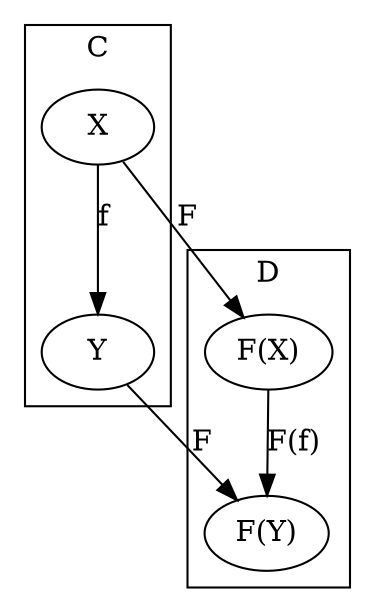

# [Definition](https://en.wikipedia.org/wiki/Functor#Definition)



# Code

## [Haskell](https://hackage.haskell.org/package/base-4.12.0.0/docs/src/GHC.Base.html#Functor)

```haskell
class  Functor f  where
    fmap  :: (a -> b) -> f a -> f b

    -- | Replace all locations in the input with the same value.
    -- The default definition is @'fmap' . 'const'@, but this may be
    -- overridden with a more efficient version.
    (<$) :: a -> f b -> f a
    (<$) =  fmap . const
```