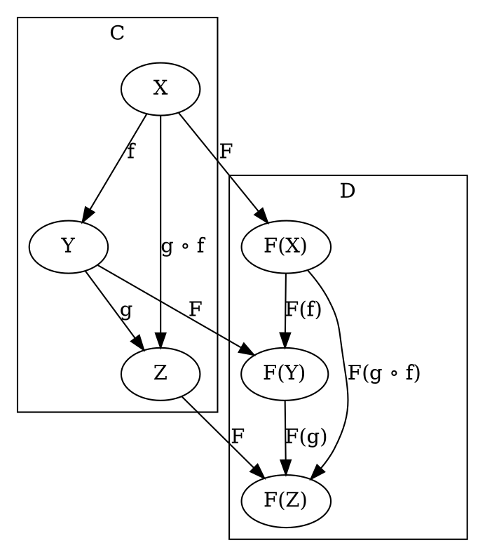

# [Definition](https://en.wikipedia.org/wiki/Functor#Definition)



// F(f) here is what we call fmap in Haskell
// in functional programming we view the F in F(X) as a container for X


```haskell
fmap :: (a -> b) -> (F a -> F b)
```

https://bartoszmilewski.com/2015/01/20/functors/

# Code

## [Haskell](https://hackage.haskell.org/package/base-4.12.0.0/docs/src/GHC.Base.html#Functor)

```haskell
class  Functor f  where
    fmap  :: (a -> b) -> f a -> f b

    -- | Replace all locations in the input with the same value.
    -- The default definition is @'fmap' . 'const'@, but this may be
    -- overridden with a more efficient version.
    (<$) :: a -> f b -> f a
    (<$) =  fmap . const
```

Faithful functor
Full functor
Forgetful functor

https://en.wikipedia.org/wiki/Functor#Examples

```graphviz
digraph G {
  "diagram" [href="Diagram"]
  "functor" -> "covariant functor"
  "functor" -> "contravariant functor"
  "covariant functor" -> "diagram" [href="https://en.wikipedia.org/wiki/Functor#Examples"]
  "presheaf" [href="presheaf"]
  "contravariant functor" -> "presheaf"
  "functor" -> "constant functor" [href="https://en.wikipedia.org/wiki/Functor#Examples"]
  "functor" -> "endofunctor" [href="https://en.wikipedia.org/wiki/Functor#Examples"]
  "functor" -> "comonoidal functor"
  "comonoidal functor" -> "monoidal functor" [dir="none", label="dual", href="https://en.wikipedia.org/wiki/Monoidal_functor"]
  "polynomial functor" [href="https://en.wikipedia.org/wiki/Polynomial_functor"]
  "monoidal functor" [href="https://en.wikipedia.org/wiki/Monoidal_functor"]
  "functor" -> "monoidal functor" [label="between monoidal categories\nwhich preserve the monoidal structure", href="https://en.wikipedia.org/wiki/Monoidal_functor"]
  "monoidal functor" -> "lax monoidal functor" [href="https://en.wikipedia.org/wiki/Monoidal_functor"]
  "monoidal functor" -> "strong monoidal functor" [label="coherence maps\nare invertible", href="https://en.wikipedia.org/wiki/Monoidal_functor"]
  "monoidal functor" -> "strict monoidal functor" [label="coherence maps\nare identity maps", href="https://en.wikipedia.org/wiki/Monoidal_functor"]
  "braided monoidal functor" -> "symmetric monoidal functor"
  "endofunctor" -> "lax monoidal functor"
  "lax monoidal functor" -> "applicative" [dir="both"]
  "lax monoidal functor" -> "monad"
  "endofunctor" -> "polynomial functor" [href="https://en.wikipedia.org/wiki/Functor#Examples"]
  "functor" -> "identity functor" [label="maps an object to itself\nand a morphism to itself", href="https://en.wikipedia.org/wiki/Functor#Examples"]
  "diagonal functor" [href="https://en.wikipedia.org/wiki/Diagonal_functor"]
  "functor" -> "diagonal functor" [label="sends each object in D\nto the constant functor\nat that object", href="https://en.wikipedia.org/wiki/Functor#Examples"]
  "functor" -> "limit functor" [label="assigns to each functor its limit", href="https://en.wikipedia.org/wiki/Functor#Examples"]
  "functor" -> "power set functor" [href="https://en.wikipedia.org/wiki/Functor#Examples"]
  "contravariant functor" -> "dual space functor" [label="assigns to every vector space\nits dual space and\nto every linear map its dual", href="https://en.wikipedia.org/wiki/Functor#Examples"]
  "functor" -> "group action" [href="https://en.wikipedia.org/wiki/Functor#Examples"]
  "functor" -> "Lie group - Lie algebra" [href="https://en.wikipedia.org/wiki/Functor#Examples"]
  "covariant functor" -> "tensor product" [href="https://en.wikipedia.org/wiki/Functor#Examples"]
  "functor" -> "forgetful functor" [label="\"forget\" some structure", href="https://en.wikipedia.org/wiki/Functor#Examples"]
  "functor" -> "free functor" [href="https://en.wikipedia.org/wiki/Functor#Examples"]
  "functor" -> "representable functor" [href="https://en.wikipedia.org/wiki/Functor#Examples"]
  "functor" -> "adjoint functor"
}

```
