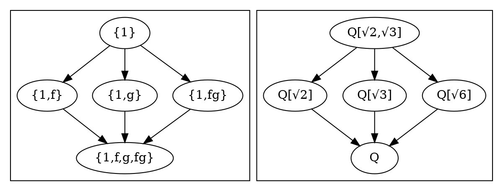
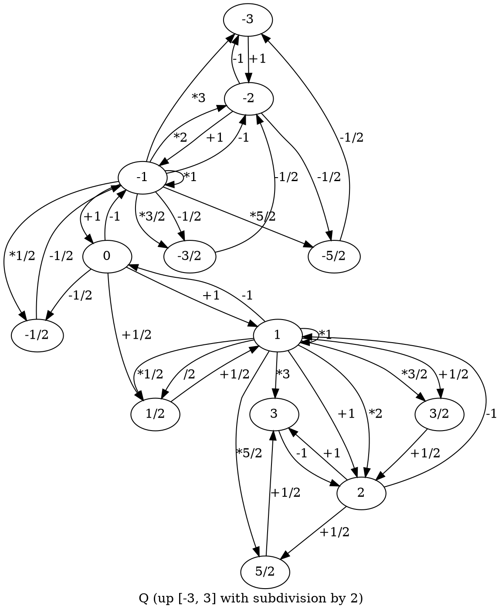
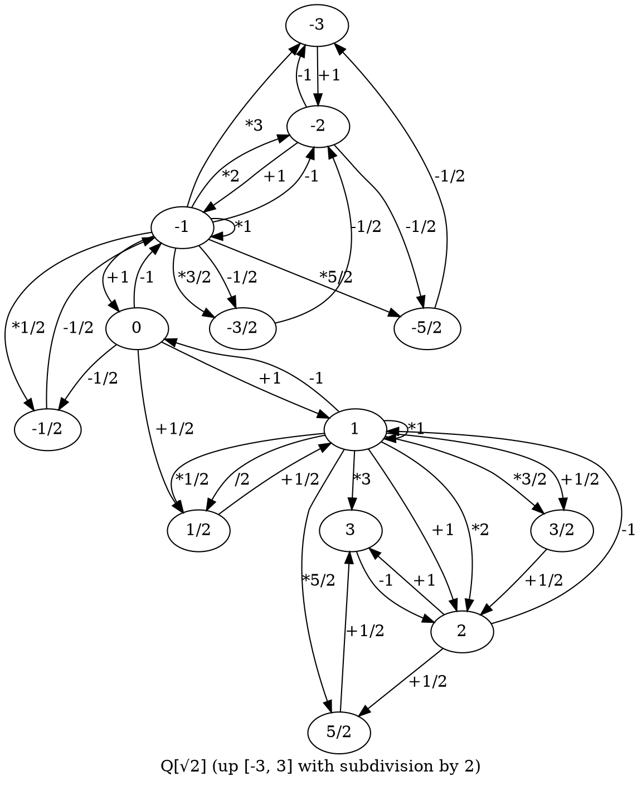

```graphviz
digraph G {
  subgraph clusterGroup {
    "{1}"
    "{1,f}"
    "{1,g}"
    "{1,fg}"
    "{1,f,g,fg}"

    "{1}" -> "{1,f}"
    "{1}" -> "{1,g}"
    "{1}" -> "{1,fg}"
    "{1,f}" -> "{1,f,g,fg}"
    "{1,g}" -> "{1,f,g,fg}"
    "{1,fg}" -> "{1,f,g,fg}"
  }

  subgraph clusterField {
    "Q[√2,√3]"
    "Q[√2]"
    "Q[√3]"
    "Q[√6]"
    "Q"

    "Q[√2,√3]" -> "Q[√2]"
    "Q[√2,√3]" -> "Q[√3]"
    "Q[√2,√3]" -> "Q[√6]"
    
    "Q[√2]" -> "Q"
    "Q[√3]" -> "Q"
    "Q[√6]" -> "Q"
  }
}
```

```graphviz
digraph G {
  label="Q (up [-3, 3] with subdivision by 2)"

  "-3"
  "-5/2"
  "-2"
  "-3/2"
  "-1"
  "-1/2"
  "0"
  "1/2"
  "1"
  "3/2"
  "2"
  "5/2"
  "3"

  "0" -> "-1/2" [label="-1/2"]
  "-1/2" -> "-1" [label="-1/2"]
  "-1" -> "-3/2" [label="-1/2"]
  "-3/2" -> "-2" [label="-1/2"]
  "-2" -> "-5/2" [label="-1/2"]
  "-5/2" -> "-3" [label="-1/2"]

  "-2" -> "-3" [label="-1"]
  "-1" -> "-2" [label="-1"]
  "0" -> "-1" [label="-1"]

  "-1" -> "-1" [label="*1"]
  "-1" -> "-1/2" [label="*1/2"]
  "-1" -> "-2" [label="*2"]
  "-1" -> "-3/2" [label="*3/2"]
  "-1" -> "-3" [label="*3"]
  "-1" -> "-5/2" [label="*5/2"]

  "-3" -> "-2" [label="+1"]
  "-2" -> "-1" [label="+1"]
  "-1" -> "0" [label="+1"]

  "0" -> "1" [label="+1"]
  "1" -> "2" [label="+1"]
  "2" -> "3" [label="+1"]

  "1" -> "0" [label="-1"]
  "2" -> "1" [label="-1"]
  "3" -> "2" [label="-1"]

  "1" -> "1" [label="*1"]
  "1" -> "1/2" [label="*1/2"]
  "1" -> "2" [label="*2"]
  "1" -> "3/2" [label="*3/2"]
  "1" -> "3" [label="*3"]
  "1" -> "5/2" [label="*5/2"]

  "0" -> "1/2" [label="+1/2"]
  "1/2" -> "1" [label="+1/2"]
  "1" -> "3/2" [label="+1/2"]
  "3/2" -> "2" [label="+1/2"]
  "2" -> "5/2" [label="+1/2"]
  "5/2" -> "3" [label="+1/2"]

  "1" -> "1/2" [label="/2"]
}
```

```graphviz
digraph G {
  label="Q[√2] (up [-3, 3] with subdivision by 2)"

  // TODO add linear combination with √2
  "-3"
  "-5/2"
  "-2"
  "-3/2"
  "-1"
  "-1/2"
  "0"
  "1/2"
  "1"
  "3/2"
  "2"
  "5/2"
  "3"

  "0" -> "-1/2" [label="-1/2"]
  "-1/2" -> "-1" [label="-1/2"]
  "-1" -> "-3/2" [label="-1/2"]
  "-3/2" -> "-2" [label="-1/2"]
  "-2" -> "-5/2" [label="-1/2"]
  "-5/2" -> "-3" [label="-1/2"]

  "-2" -> "-3" [label="-1"]
  "-1" -> "-2" [label="-1"]
  "0" -> "-1" [label="-1"]

  "-1" -> "-1" [label="*1"]
  "-1" -> "-1/2" [label="*1/2"]
  "-1" -> "-2" [label="*2"]
  "-1" -> "-3/2" [label="*3/2"]
  "-1" -> "-3" [label="*3"]
  "-1" -> "-5/2" [label="*5/2"]

  "-3" -> "-2" [label="+1"]
  "-2" -> "-1" [label="+1"]
  "-1" -> "0" [label="+1"]

  "0" -> "1" [label="+1"]
  "1" -> "2" [label="+1"]
  "2" -> "3" [label="+1"]

  "1" -> "0" [label="-1"]
  "2" -> "1" [label="-1"]
  "3" -> "2" [label="-1"]

  "1" -> "1" [label="*1"]
  "1" -> "1/2" [label="*1/2"]
  "1" -> "2" [label="*2"]
  "1" -> "3/2" [label="*3/2"]
  "1" -> "3" [label="*3"]
  "1" -> "5/2" [label="*5/2"]

  "0" -> "1/2" [label="+1/2"]
  "1/2" -> "1" [label="+1/2"]
  "1" -> "3/2" [label="+1/2"]
  "3/2" -> "2" [label="+1/2"]
  "2" -> "5/2" [label="+1/2"]
  "5/2" -> "3" [label="+1/2"]

  "1" -> "1/2" [label="/2"]
}
```