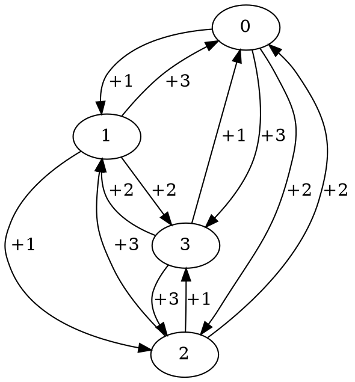

## 4 elements

```graphviz
digraph G {
  "0"
  "1"
  "2"
  "3"

  "0" -> "1" [label="+1"]
  "1" -> "2" [label="+1"]
  "2" -> "3" [label="+1"]
  "3" -> "0" [label="+1"]

  "0" -> "2" [label="+2"]
  "1" -> "3" [label="+2"]
  "2" -> "0" [label="+2"]
  "3" -> "1" [label="+2"]

  "0" -> "3" [label="+3"]
  "1" -> "0" [label="+3"]
  "2" -> "1" [label="+3"]
  "3" -> "2" [label="+3"]
}
```