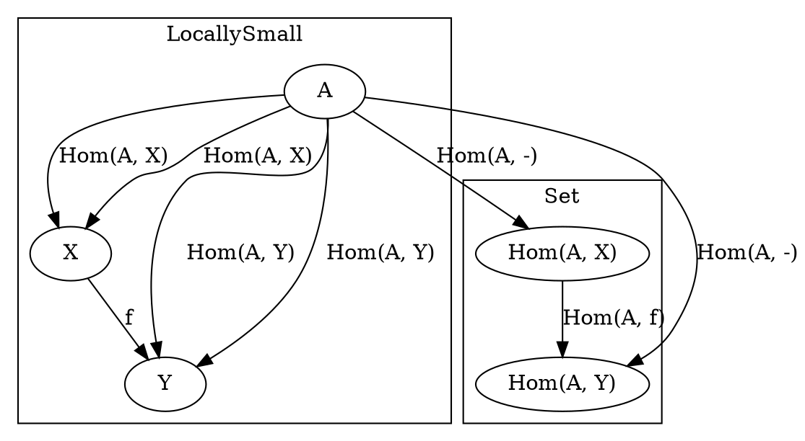

# [Definition](https://en.wikipedia.org/wiki/Hom_functor#Formal_definition)

<!-- Hom(A,–) : C → Set -->

### Object level

```graphviz
digraph G {
  subgraph clusterLocallySmall {
    label="LocallySmall"

    "A"
    "X"
    "Y"
  }

  subgraph clusterSet {
    label="Set"

    "Hom(A, X)"
    "Hom(A, Y)"
  }

  "X" -> "Y" [label="f"]
  "A" -> "X" [label="Hom(A, X)"]
  "A" -> "X" [label="Hom(A, X)"]
  "A" -> "Y" [label="Hom(A, Y)"]
  "A" -> "Y" [label="Hom(A, Y)"]

  "A" -> "Hom(A, X)" [label="Hom(A, -)"]
  "A" -> "Hom(A, Y)" [label="Hom(A, -)"]

  "Hom(A, X)" -> "Hom(A, Y)" [label="Hom(A, f)"]
}
```