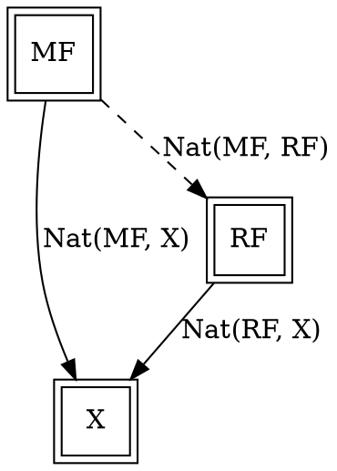
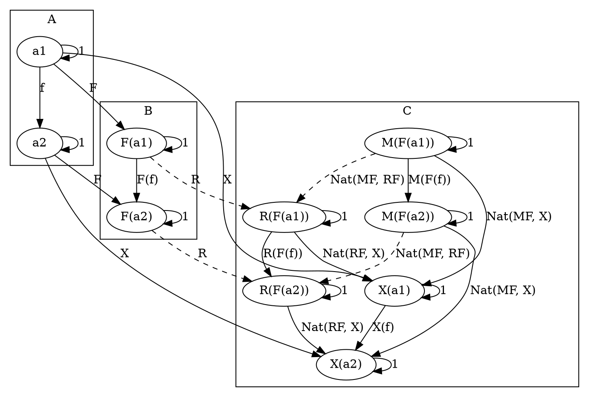
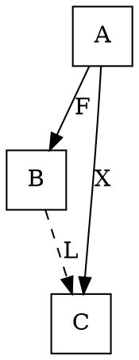
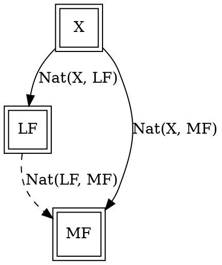
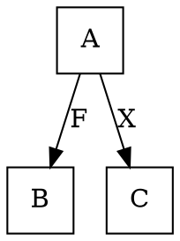
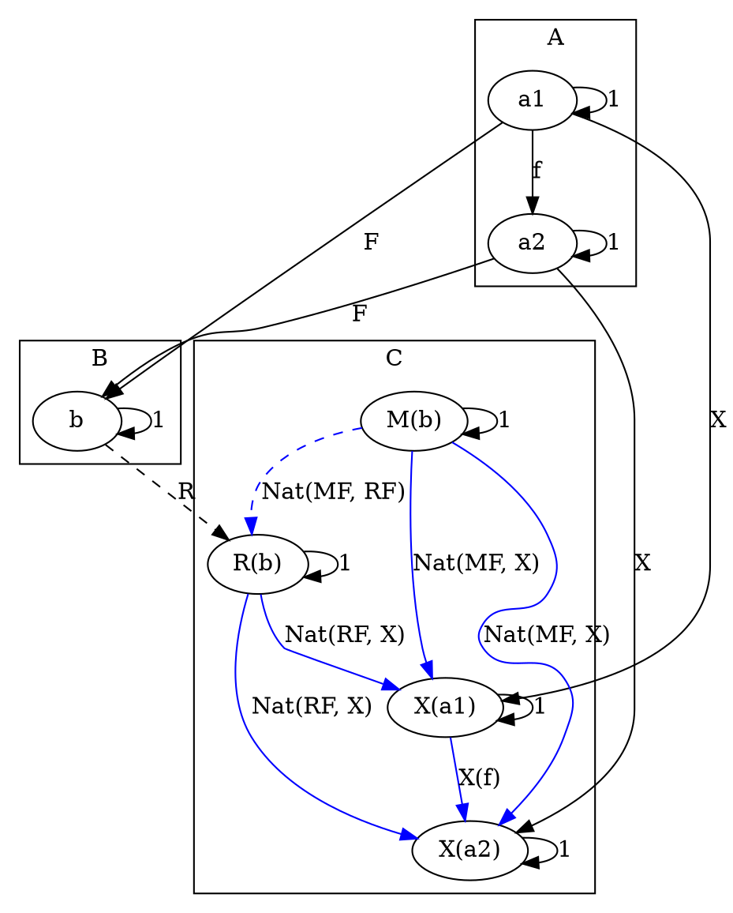
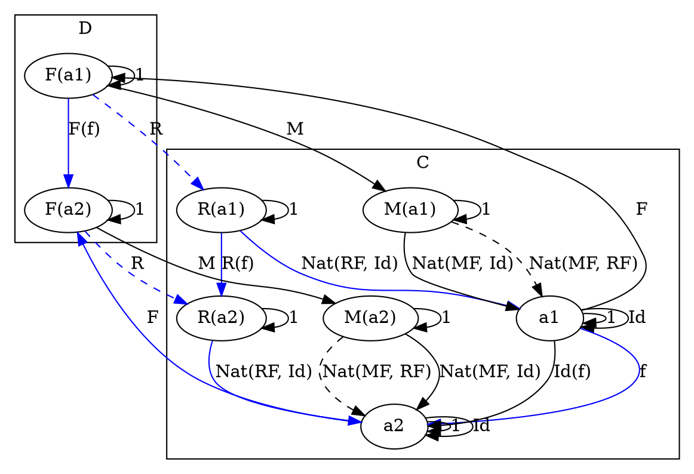

# Right Kan Extension

## [Definition](https://en.wikipedia.org/wiki/Kan_extension#Definition)

Right Kan Extension of X along F

### Category level


### Functor level



### Object level



## Code

### [Haskell](https://hackage.haskell.org/package/kan-extensions-5.2/docs/src/Data.Functor.Kan.Ran.html#Ran)

```haskell
newtype Ran g h a =
  Ran {
    runRan ::
      forall b.
        (a -> g b) ->
          h b
  }
```

# Left Kan Extension

## [Definition](https://en.wikipedia.org/wiki/Kan_extension#Definition)

### Category level



### Functor level



### Object level

```graphviz
digraph G {
  subgraph clusterA {
    label="A"

    "a1"
    "a2"
  }

  subgraph clusterB {
    label="B"

    "F(a1)"
    "F(a2)"
  }

  subgraph clusterC {
    label="C"

    "L(F(a1))"
    "L(F(a2))"

    "X(a1)"
    "X(a2)"

    "M(F(a1))"
    "M(F(a2))"
  }

  "a1" -> "a1" [label="1"]
  "a2" -> "a2" [label="1"]
  "F(a1)" -> "F(a1)" [label="1"]
  "F(a2)" -> "F(a2)" [label="1"]
  "L(F(a1))" -> "L(F(a1))" [label="1"]
  "L(F(a2))" -> "L(F(a2))" [label="1"]
  "X(a1)" -> "X(a1)" [label="1"]
  "X(a2)" -> "X(a2)" [label="1"]
  "M(F(a1))" -> "M(F(a1))" [label="1"]
  "M(F(a2))" -> "M(F(a2))" [label="1"]

  "a1" -> "a2" [label="f"]
  "F(a1)" -> "F(a2)" [label="F(f)"]
  "L(F(a1))" -> "L(F(a2))" [label="L(F(f))"]

  "a1" -> "F(a1)" [label="F"]
  "a2" -> "F(a2)" [label="F"]

  "a1" -> "X(a1)" [label="X"]
  "a2" -> "X(a2)" [label="X"]

  "X(a1)" -> "X(a2)" [label="X(f)"]

  "F(a1)" -> "L(F(a1))" [label="L", style="dashed"]
  "F(a2)" -> "L(F(a2))" [label="L", style="dashed"]


  "X(a1)" -> "L(F(a1))" [label="Nat(X, LF)"]
  "X(a2)" -> "L(F(a2))" [label="Nat(X, LF)"]

  "X(a1)" -> "M(F(a1))" [label="Nat(X, MF)"]
  "X(a2)" -> "M(F(a2))" [label="Nat(X, MF)"]

  "M(F(a1))" -> "M(F(a2))" [label="M(F(f))"]

  "L(F(a1))" -> "M(F(a1))" [label="Nat(LF, MF)", style="dashed"]
  "L(F(a2))" -> "M(F(a2))" [label="Nat(LF, MF)", style="dashed"]
}

## Code

### [Haskell](https://hackage.haskell.org/package/kan-extensions-5.2/docs/src/Data.Functor.Kan.Ran.html#Ran)

```haskell
data Lan g h a where
  Lan ::
    (g b -> a) ->
      h b ->
        Lan g h a
```

# [Properties](https://en.wikipedia.org/wiki/Kan_extension#Properties)

## [Kan extensions as (co)limits](https://en.wikipedia.org/wiki/Kan_extension#Kan_extensions_as_(co)limits)

Right Kan extension <-> limit

https://bartoszmilewski.com/2017/04/17/kan-extensions/

### Category level



complete category (a category in which all small limits exist)

```
If A is small
 and C is complete,
  then there exists a left Kan extension Lan_FX of X along F,
   defined at each object b of B
    Lan_FX(b) = colim X(a)
                f: Fa -> b
```

### Object level



## [Kan extensions as (co)ends](https://en.wikipedia.org/wiki/Kan_extension#Kan_extensions_as_(co)ends)

## [Limits as Kan extensions](https://en.wikipedia.org/wiki/Kan_extension#Limits_as_Kan_extensions)

## [Adjoints as Kan extensions](https://en.wikipedia.org/wiki/Kan_extension#Adjoints_as_Kan_extensions)

```
A functor F: C -> D
  possesses a left adjoint
    if and only if the right Kan extension of Id :C -> C along F exists
      and is preserved by F
```

// R is the left adjoint of F


### Object level


