# Right Kan Extension

## [Definition](https://en.wikipedia.org/wiki/Kan_extension#Definition)

Right Kan Extension of X along F

TODO start with motivation from limits described here
https://bartoszmilewski.com/2017/04/17/kan-extensions/

[limit](./limit.md)

### Category level

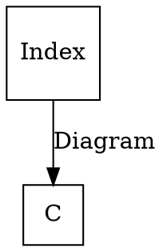

### Object level

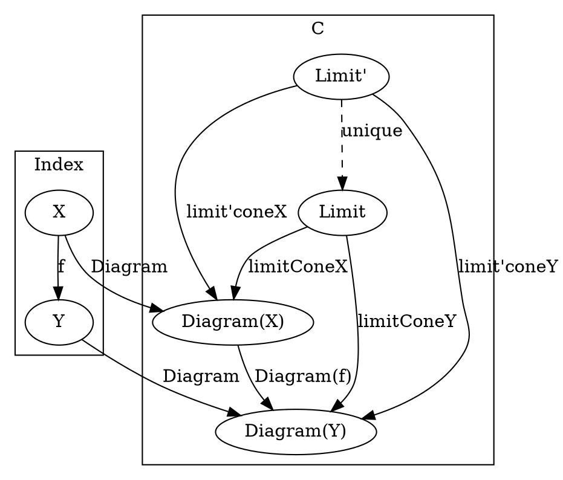

Let’s define a limit using three categories. Let’s start with the functor D from the index category I to C. This is the functor that selects the base of the cone — the diagram functor

### Category level

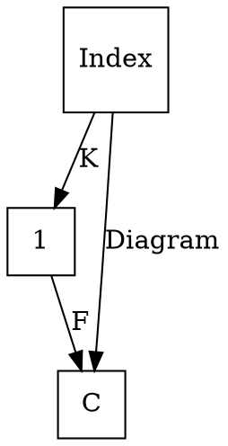

### Object level

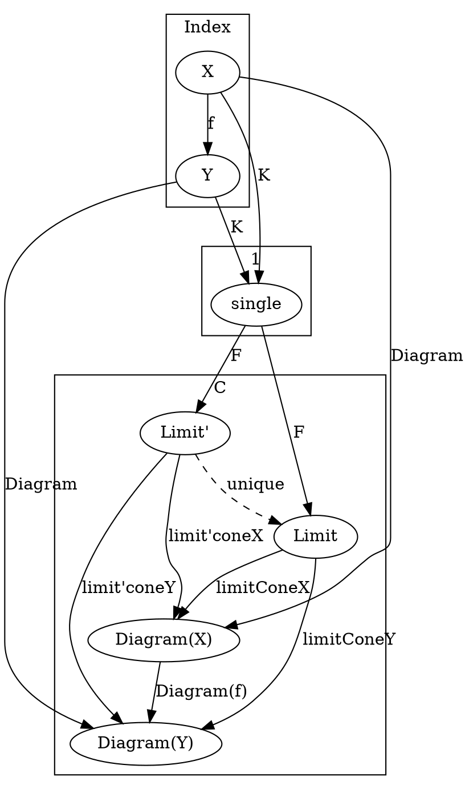

A cone is a natural transformation ε from F ∘ K to D. Notice that F ∘ K does exactly the same thing as our original Δc

// Now we can generalize so that our intermediate Category is no longer 1


### Category level


### Functor level

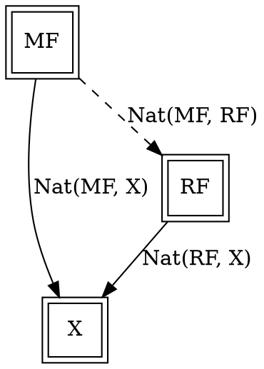

### Object level

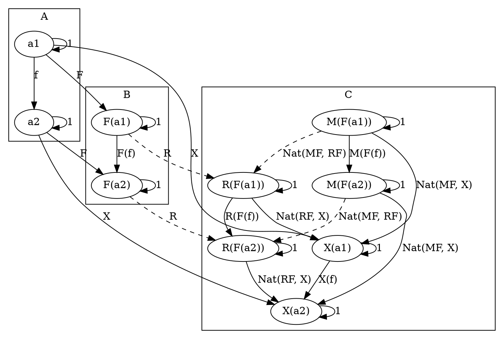

## Code

### [Haskell](https://hackage.haskell.org/package/kan-extensions-5.2/docs/src/Data.Functor.Kan.Ran.html#Ran)

The end/coend formulas for Kan extensions can be easily translated to Haskell. Let’s start with the right extension:

RanKD a ≅ ∫i Set(A(a, K i), D i)
We replace the end with the universal quantifier, and hom-sets with function types:

newtype Ran k d a = Ran (forall i. (a -> k i) -> d i)

```haskell
newtype Ran g h a =
  Ran {
    runRan ::
      forall b.
        (a -> g b) ->
          h b
  }
```

# Applications

right

https://bartoszmilewski.com/2017/04/17/kan-extensions/
For instance, suppose that k is the tree functor,
  and d is the list functor,
    and you were given a Ran Tree [] String.
      If you pass it a function:
        f :: String -> Tree Int
          you’ll get back a list of Int, and so on
            The right Kan extension will use your function
              to produce a tree
                and then repackage it into a list
                  For instance, you may pass it a parser
                    that generates a parsing tree from a string,
                      and you’ll get a list that corresponds to the depth-first traversal of this tree

https://bartoszmilewski.com/2017/04/17/kan-extensions/
The right Kan extension
  can be used to calculate the left adjoint of a given functor
    by replacing the functor d
      with the identity functor
        This leads to the left adjoint of a functor k
          being represented by the set of polymorphic functions of the type:
            forall i. (a -> k i) -> i
              Suppose that k is the forgetful functor from the category of monoids
                The universal quantifier then goes over all monoids
                  Of course, in Haskell we cannot express monoidal laws,
                    but the following is a decent approximation of the resulting free functor (the forgetful functor k is an identity on objects):
                      type Lst a = forall i. Monoid i => (a -> i) -> i
                        As expected, it generates free monoids, or Haskell lists:
                          toLst :: [a] -> Lst a
                          toLst as = \f -> foldMap f as
                            
                          fromLst :: Lst a -> [a]
                          fromLst f = f (\a -> [a])

https://bartoszmilewski.com/2017/04/17/kan-extensions/
An interesting application of Kan extensions is the construction of a free functor
  It’s the solution to the following practical problem: suppose you have a type constructor — that is a mapping of objects
    Is it possible to define a functor based on this type constructor?
      In other words, can we define a mapping of morphisms that would extend this type constructor to a full-blown endofunctor?
        The key observation is that a type constructor can be described as a functor whose domain is a discrete category
          A discrete category has no morphisms other than the identity morphisms
             Given a category C, we can always construct a discrete category |C| by simply discarding all non-identity morphisms
              A functor F from |C| to C is then a simple mapping of objects, or what we call a type constructor in Haskell
                There is also a canonical functor J that injects |C| into C: it’s an identity on objects (and on identity morphisms)
                  The left Kan extension of F along J, if it exists, is then a functor for C to C:
                    LanJ F a = ∫i C(J i, a) × F i
                      It’s called a free functor based on F.
                        In Haskell, we would write it as:
                          data FreeF f a = forall i. FMap (i -> a) (f i)
                            Indeed, for any type constructor f, FreeF f is a functor
                              instance Functor (FreeF f) where
                                fmap g (FMap h fi) = FMap (g . h) fi
                                  As you can see, the free functor fakes the lifting of a function by recording both the function and its argument.
                                    It accumulates the lifted functions by recording their composition. Functor rules are automatically satisfied
                                      This construction was used in a paper Freer Monads, More Extensible Effects.

https://bartoszmilewski.com/2017/04/17/kan-extensions/
The right Kan extension of a functor along itself, K/K, is called a codensity monad.

http://comonad.com/reader/2008/kan-extensions/
This looks an awful lot like the type of a continuation monad transformer:
  newtype ContT r m a = ContT
          { runContT :: (a -> m r) -> m r }
    The main difference is that we have two functors involved and that the body of the Kan extension is universally quantified over the value it contains, so the function it carries can't just hand you back an m r it has lying around unless the functor it has closed over doesn't depend at all on the type r.
      Interestingly we can define an instance of Functor for a right Kan extension without even knowing that g or h are functors! Anything of kind * -> * will do.
        instance Functor (Ran g h) where
                fmap f m = Ran (\\k -> runRan m (k . f))

http://comonad.com/reader/2008/kan-extensions/
We can take the right Kan extension of a functor f along itself (this works for any functor in Haskell) and get what is known as the monad generated by f or the codensity monad of f: 
  instance Monad (Ran f f) where
    return x = Ran (\\k -> k x)
    m >>= k = Ran (\\c -> runRan m (\\a -> runRan (k a) c))
      This monad is mentioned in passing in Opmonoidal Monads by Paddy McCrudden and dates back further to Ross Street's "The formal theory of monads" from 1972. The term codensity seems to date back at least to Dubuc's thesis in 1974.
        Again, this monad doesn't care one whit about the fact that f is a Functor in the Haskell sense.
          This monad provides a useful opportunity for optimization. For instance Janis Voigtländer noted in Asymptotic improvement of functions over Free Monads that a particular monad could be used to improve performance -- Free monads as you'll recall are the tool used in Wouter Sweirstra's Data Types á la Carte, and provide an approach for, among other things, decomposing the IO monad into something more modular, so this is by no means a purely academic exercise!

http://comonad.com/reader/2008/kan-extensions/
Dan Piponi posted a bit about the Yoneda lemma a couple of years back, which ended with the observation that the Yoneda lemma says that check and uncheck are inverses: 
  > check :: Functor f => f a -> (forall b . (a -> b) -> f b)
  > check a f = fmap f a
  
  > uncheck :: (forall b . (a -> b) -> f b) -> f a
  > uncheck t = t id 
    We can see that this definition for a right Kan extension just boxes up that universal quantifier in a newtype and that we could instantiate: 
      > type Yoneda = Ran Identity 
        and we can define check and uncheck as:
          check' :: Functor f => f a -> Yoneda f a
          check' a = Ran (\\f -> fmap (runIdentity . f) a)
          
          uncheck' :: Yoneda f a -> f a
          uncheck' t = runRan t Identity

http://comonad.com/reader/2008/kan-extensions/
We can go on and define categorical limits in terms of right Kan extensions using the Trivial functor that maps everything to a category with a single value and function. In Haskell, this is best expressed by:
  data Trivial a = Trivial
  instance Functor Trivial where
          fmap f _ = Trivial
  trivialize :: a -> Trivial b
  trivialize _ = Trivial
    type Lim = Ran Trivial
      Now, in Haskell, this gives us a clear operational understanding of categorical limits.
        Lim f a ~ forall b. (a -> Trivial b) -> f b
          This says that we can't use any information of the value a we supply, or given by the function (a -> Trivial b) when constructing f b, but we have to be able to define an f b for any type b requested. However, we have no way to get any b to plug into the functor! So the only (non-cheating) member of Lim Maybe a is Nothing, of Lim [] a is [], etc.

left

https://bartoszmilewski.com/2017/04/17/kan-extensions/
The left Kan extension is a coend
  LanKD a = ∫i A(K i, a) × D i
    so it translates to an existential quantifier. Symbolically:
      Lan k d a = exists i. (k i -> a, d i)
        This can be encoded in Haskell using GADTs, or using a universally quantified data constructor:
          data Lan k d a = forall i. Lan (k i -> a) (d i)
            The interpretation of this data structure is that it contains a function that takes a container of some unspecified `i`s and produces an `a`.
              It also has a container of those `i`s
                Since you have no idea what `i`s are, the only thing you can do with this data structure is to retrieve the container of `i`s, repack it into the container defined by the functor k using a natural transformation, and call the function to obtain the `a`
                  For instance, if d is a tree, and k is a list, you can serialize the tree, call the function with the resulting list, and obtain an a

https://bartoszmilewski.com/2017/04/17/kan-extensions/
The left Kan extension can be used to calculate the right adjoint of a functor
  We know that the right adjoint of the product functor is the exponential, so let’s try to implement it using the Kan extension:
    type Exp a b = Lan ((,) a) I b
      This is indeed isomorphic to the function type, as witnessed by the following pair of functions:
        toExp :: (a -> b) -> Exp a b
        toExp f = Lan (f . fst) (I ())

        fromExp :: Exp a b -> (a -> b)
        fromExp (Lan f (I x)) = \a -> f (a, x)
          Notice that, as described earlier in the general case, we performed the following steps:
            (1) retrieved the container of x (here, it’s just a trivial identity container), and the function f
            (2) repackaged the container using the natural transformation between the identity functor and the pair functor, and (3) called the function f.


https://books.google.ca/books?id=Q8q6BQAAQBAJ&pg=PA357&lpg=PA357&dq=daniel+kan+on+kan+extension&source=bl&ots=h6F-mak6EK&sig=ACfU3U0_OEglMb9oUPAhRrScfToo8FGkEg&hl=en&sa=X&ved=2ahUKEwjCyL3Qj-PoAhXEQs0KHfqzB4QQ6AEwBnoECAsQKQ#v=onepage&q=daniel%20kan%20on%20kan%20extension&f=false
Kan extensions have found a few applications in computer science:
  right Kan extensions have been used to
    give a semantics to
      generalised folds for nested datatypes;
  left Kan extensions have been used to
    provide an initial algebra semantics for
      certain "generalised algebraic datatypes"

http://comonad.com/reader/2008/kan-extensions/
Left Kan extensions are a bit more obscure to a Haskell programmer, because where right Kan extensions relate to the well-known ContT monad transformer, the left Kan extension is related to a less well known comonad transformer.
  First, the a Haskell type for the Left Kan extension of h along g: 
    data Lan g h a = forall b. Lan (g b -> a) (h b) 
      This is related to the admittedly somewhat obscure state-in-context comonad transformer, which I constructed for category-extras.
        newtype ContextT s w a = ContextT
                { runContextT :: (w s -> a, w s) } 
          However, the left Kan extension provides no information about the type b contained inside of its h functor and g and h are not necessarily the same functor.
            As before we get that Lan g h is a Functor regardless of what g and h are, because we only have to map over the right hand side of the contained function:
              instance Functor (Lan f g) where
                fmap f (Lan g h) = Lan (f . g) h

http://comonad.com/reader/2008/kan-extensions/
The comonad generated by a functor
  We can also see that the left Kan extension of any functor f along itself is a comonad, even if f is not a Haskell Functor. This is of course known as the comonad generated by f, or the density comonad of f.
    instance Comonad (Lan f f) where
      extract (Lan f a) = f a
      duplicate (Lan f ws) = Lan (Lan f) ws

http://comonad.com/reader/2008/kan-extensions/
Colimits
  Finally we can derive colimits, by:
    type Colim = Lan Trivial 
      then Colim f a ~ exists b. (Trivial b -> a, f b), and we can see that operationally, we have an f of some unknown type b and for all intents and purposes a value of type a since we can generate a Trivial b from thin air, so while limits allow only structures without values, colimits allow arbitrary structures, but keep you from inspecting the values in them by existential quantification. So for instance you could apply a length function to a Colim [] a, but not add up its values.
        You can also build up a covariant analog of the traditional Yoneda lemma using Lan Identity, but I leave that as an exercise for the reader.

# Left Kan Extension

## [Definition](https://en.wikipedia.org/wiki/Kan_extension#Definition)

### Category level

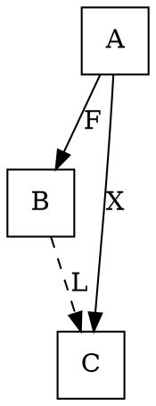

### Functor level

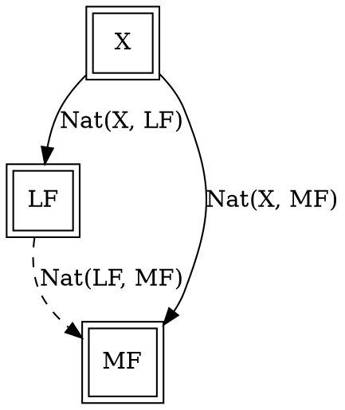

### Object level

```graphviz
digraph G {
  subgraph clusterA {
    label="A"

    "a1"
    "a2"
  }

  subgraph clusterB {
    label="B"

    "F(a1)"
    "F(a2)"
  }

  subgraph clusterC {
    label="C"

    "L(F(a1))"
    "L(F(a2))"

    "X(a1)"
    "X(a2)"

    "M(F(a1))"
    "M(F(a2))"
  }

  "a1" -> "a1" [label="1"]
  "a2" -> "a2" [label="1"]
  "F(a1)" -> "F(a1)" [label="1"]
  "F(a2)" -> "F(a2)" [label="1"]
  "L(F(a1))" -> "L(F(a1))" [label="1"]
  "L(F(a2))" -> "L(F(a2))" [label="1"]
  "X(a1)" -> "X(a1)" [label="1"]
  "X(a2)" -> "X(a2)" [label="1"]
  "M(F(a1))" -> "M(F(a1))" [label="1"]
  "M(F(a2))" -> "M(F(a2))" [label="1"]

  "a1" -> "a2" [label="f"]
  "F(a1)" -> "F(a2)" [label="F(f)"]
  "L(F(a1))" -> "L(F(a2))" [label="L(F(f))"]

  "a1" -> "F(a1)" [label="F"]
  "a2" -> "F(a2)" [label="F"]

  "a1" -> "X(a1)" [label="X"]
  "a2" -> "X(a2)" [label="X"]

  "X(a1)" -> "X(a2)" [label="X(f)"]

  "F(a1)" -> "L(F(a1))" [label="L", style="dashed"]
  "F(a2)" -> "L(F(a2))" [label="L", style="dashed"]


  "X(a1)" -> "L(F(a1))" [label="Nat(X, LF)"]
  "X(a2)" -> "L(F(a2))" [label="Nat(X, LF)"]

  "X(a1)" -> "M(F(a1))" [label="Nat(X, MF)"]
  "X(a2)" -> "M(F(a2))" [label="Nat(X, MF)"]

  "M(F(a1))" -> "M(F(a2))" [label="M(F(f))"]

  "L(F(a1))" -> "M(F(a1))" [label="Nat(LF, MF)", style="dashed"]
  "L(F(a2))" -> "M(F(a2))" [label="Nat(LF, MF)", style="dashed"]
}

## Code

### [Haskell](https://hackage.haskell.org/package/kan-extensions-5.2/docs/src/Data.Functor.Kan.Ran.html#Ran)

```haskell
data Lan g h a where
  Lan ::
    (g b -> a) ->
      h b ->
        Lan g h a
```

# [Properties](https://en.wikipedia.org/wiki/Kan_extension#Properties)

## [Kan extensions as (co)limits](https://en.wikipedia.org/wiki/Kan_extension#Kan_extensions_as_(co)limits)

Right Kan extension <-> limit

https://bartoszmilewski.com/2017/04/17/kan-extensions/

### Category level

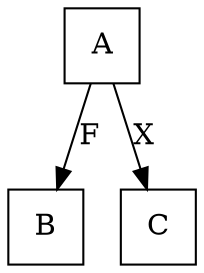

complete category (a category in which all small limits exist)

```
If A is small
 and C is complete,
  then there exists a left Kan extension Lan_FX of X along F,
   defined at each object b of B
    Lan_FX(b) = colim X(a)
                f: Fa -> b
```

### Object level

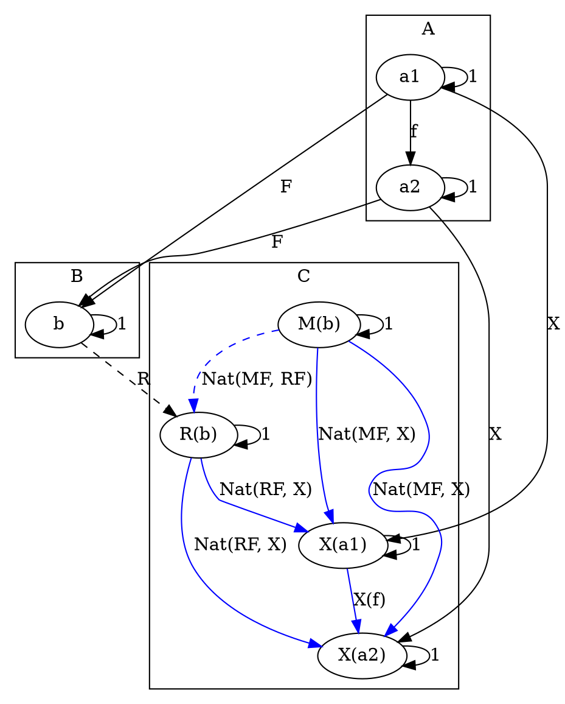

## [Kan extensions as (co)ends](https://en.wikipedia.org/wiki/Kan_extension#Kan_extensions_as_(co)ends)

https://bartoszmilewski.com/2017/04/17/kan-extensions/

### Object level

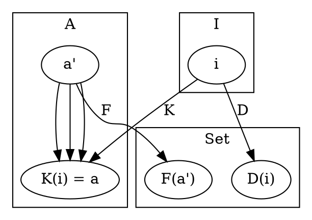

### Functor Category level

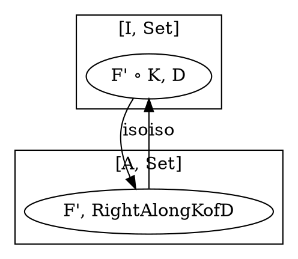

F' = A(a, -)

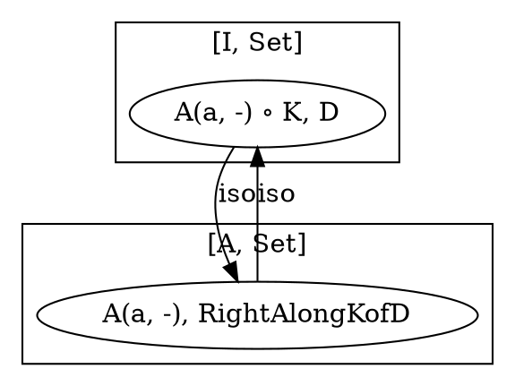

A(a, -) ∘ K = A(a, K(-))

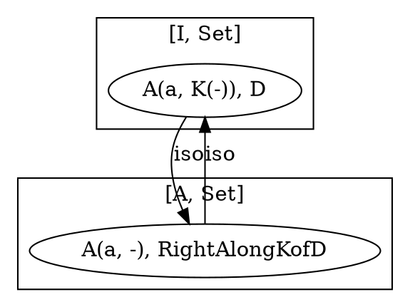

Yoneda

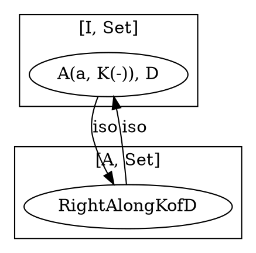

End definition

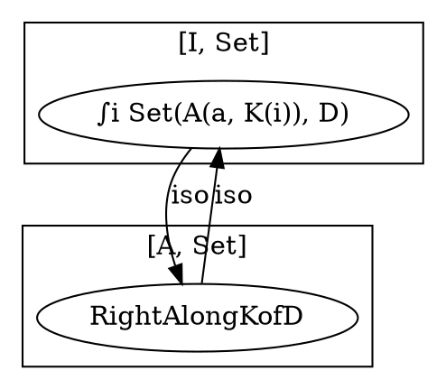

## [Limits as Kan extensions](https://en.wikipedia.org/wiki/Kan_extension#Limits_as_Kan_extensions)

## [Adjoints as Kan extensions](https://en.wikipedia.org/wiki/Kan_extension#Adjoints_as_Kan_extensions)

```
A functor F: C -> D
  possesses a left adjoint
    if and only if the right Kan extension of Id :C -> C along F exists
      and is preserved by F
```

// R is the left adjoint of F


### Object level


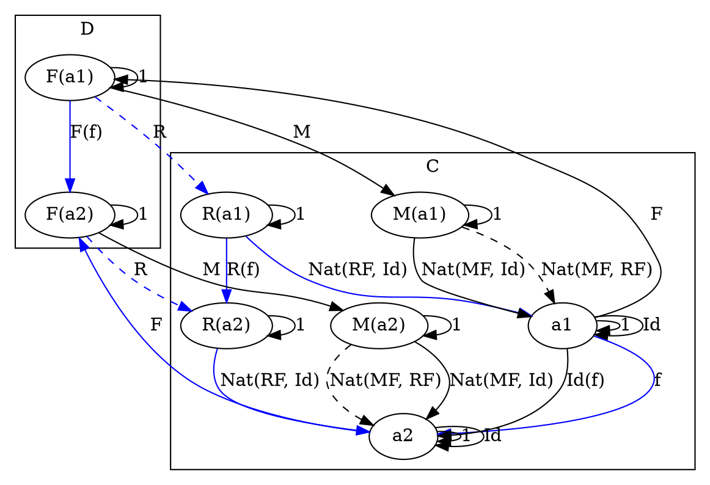

## [Kan Extension as Adjunction](https://bartoszmilewski.com/2017/04/17/kan-extensions/)