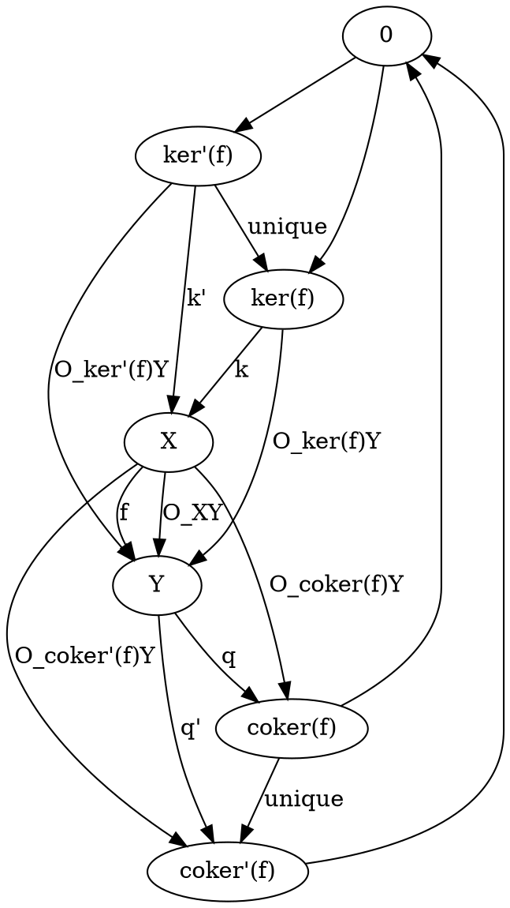

kernel as equalizer
cokernel as coequalizer

```graphviz
digraph G {
  "0" -> "ker(f)"
  "0" -> "ker'(f)"

  "coker(f)" -> "0"
  "coker(f)" -> "coker'(f)" [label="unique"]

  "coker'(f)" -> "0"

  "ker(f)" -> "X" [label="k"]
  "ker(f)" -> "Y" [label="O_ker(f)Y"]

  "ker'(f)" -> "X" [label="k'"]
  "ker'(f)" -> "ker(f)" [label="unique"]
  "ker'(f)" -> "Y" [label="O_ker'(f)Y"]

  "X" -> "coker(f)" [label="O_coker(f)Y"]
  "X" -> "Y" [label="f"]
  "X" -> "Y" [label="O_XY"]
  "X" -> "coker'(f)" [label="O_coker'(f)Y"]

  "Y" -> "coker(f)" [label="q"]
  "Y" -> "coker'(f)" [label="q'"]
}
```