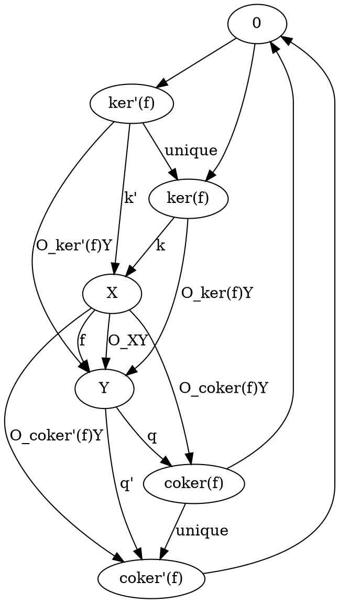
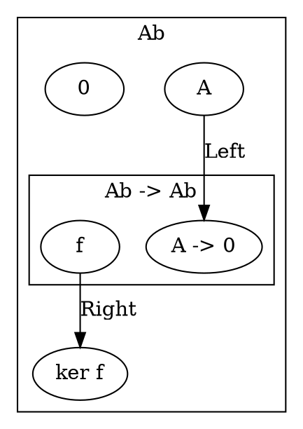

kernel as equalizer
cokernel as coequalizer

```graphviz
digraph G {
  "0" -> "ker(f)"
  "0" -> "ker'(f)"

  "coker(f)" -> "0"
  "coker(f)" -> "coker'(f)" [label="unique"]

  "coker'(f)" -> "0"

  "ker(f)" -> "X" [label="k"]
  "ker(f)" -> "Y" [label="O_ker(f)Y"]

  "ker'(f)" -> "X" [label="k'"]
  "ker'(f)" -> "ker(f)" [label="unique"]
  "ker'(f)" -> "Y" [label="O_ker'(f)Y"]

  "X" -> "coker(f)" [label="O_coker(f)Y"]
  "X" -> "Y" [label="f"]
  "X" -> "Y" [label="O_XY"]
  "X" -> "coker'(f)" [label="O_coker'(f)Y"]

  "Y" -> "coker(f)" [label="q"]
  "Y" -> "coker'(f)" [label="q'"]
}
```

kernel as right adjoint functor

```graphviz
digraph G {
  subgraph cluster_Ab {
    label="Ab"

    subgraph cluster_AbAb {
      label="Ab -> Ab"

      "A -> 0"
      "f"
    }
    
    "A"
    "0"
    "ker f"
  }

  "f" -> "ker f" [label="Right"]
  "A" -> "A -> 0" [label="Left"]
}
```
