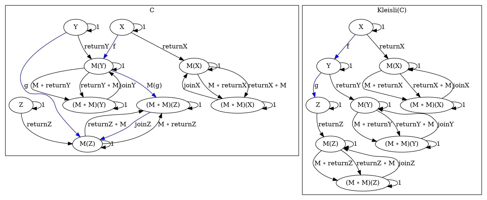

# [Definitions](https://en.m.wikipedia.org/wiki/Category_(mathematics))




# Code

## [Haskell](http://hackage.haskell.org/package/data-category-0.7.1/docs/src/Data.Category.Kleisli.html#Kleisli)

```haskell
data Kleisli m a b where
  Kleisli ::
    (Functor m, Dom m ~ k, Cod m ~ k) =>
      Monad m -> Obj k b -> k a (m :% b) -> Kleisli m a b

kleisliId ::
  (Functor m, Dom m ~ k, Cod m ~ k) =>
    Monad m -> Obj k a -> Kleisli m a a
kleisliId m a = Kleisli m a (unit m ! a)

-- | The category of Kleisli arrows.
instance Category (Kleisli m) where
  src (Kleisli m _ f) = kleisliId m (src f)
  tgt (Kleisli m b _) = kleisliId m b

  (Kleisli m c f) . (Kleisli _ _ g) = Kleisli m c ((multiply m ! c) . (monadFunctor m % f) . g)
```
