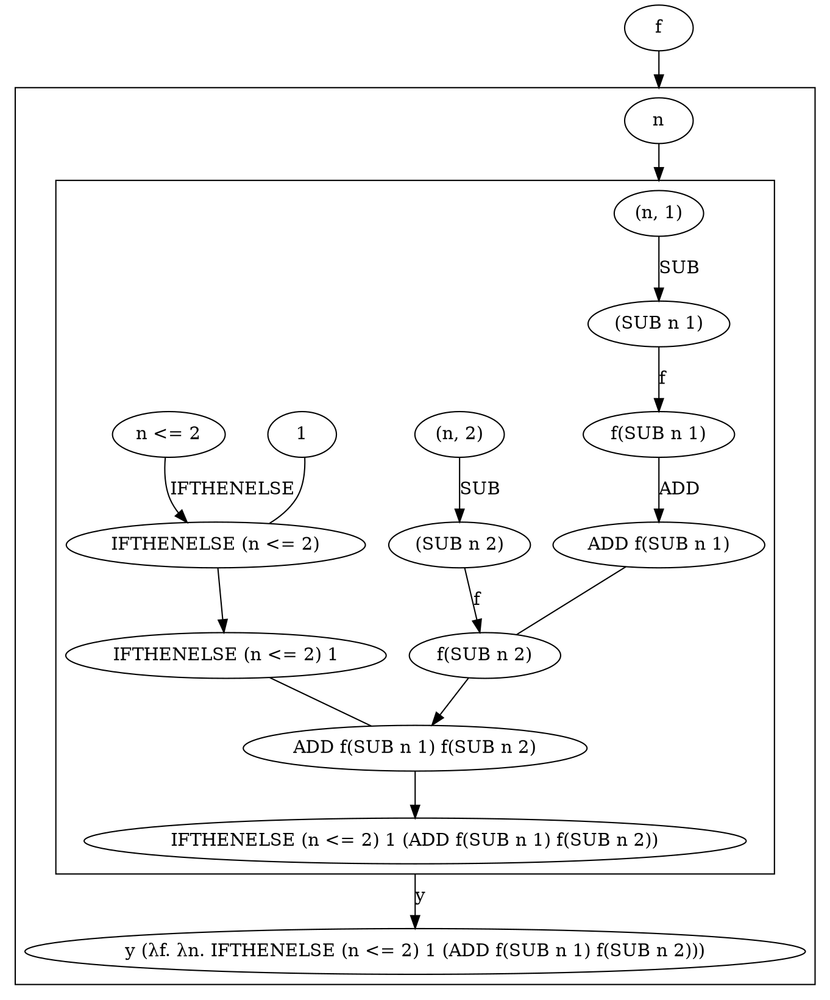

<!-- https://gist.github.com/alopatindev/4a4fddb983911c0a7c872e4720014eee
y := λf.(λx.f (x x)) (λx.f (x x))
fib := y (λf n.if n <= 2 then 1 else f(n - 1) + f(n - 2))

fib := y ( λf. λn. IFTHENELSE (n <= 2) 1 (ADD f(SUB n 1) f(SUB n 2)) )
-->

<!-- digraph g{
  n1 -> p1 [dir=none];
  p1 -> p2
  p1 [shape=none, width=0, height=0, label=""]
  {rank=same; n2 -> p1}
} -->