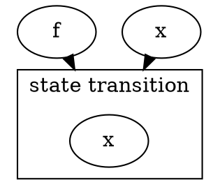
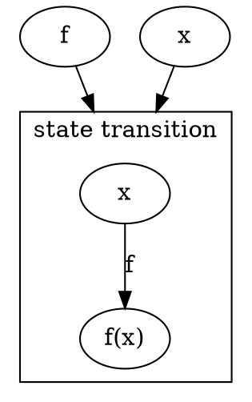
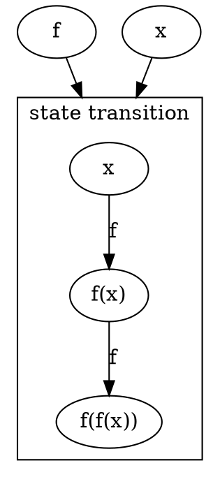
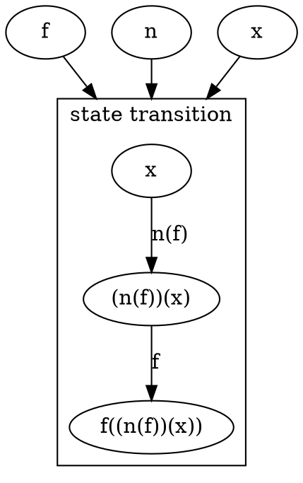
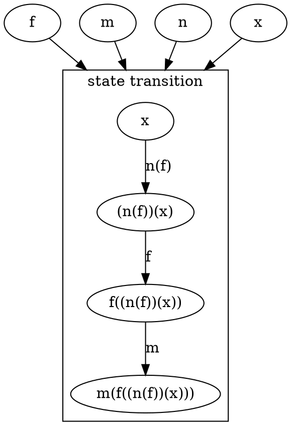
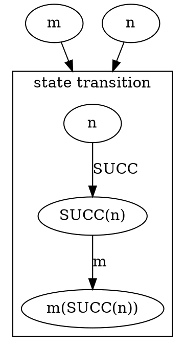
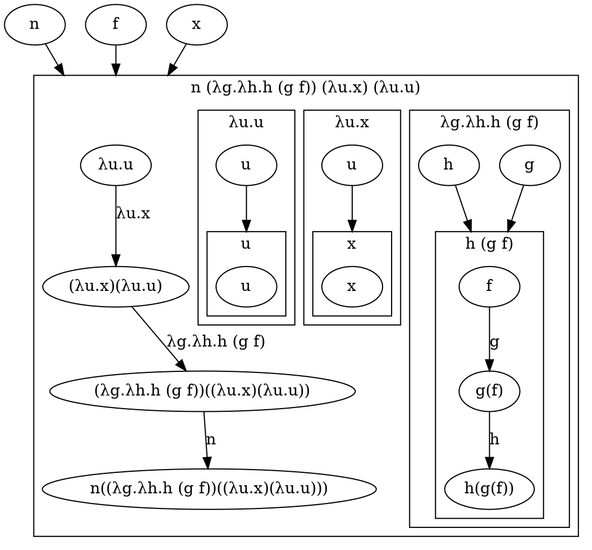
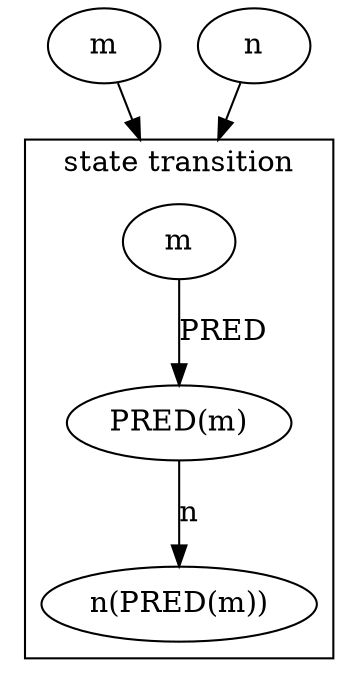

<!-- https://en.wikipedia.org/wiki/Lambda_calculus -->

// similar to monoid definition as category

0 := λf.λx.x

1 := λf.λx.f x

2 := λf.λx.f (f x)

3 := λf.λx.f (f (f x))

## 0

## 1

## 2

## SUCC

SUCC := λn.λf.λx.f (n f x)

## PLUS

PLUS := λm.λn.λf.λx.m f (n f x)

PLUS := λm.λn.m SUCC n

PRED := λn.λf.λx.n (λg.λh.h (g f)) (λu.x) (λu.u)

SUB := λm.λn.n PRED m

