<!-- https://en.wikipedia.org/wiki/Lambda_calculus -->

// similar to monoid definition as category

0 := λf.λx.x

1 := λf.λx.f x

2 := λf.λx.f (f x)

3 := λf.λx.f (f (f x))

## 0

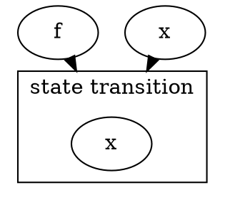

## 1

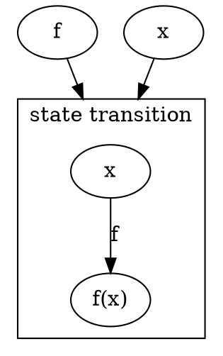

## 2

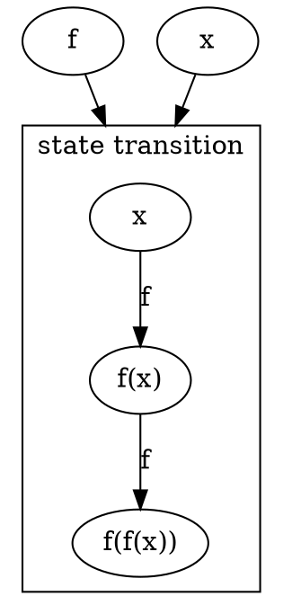

## SUCC

SUCC := λn.λf.λx.f (n f x)

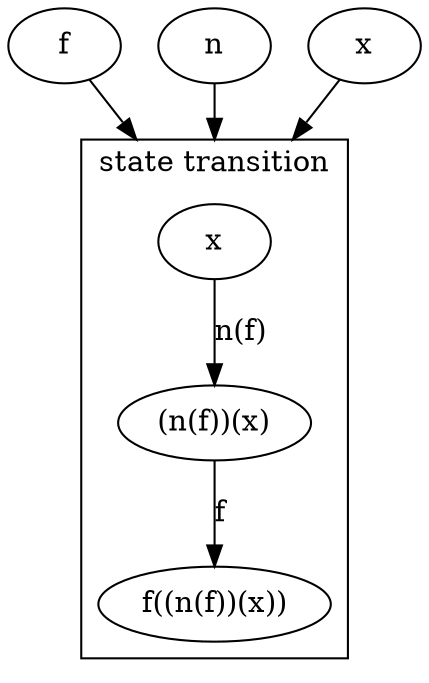

## PLUS

PLUS := λm.λn.λf.λx.m f (n f x)

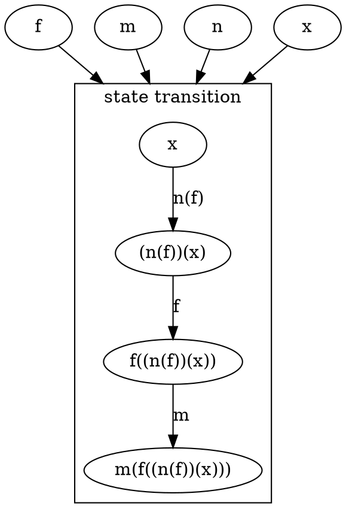

PLUS := λm.λn.m SUCC n

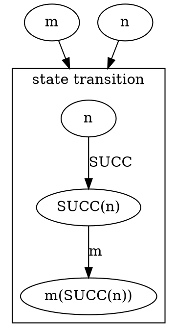

PRED := λn.λf.λx.n (λg.λh.h (g f)) (λu.x) (λu.u)

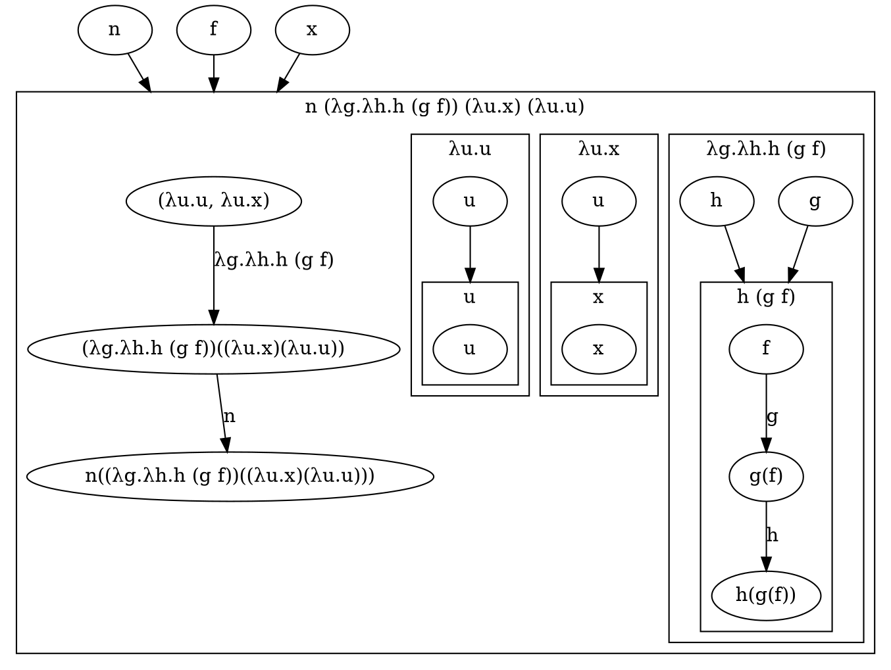

SUB := λm.λn.n PRED m

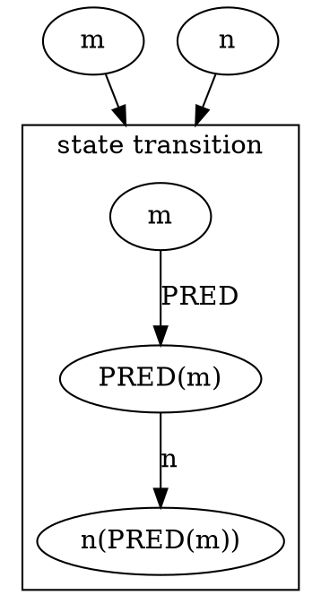

TRUE := λx.λy.x

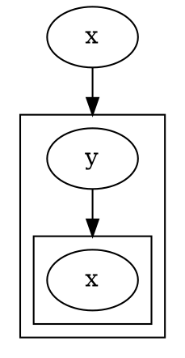

FALSE := λx.λy.y

(Note that FALSE is equivalent to the Church numeral zero defined above)
Then, with these two lambda terms, we can define some logic operators (these are just possible formulations; other expressions are equally correct):

AND := λp.λq.p q p

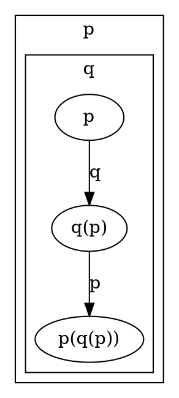

OR := λp.λq.p p q

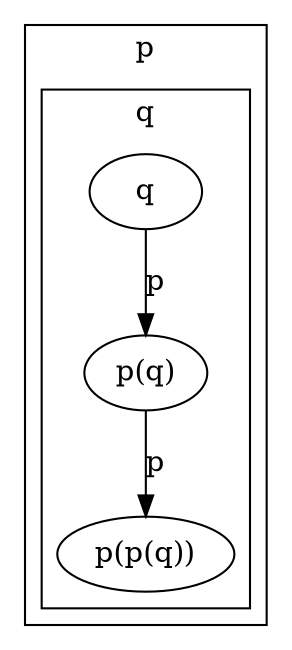

NOT := λp.p FALSE TRUE

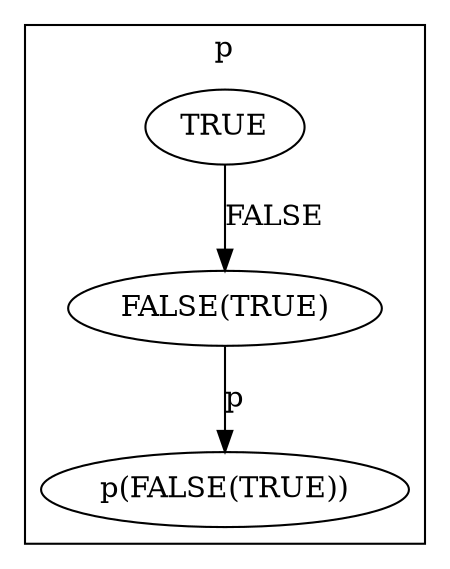

IFTHENELSE := λp.λa.λb.p a b

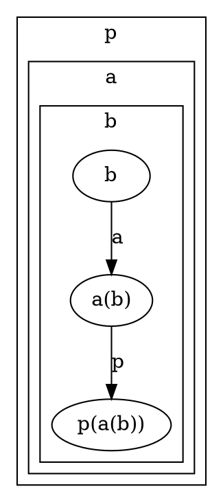

## Factorial

F(n) = 1, if n = 0; else n × F(n − 1).

G := λr. λn.(1, if n = 0; else n × (r r (n−1)))
with  r r x = F x = G r x  to hold, so  r = G  and
F := G G = (λx.x x) G

The self-application achieves replication here, passing the function's lambda expression on to the next invocation as an argument value, making it available to be referenced and called there.

This solves it but requires re-writing each recursive call as self-application. We would like to have a generic solution, without a need for any re-writes:

G := λr. λn.(1, if n = 0; else n × (r (n−1)))
with  r x = F x = G r x  to hold, so  r = G r =: FIX G  and
F := FIX G  where  FIX g := (r where r = g r) = g (FIX g)
so that  FIX G = G (FIX G) = (λn.(1, if n = 0; else n × ((FIX G) (n−1))))

## Y combinator

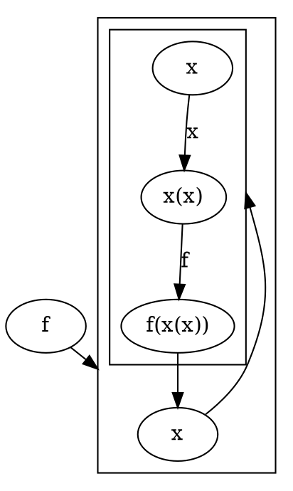