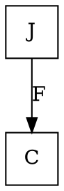
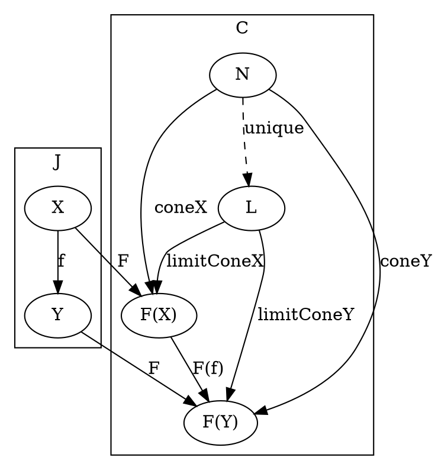
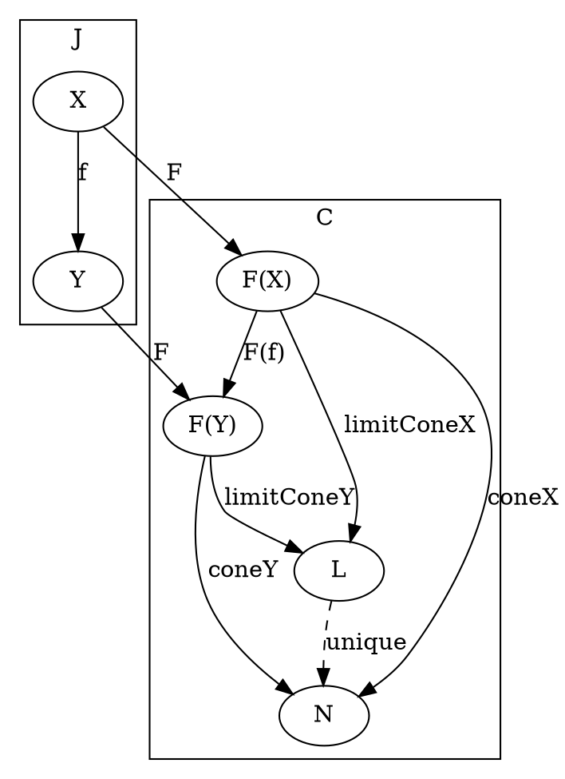

# [Definition](https://en.wikipedia.org/wiki/Limit_(category_theory)#Limits)

[./cone.md](cone.md)

### Category level

### Object level

# [Definition](https://en.wikipedia.org/wiki/Limit_(category_theory)#Colimits)

[./cone.md](cone.md)

### Category level

### Object level

