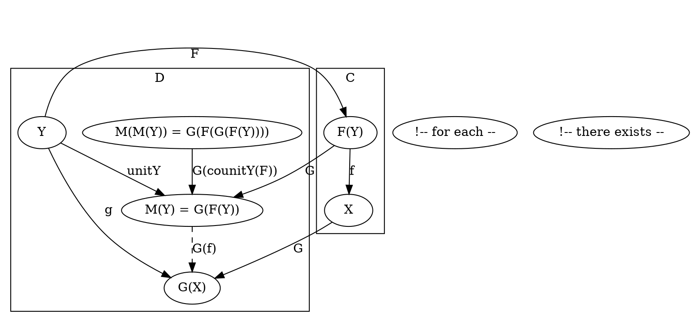

# [Monads and adjunctions](https://en.wikipedia.org/wiki/Monad_(category_theory)#Monads_arising_from_adjunctions)

Any adjunction

F:C <-> D:G
gives rise to a monad on C

Object level

```graphviz
digraph G {
  subgraph clusterD {
    label="D"
    "Y"
    "G(X)"
    "G(F(Y))" [label="M(Y) = G(F(Y))"]
    "G(F(G(F(Y))))" [label="M(M(Y)) = G(F(G(F(Y))))"]
  }

  subgraph clusterC {
    label="C"
    "X"
    "F(Y)"
  }

  "Y" -> "F(Y)" [label="F"]
  "X" -> "G(X)" [label="G"]

  <!-- for each -->
  "Y" -> "G(X)" [label="g"]
  <!-- there exists -->
  "F(Y)" -> "X" [label="f"]

  "F(Y)" -> "G(F(Y))" [label="G"]
  "Y" -> "G(F(Y))" [label="unitY"]
  "G(F(Y))" -> "G(X)" [label="G(f)", style="dashed"]

  "G(F(G(F(Y))))" -> "G(F(Y))" [label="G(counitY(F))"]
}
```
