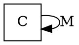
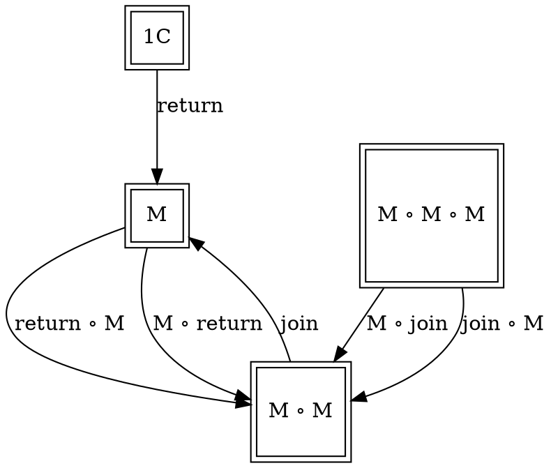

# [Definition](https://en.wikipedia.org/wiki/Monad_(category_theory)#Formal_definition)



At functor level:




# Code

## [Haskell](https://www.haskell.org/tutorial/monads.html)

```haskell
infixl 1  >>, >>=

class  Monad m  where
    (>>=) ::
      m a -> (a -> m b) -> m b
    (>>) ::
      m a -> m b -> m b
    return ::
      a -> m a
```