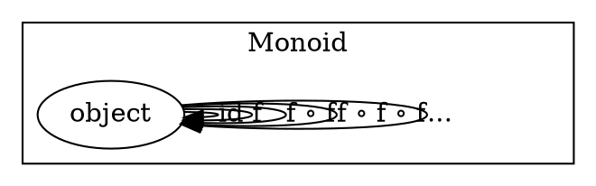

# Functor level

<!-- TODO monoid as F-algebra -->

# Category level

<!-- TODO monoid as category -->

# Object level

<!-- TODO monoid as strict monoidal category -->

# Element level

<!-- TODO monoid as algebraic structure -->

