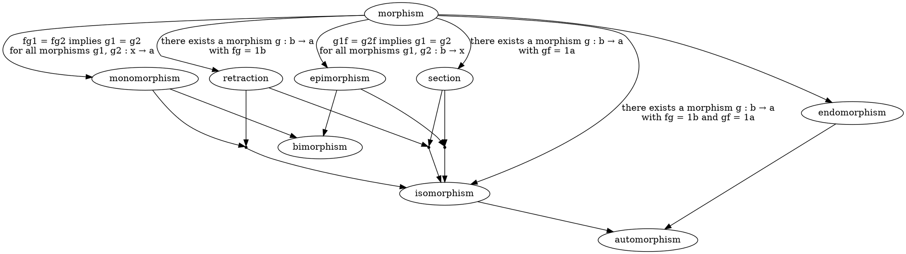

https://en.wikipedia.org/wiki/Category_(mathematics)#Types_of_morphisms

```graphviz
digraph G {
  "morphism" -> "monomorphism" [label="fg1 = fg2 implies g1 = g2\nfor all morphisms g1, g2 : x → a", href="https://en.wikipedia.org/wiki/Category_(mathematics)#Types_of_morphisms"]
  "morphism" -> "epimorphism" [label="g1f = g2f implies g1 = g2\nfor all morphisms g1, g2 : b → x", href="https://en.wikipedia.org/wiki/Category_(mathematics)#Types_of_morphisms"]
  "monomorphism" -> "bimorphism" [href="https://en.wikipedia.org/wiki/Category_(mathematics)#Types_of_morphisms"]
  "epimorphism" -> "bimorphism" [href="https://en.wikipedia.org/wiki/Category_(mathematics)#Types_of_morphisms"]
  "morphism" -> "retraction" [label="there exists a morphism g : b → a\nwith fg = 1b", href="https://en.wikipedia.org/wiki/Category_(mathematics)#Types_of_morphisms"]
  "morphism" -> "section" [label="there exists a morphism g : b → a\nwith gf = 1a", href="https://en.wikipedia.org/wiki/Category_(mathematics)#Types_of_morphisms"]
  "morphism" -> "isomorphism" [label="there exists a morphism g : b → a\nwith fg = 1b and gf = 1a", href="https://en.wikipedia.org/wiki/Category_(mathematics)#Types_of_morphisms"]
  "morphism" -> "endomorphism" [href="https://en.wikipedia.org/wiki/Category_(mathematics)#Types_of_morphisms"]

  "retraction x section" [shape="point"]
  "monomorphism x retraction" [shape="point"]
  "epimorphism x section" [shape="point"]

  "retraction" -> "retraction x section" [href="https://en.wikipedia.org/wiki/Category_(mathematics)#Types_of_morphisms"]
  "section" -> "retraction x section" [href="https://en.wikipedia.org/wiki/Category_(mathematics)#Types_of_morphisms"]
  "retraction x section" -> "isomorphism" [href="https://en.wikipedia.org/wiki/Category_(mathematics)#Types_of_morphisms"]

  "epimorphism" -> "epimorphism x section"
  "section" -> "epimorphism x section"
  "epimorphism x section" -> "isomorphism" [href="https://en.wikipedia.org/wiki/Category_(mathematics)#Types_of_morphisms"]

  "monomorphism" -> "monomorphism x retraction"
  "retraction" -> "monomorphism x retraction"
  "monomorphism x retraction" -> "isomorphism" [href="https://en.wikipedia.org/wiki/Category_(mathematics)#Types_of_morphisms"]

  "isomorphism" -> "automorphism" [href="https://en.wikipedia.org/wiki/Category_(mathematics)#Types_of_morphisms"]
  "endomorphism" -> "automorphism" [href="https://en.wikipedia.org/wiki/Category_(mathematics)#Types_of_morphisms"]
}
```