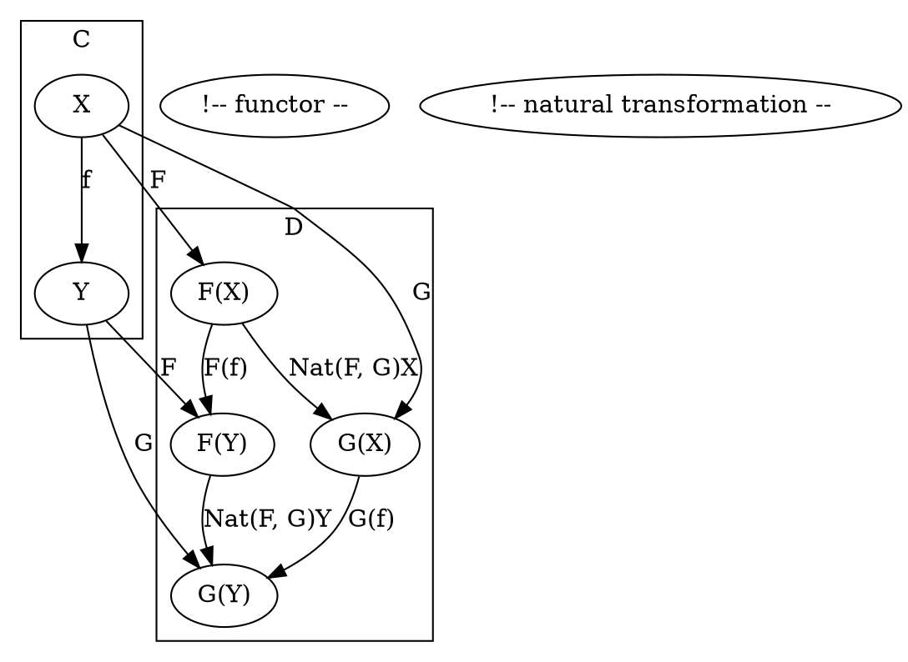

# [Definition](https://en.wikipedia.org/wiki/Natural_transformation#Definition)



# Code

## [Haskell](https://hackage.haskell.org/package/natural-transformation-0.4/docs/src/Control-Natural.html#%3A~%3E)

```haskell
infixr 0 ->

type f -> g = forall x. f x -> g x
```