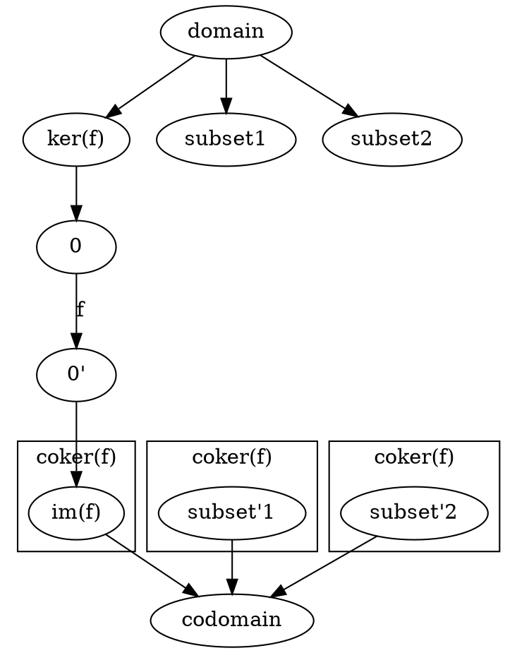

```graphviz
digraph G {
  "domain" -> "ker(f)"
  "domain" -> "subset1"
  "domain" -> "subset2"

  "ker(f)" -> "0"

  "0" -> "0'" [label="f"]
  "0'" -> "im(f)"

  "im(f)" -> "codomain"

  subgraph cluster_coker {
    label="coker(f)"

    "im(f)"
  }

  subgraph cluster_coker1 {
    label="coker(f)"

    "subset'1"
  }

  subgraph cluster_coker2 {
    label="coker(f)"

    "subset'2"
  }

  "subset'1" -> "codomain"
  "subset'2" -> "codomain"
}
```

domain / ker(f) ~ im(f)
domain / im(f) ~ coker(f)