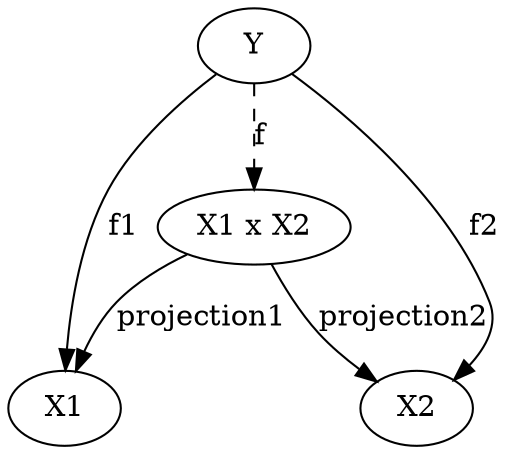
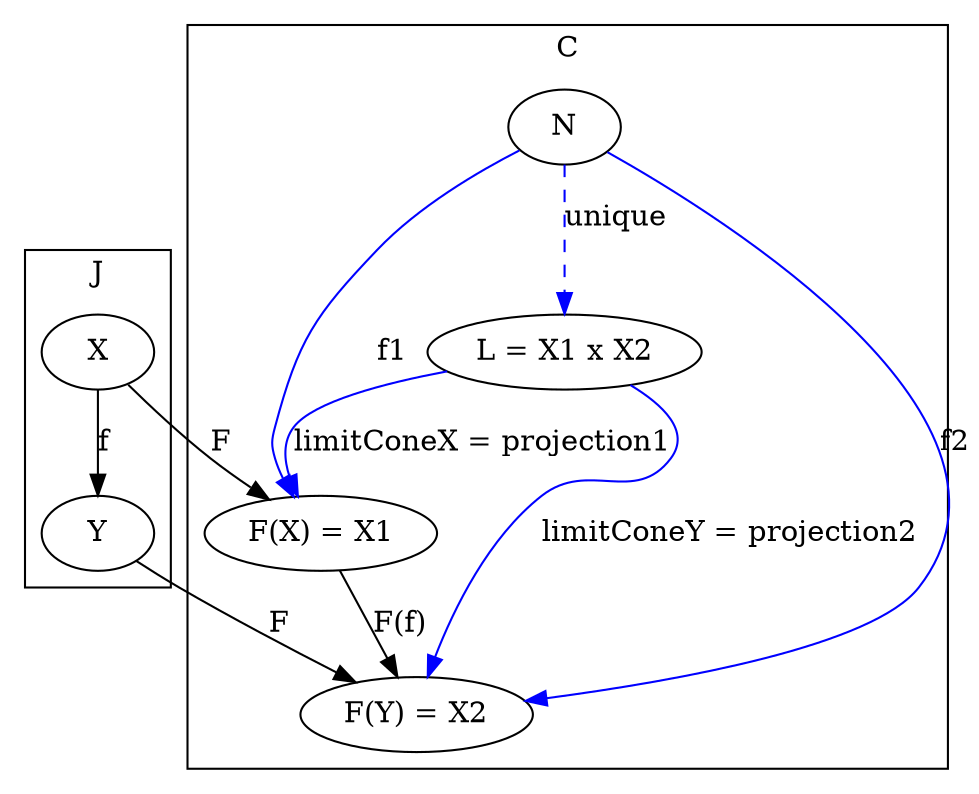
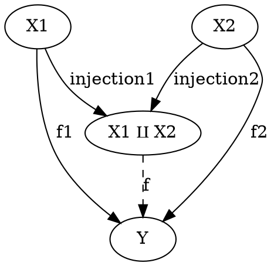

# Product

## [Definition](https://en.wikipedia.org/wiki/Product_(category_theory)#Definition)

### Object level

The product is a special case of a limit. This may be seen by using a discrete category (a family of objects without any morphisms, other than their identity morphisms) as the diagram required for the definition of the limit. The discrete objects will serve as the index of the components and projections. If we regard this diagram as a functor, it is a functor from the index set I considered as a discrete category. The definition of the product then coincides with the definition of the limit, { f }i being a cone and projections being the limit (limiting cone).

A product is a limit

### Object level

# Coproduct

## [Definition](https://en.wikipedia.org/wiki/Coproduct#Definition)

### Object level

