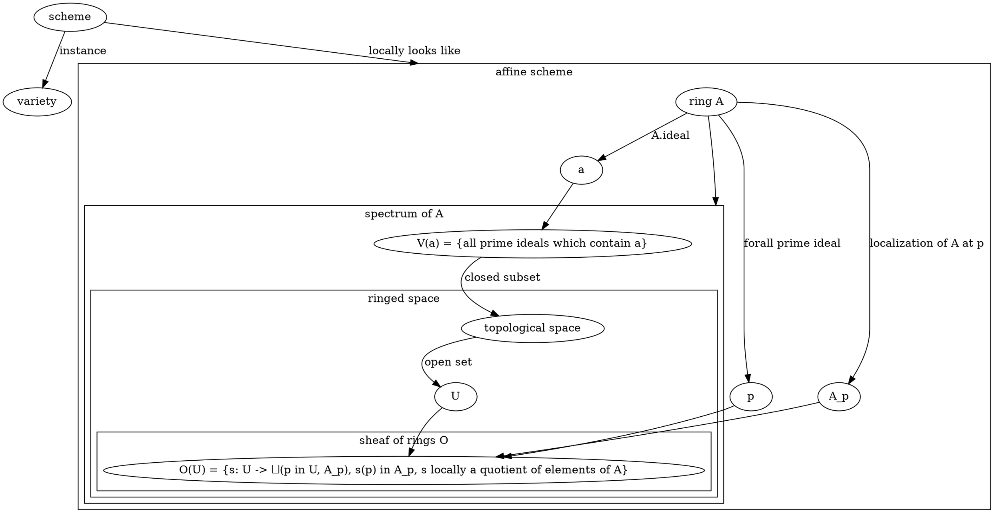
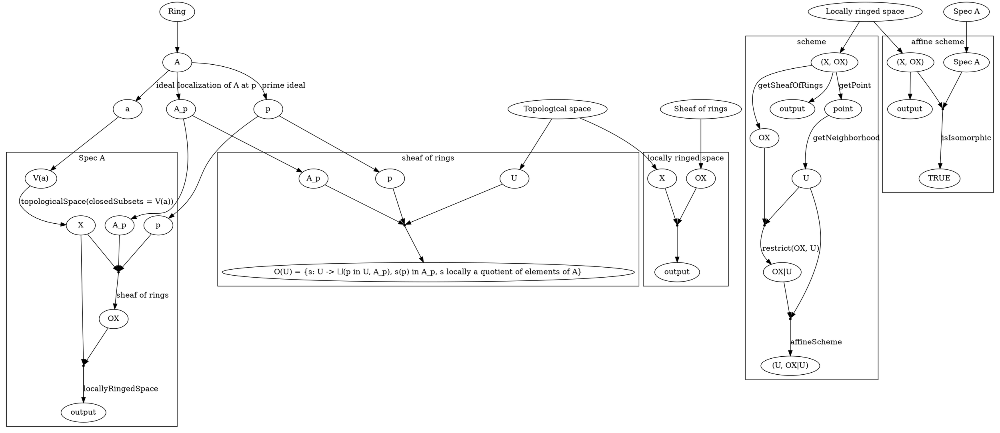

https://en.wikipedia.org/wiki/Scheme_(mathematics)#Definition
An affine scheme
 is a locally ringed space
  isomorphic to the spectrum Spec(R) of a commutative ring R.
   A scheme is a locally ringed space X
    admitting a covering by open sets Ui,
     such that each Ui (as a locally ringed space) is an affine scheme.
      In particular,
       X comes with a sheaf OX,
        which assigns to every open subset U a commutative ring OX(U)
         called the ring of regular functions on U.
          One can think of a scheme
           as being covered by "coordinate charts" which are affine schemes.
            The definition means exactly
             that schemes are obtained by gluing together affine schemes
              using the Zariski topology.

https://www.dropbox.com/home/Documents/Books/Science/Mathematics/Geometry/Algebraic?preview=Robin+Hartshorne+-+Algebraic+Geometry.pdf#page=87

Second version (following lambda calculus)

