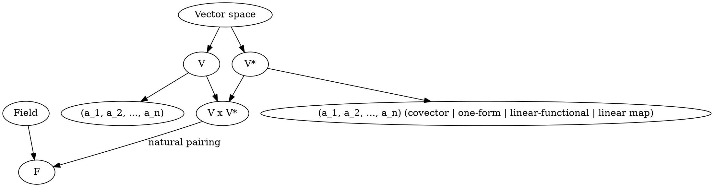
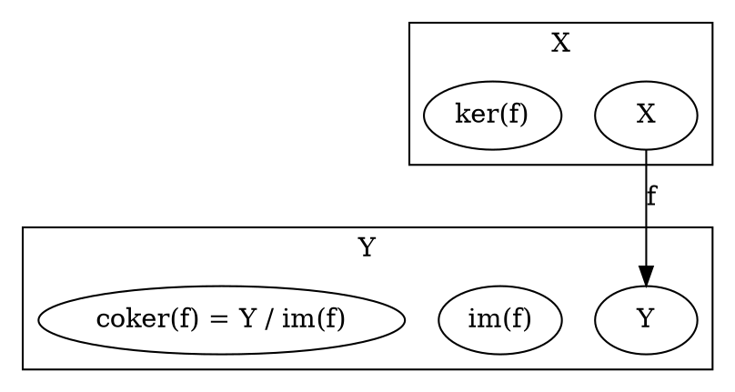
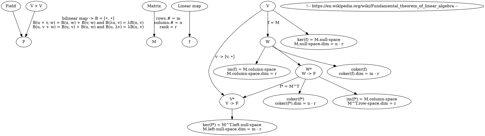

```graphviz
digraph G {
  "Field" -> "F"
  "Vector space" -> "V"
  "Vector space" -> "V*"

  "V" -> "V x V*"
  "V*" -> "V x V*"
  "V*" -> "(a_1, a_2, ..., a_n) (covector | one-form | linear-functional | linear map)"
  "V x V*" -> "F" [label="natural pairing", href="https://en.wikipedia.org/wiki/Dual_space#Algebraic_dual_space"]

  "V" -> "(a_1, a_2, ..., a_n)"
}
```

```graphviz
digraph G {
  subgraph clusterX {
    label="X"

    "X"

    "ker(f)"
  }
  subgraph clusterY {
    label="Y"

    "Y"

    "im(f)"
    "coker(f) = Y / im(f)" [href="https://en.wikipedia.org/wiki/Cokernel"]
  }

  "X" -> "Y" [label="f"]
}
```

```graphviz
digraph G {
  "Field" -> "F"

  "Matrix" -> "M" [label="rows.# = m\ncolumn.# = n\nrank = r"]

  "Linear map" -> "f"

  "M"

  "V" -> "W" [label="f = M"]

  "W" -> "im(f) = M.column-space\nM.column-space.dim = r" [href="https://en.wikipedia.org/wiki/Fundamental_theorem_of_linear_algebra"]
  "V" -> "ker(f) = M.null-space\nM.null-space.dim = n - r" [href="https://en.wikipedia.org/wiki/Fundamental_theorem_of_linear_algebra"]
  "W" -> "coker(f)\ncoker(f).dim = m - r" [href="https://en.wikipedia.org/wiki/Fundamental_theorem_of_linear_algebra"]

  "W*" -> "im(f*) = M.column-space\nM^T.row-space.dim = r" [href="https://en.wikipedia.org/wiki/Fundamental_theorem_of_linear_algebra"]
  "V*" -> "ker(f*) = M^T.left-null-space\nM.left-null-space.dim = m - r" [href="https://en.wikipedia.org/wiki/Fundamental_theorem_of_linear_algebra"]
  "W*" -> "coker(f*)\ncoker(f*).dim = n - r" [href="https://en.wikipedia.org/wiki/Fundamental_theorem_of_linear_algebra"]

  <!-- https://en.wikipedia.org/wiki/Fundamental_theorem_of_linear_algebra -->

  "V*" [label="V*\nV -> F"]

  "V" -> "V*" [label="v -> [v, •]"]

  "W" -> "W*"

  "W*" [label="W*\nW -> F"]

  "W*" -> "V*" [label="f* = M^T"]

  "V × V" -> "F" [label="bilinear map -> B = [•, •]\nB(u + v, w) = B(u, w) + B(v, w) and B(λu, v) = λB(u, v)\nB(u, v + w) = B(u, v) + B(u, w) and B(u, λv) = λB(u, v)", href="https://en.wikipedia.org/wiki/Bilinear_form"]
}
```