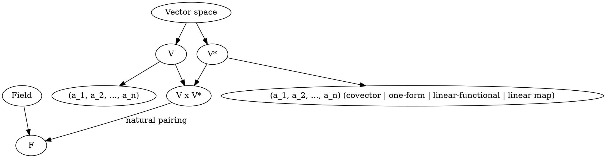
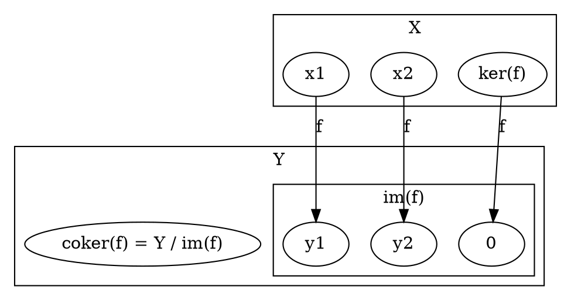
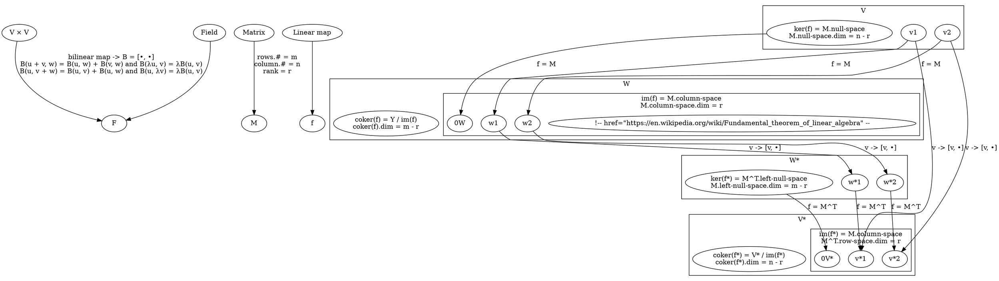
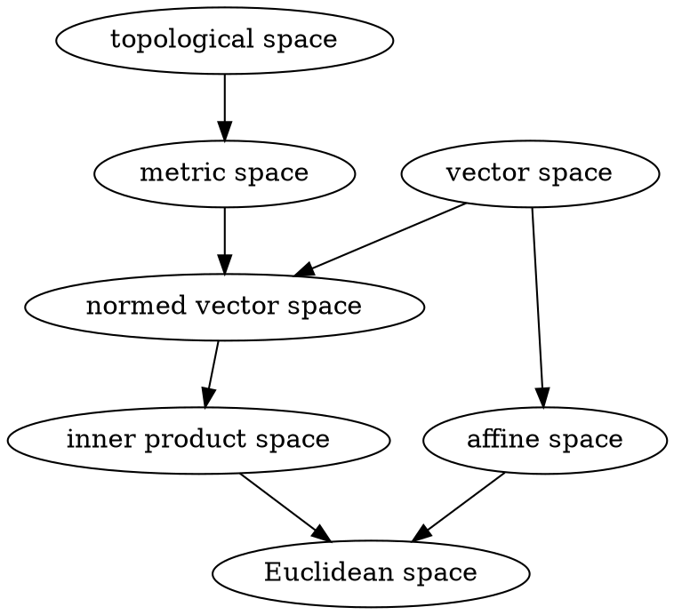

https://en.wikipedia.org/wiki/Cokernel#Intuition
The cokernel can be thought of as the space of constraints that an equation must satisfy, as the space of obstructions, just as the kernel is the space of solutions.

https://en.wikipedia.org/wiki/Cokernel
Cokernels are dual to the kernels of category theory, hence the name: the kernel is a subobject of the domain (it maps to the domain), while the cokernel is a quotient object of the codomain (it maps from the codomain).

https://en.wikipedia.org/wiki/Transpose_of_a_linear_mapthe
transpose of a linear map between two vector spaces, defined over the same field, is an induced map between the dual spaces of the two vector spaces. The transpose or algebraic adjoint of a linear map is often used to study the original linear map. This concept is generalised by adjoint functors

https://en.wikipedia.org/wiki/Transpose_of_a_linear_map#Representation_as_a_matrix
These points of view are related by the canonical inner product on Rn, which identifies the space of column vectors with the dual space of row vectors

https://en.wikipedia.org/wiki/Cokernel
the cokernel can be thought of as something that "detects" surjections in the same way that the kernel "detects" injections

A map is injective if and only if its kernel is trivial, and a map is surjective if and only if its cokernel is trivial, or in other words, if W = im(T)

https://en.wikipedia.org/wiki/Cokernel
Intuitively, given an equation f(x) = y that one is seeking to solve, the cokernel measures the constraints that y must satisfy for this equation to have a solution – the obstructions to a solution – while the kernel measures the degrees of freedom in a solution, if one exists

https://en.wikipedia.org/wiki/Linear_form
if vectors are represented as column vectors, then linear functionals are represented as row vectors, and their action on vectors is given by the matrix product with the row vector on the left and the column vector on the right

// from above, covectors turn out to be actions on vectors

https://en.wikipedia.org/wiki/Fundamental_theorem_of_linear_algebra

let f be a linear map between two finite-dimensional vector spaces, represented by a m×n matrix M of rank r, then:

r is the dimension of the column space of M, which represents the image of f;
n – r is the dimension of the null space of M, which represents the kernel of f;
m – r is the dimension of the cokernel of f.
The transpose MT of M is the matrix of the dual f* of f. It follows that one has also:

r is the dimension of the row space of M, which represents the image of f*;
m – r is the dimension of the left null space of M, which represents the kernel of f*;
n – r is the dimension of the cokernel of f*.
The two first assertions are also called the rank–nullity theorem.

