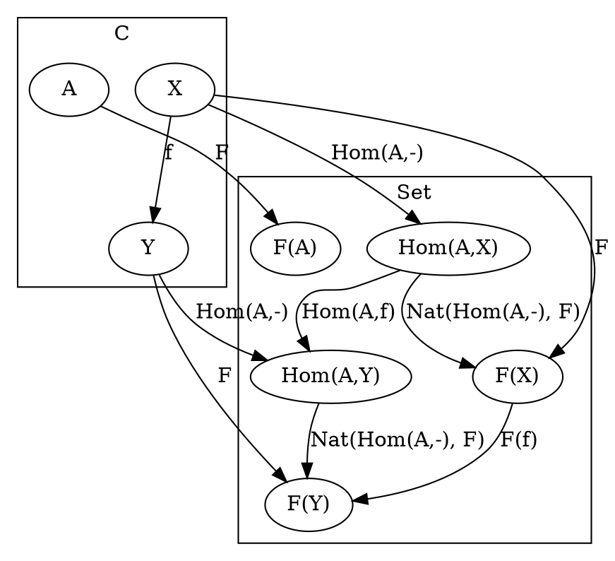

# [Statement](https://en.wikipedia.org/wiki/Yoneda_lemma#Formal_statement)



# Code

## [Haskell](https://gist.github.com/jwiegley/5438178)

```haskell
data Yoneda functor a =
    Yoneda
    {
        runYoneda ::
            forall b.
                Functor functor =>
                    (a -> b) ->
                        functor b
    }

liftYoneda ::
    Functor functor =>
        functor a ->
            Yoneda functor a
liftYoneda functorA =
    Yoneda $ \function -> fmap function functorA
```

